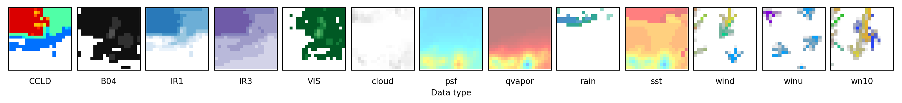
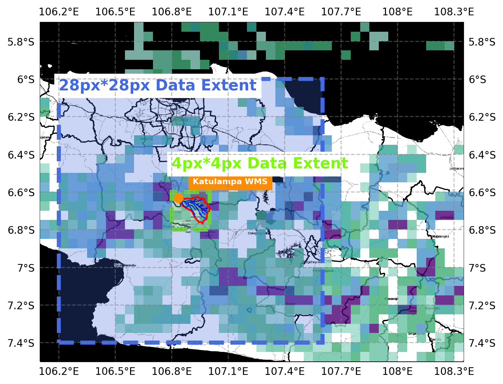
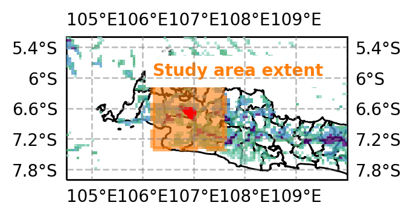
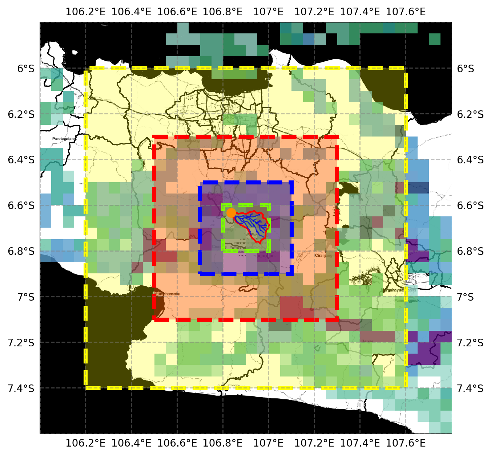
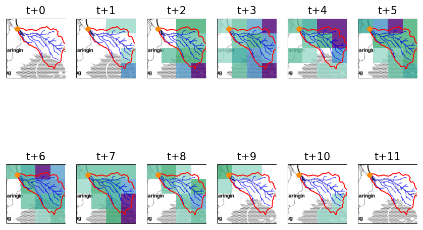
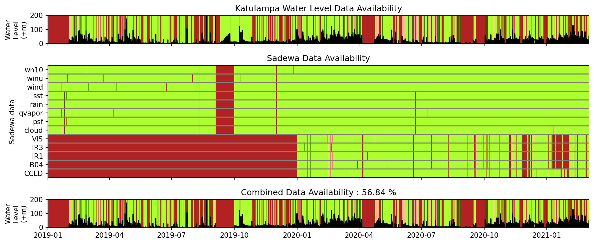

***Created by Jonathan Raditya Valerian - jonathanraditya@live.com***

Data Visualization Table of contents:
- [ ] Sadewa Visual Preview (sadewa_visualpreview.ipynb)
- [ ] 4px\*4px & 28px\*28px Situation Map Input Data Extent (cartopy_inputextent.ipynb)
- [ ] Mini Map Study Area Extent (cartopy_inputextent.ipynb)
- [ ] 4px\*4px, 8px\*8px, 16px\*16px, and 28px\*28px LSTM RNN Spatial Optimization (cartopy_inputextent.ipynb)
- [ ] Katulampa Rain Series (cartopy_inputextent.ipynb)
- [ ] Katulampa WL and Sadewa Data Availability (available_data.ipynb)
- [ ] Deep Neural Network Simulation Results (DNNsimulation_results.ipynb)
- [ ] Timeseries Results Visualization (preview_model_result.ipynb)


Data Gathering & Preprocessing Table of contents:
- [ ] Fetching Sadewa Data (sadewa_mining.py)
- [ ] Fetching Water Level Data (DSDA Data Fetch 2.ipynb)
- [ ] Wind Data Error Handling (windCheck1.py & windCheck2.py) 
- [ ] Creating Deep Neural Network Input Datasets (imgcrop.py)
- [ ] Creating Master Raw-unstacked Datasets for RNN (imgcrop.py)
- [ ] Restacking Simple RNN Input Datasets (restackRecurrent.py)
- [ ] Restacking LSTM RNN Input Datasets (LSTM_restacking-1.py)
- [ ] Restacking Flagged LSTM RNN Input Datasets (LSTM_restacking!-1.py)

Machine Learning Models
- [ ] Deep Neural Network Model
- [ ] Deep Neural Network Flagged Model (DNNsimulation-8-1-flag.ipynb)
- [ ] Simple Recurrent Neural Network Model
- [ ] LSTM Recurrent Neural Network Model
- [ ] LSTM Recurrent Neural Network Flagged Model
- [ ] LSTM Recurrent Neural Network Unflagged 4K Data Model


# General Functions


```python
# import modules
import sqlite3
from sqlite3 import Error
import os
import matplotlib.pyplot as plt
import matplotlib.image as mpimg
import datetime
import pandas as pd
import numpy as np
import random
from skimage import color
import h5py
import time
import tensorflow as tf
from sklearn.metrics import r2_score
import hydroeval
import keras
from PIL import Image
import copy
%matplotlib inline


def hello():
    print('Hello!')

def showSampleSadewaData():
    '''
    showing sadewa sampel data 
    current : cloud-0
    '''
    himawariPath='../mining_sadewa/sadewa/'
    himawari=getHimawariFilename()

    data=himawari['cloud'][0]
    fullPath='{}{}/{}'.format(himawariPath, 'cloud', data)
    img=mpimg.imread(fullPath)
    plt.imshow(img, cmap='rainbow')
    plt.colorbar()

def create_connection(db_file):
    '''
    create a database connection to a SQLite database
    specified by db_file
    :param db_file : database file
    :return: Connection Object or None
    '''
    conn=None
    try:
        conn=sqlite3.connect(db_file)
        return conn
    except Error as e:
        print(e)  
    
def printSadewaFetchMissingData():
    '''
    printing total count of missing data for every sadewa-himawari dataset
    '''
    sadPath='../mining_sadewa/sadewaerr.txt'
    with open(sadPath, 'r') as sErrFile:
        errContent=sErrFile.read()

    rawErrList=errContent.split('.png')
    cleanErrUrl=[]
    for err in rawErrList:
        cleanErrUrl.append('{}.png'.format(err))

    database={
            'IR1':{
                'url':'https://sadewa.sains.lapan.go.id/HIMAWARI/himawari_merc/IR1/{}/{}/{}/',
                'fname':'H89_IR1_{}{}{}{}00.png',
                'yearStart':'2020'
            },
            'IR3':{
                'url':'https://sadewa.sains.lapan.go.id/HIMAWARI/himawari_merc/IR3/{}/{}/{}/',
                'fname':'H89_IR3_{}{}{}{}00.png',
                'yearStart':'2020'
            },
            'VIS':{
                'url':'https://sadewa.sains.lapan.go.id/HIMAWARI/himawari_merc/VIS/{}/{}/{}/',
                'fname':'H89_VIS_{}{}{}{}00.png',
                'yearStart':'2020'
            },
            'B04':{
                'url':'https://sadewa.sains.lapan.go.id/HIMAWARI/himawari_merc/B04/{}/{}/{}/',
                'fname':'H89_B04_{}{}{}{}00.png',
                'yearStart':'2020'
            },
            'CCLD':{
                'url':'https://sadewa.sains.lapan.go.id/HIMAWARI/komposit/{}/{}/{}/',
                'fname':'H89_CCLD_{}{}{}{}00.png',
                'yearStart':'2020'
            },
            'rain':{
                'url':'https://sadewa.sains.lapan.go.id/wrf/{}/{}/{}/',
                'fname':'rain_{}{}{}_{}.png',
                'yearStart':'2019'
            },
            'cloud':{
                'url':'https://sadewa.sains.lapan.go.id/wrf/{}/{}/{}/',
                'fname':'cloud_{}{}{}_{}.png',
                'yearStart':'2019'
            },
            'psf':{
                'url':'https://sadewa.sains.lapan.go.id/wrf/{}/{}/{}/',
                'fname':'psf_{}{}{}_{}.png',
                'yearStart':'2019'
            },
            'qvapor':{
                'url':'https://sadewa.sains.lapan.go.id/wrf/{}/{}/{}/',
                'fname':'qvapor_{}{}{}_{}.png',
                'yearStart':'2019'
            },
            'sst':{
                'url':'https://sadewa.sains.lapan.go.id/wrf/{}/{}/{}/',
                'fname':'sst_{}{}{}_{}.png',
                'yearStart':'2019'
            },
            'wind':{
                'url':'https://sadewa.sains.lapan.go.id/wrf/{}/{}/{}/',
                'fname':'wind_{}{}{}_{}.png',
                'yearStart':'2019'
            },
            'winu':{
                'url':'https://sadewa.sains.lapan.go.id/wrf/{}/{}/{}/',
                'fname':'winu_{}{}{}_{}.png',
                'yearStart':'2019'
            },
            'wn10':{
                'url':'https://sadewa.sains.lapan.go.id/wrf/{}/{}/{}/',
                'fname':'wn10_{}{}{}_{}.png',
                'yearStart':'2019'
            }
        }

    # making list of data keys through list comprehension
    dataKeys=[x for x in database.keys()]
    errClassification={}
    # establishing dictionary
    for key in dataKeys:
        errClassification[key]=[]

    # loop to append error URL for each data type
    for err in cleanErrUrl:
        # loop for each key to check for True value
        for key in dataKeys:
            # check for match data type
            if key in err:
                errClassification[key].append(err)
                continue

    # print count of missing data for each data 
    for errKey in errClassification.keys():
        print(errKey, len(errClassification[errKey]))
        
def idealDataCount():
    '''
    returning (2019idc, 2020idc) ideal data count for Himawari dataset
    '''
    # calculating ideal data count for each entry date
    early2019=[2019,1,1]
    early2020=[2020,1,1]
    minedDate=[2021,3,14]
    fdE19=datetime.datetime(*(early2019))
    fdE20=datetime.datetime(*(early2020))
    fdMD=datetime.datetime(*(minedDate))

    dateRange2019=(fdMD-fdE19).days
    dateRange2020=(fdMD-fdE20).days

    # ideal data count for each entry date
    dataCount2019=dateRange2019*24
    dataCount2020=dateRange2020*24
    
    return dataCount2019, dataCount2020

def manggaraiFullData():
    # read and fetch database data to pandas dataframe
    dsdaPath='../mining_dsda/dsda.db'
    conn=create_connection(dsdaPath)
    manggarai=pd.read_sql_query('SELECT * FROM manggarai', conn)

    # set main index to currentdate
    manggarai.set_index('currentdate')

    # convert data type from object to string
    manggaraiConv=manggarai.convert_dtypes()

    # set main index to currentdate
    manggaraiConv.set_index('currentdate')

    # convert date datatype to datetime64[ns]
    manggaraiConv['currentdate']=manggaraiConv['currentdate'].astype('datetime64[ns]')
    
    return manggaraiConv

def manggaraiDataList(maxData=True, hourOffset=0, wlstation='manggarai'):
    '''
    Returning a tuple of list (date, data) of manggarai TMA data with 10-minutes-interval from DSDA dataset in year 2020
    '''
    # read and fetch database data to pandas dataframe
    dsdaPath='../mining_dsda/dsda.db'
    conn=create_connection(dsdaPath)
    manggarai=pd.read_sql_query('SELECT * FROM {}'.format(wlstation), conn)

    # set main index to currentdate
    manggarai.set_index('currentdate')

    # convert data type from object to string
    manggaraiConv=manggarai.convert_dtypes()

    # set main index to currentdate
    manggaraiConv.set_index('currentdate')

    # convert date datatype to datetime64[ns]
    manggaraiConv['currentdate']=manggaraiConv['currentdate'].astype('datetime64[ns]')

    # slicing data to 2020 timeframe
    #mask = (manggaraiConv['currentdate'] >= '2019-02-01 00:00') & (manggaraiConv['currentdate'] <= '2021-04-03 23:50')
    mask = (manggaraiConv['currentdate'] >= '2019-02-01 00:00')
    manggaraiSlice2020=manggaraiConv.loc[mask]

    # converting 10-minute-data to hourly data
    startDate=datetime.datetime(2019,2,1)
    minutes=[x*10 for x in range(6)]
    hours=[x for x in range(24)]
    days=[x for x in range(780)]

    dateListHourly=[]
    dataListHourly=[]
    for day in days:
        for hour in hours:
            hourlyData=[]

            # set error indicator back to false
            error=False

            for minute in minutes:
                # perform data fetch, add to list, and get max value
                dateLoop=startDate+datetime.timedelta(days=day, hours=hour+hourOffset, minutes=minute)
                rowFetch=manggaraiSlice2020.loc[(manggaraiSlice2020['currentdate'] == dateLoop)]
                #print(rowFetch)

                # try to fetch if the result is not zero
                try:
                    dataFetch=rowFetch['data'].item()
                    hourlyData.append(dataFetch)
                except ValueError:
                    error=True

            # insert data if error indicator is False
            if not error:
                # make hourly date using timedelta
                hourlyDate=startDate+datetime.timedelta(days=day, hours=hour)
                
                if maxData:
                    # get maximum value of hourly data
                    maxDataHourly=max(hourlyData)
                else:
                    # get maximum value of hourly data
                    maxDataHourly=hourlyData.mean()

                # insert value to global list
                dateListHourly.append(hourlyDate)
                dataListHourly.append(maxDataHourly)
            else: # if error occured during data fetch (null or something else)
                continue # to next loop
    return dateListHourly, dataListHourly

def getHimawariFilename():
    '''
    Return dictionary of available himawari data based on filename inside
    folder as a key
    '''
    himawariPath='../mining_sadewa/sadewa/'
    # load folder name
    directory=[directory for directory in os.listdir(himawariPath)]

    # store fileame
    himawari={}

    # load all filename stored on disk to dictionary with each folder name as keys
    for direct in directory:
        fpath='{}{}'.format(himawariPath, direct)
        himawari[direct]=[fname for fname in os.listdir(fpath)]
        
    return himawari

def extractHimawariDatetime():
    '''
    Extract every filename in sadewa-himawari data to datetime object for easier handling
    
    Returns :
    extractedDate -- dictionary containing list of datetime object for each filename inside dictionary keys for every data
    '''
    himawari=getHimawariFilename()

    # extract date for each himawari data type to datetime.datetime object
    observations=['CCLD','B04','IR1','IR3','VIS']
    extractedDate={}
    for obs in observations:
        extractedDate[obs]=[datetime.datetime.strptime(x.replace('H89_{}_'.format(obs),'').replace('.png',''), '%Y%m%d%H%M') for x in himawari[obs]]

    predictions=['cloud','psf','qvapor','rain','sst','wind','winu','wn10']
    for pred in predictions:
        extractedDate[pred]=[datetime.datetime.strptime(x.replace('{}_'.format(pred),'').replace('.png','').replace('_','')+'00', '%Y%m%d%H%M') for x in himawari[pred]]
        
    return extractedDate

def getAvailableSlicedData(maxData=True, hourOffset=0, dataScope='combination', wlstation='manggarai', flagged=False):
    '''
    check through all available dataset, including manggarai TMA, sadewa-himawari IR1, IR3, VIS, B04, and CCLD
    and return a tuple containing datetime object and manggarai hourly TMA data that are synced through all available dataset
    
    This function doesn't return sadewa-himawari data, because using the datetime format and the sadewa-himawari data types,
    the full name of the file required can be constructed.
    
    return : (slicedDate, slicedData) # both are lists inside a tuple
    '''
    extractedDate = extractHimawariDatetime()
        
    # getting date-data slice from himawari and manggarai TMA data

    # using function to get manggarai available date-data
    dateListHourly, dataListHourly = manggaraiDataList(maxData, hourOffset, wlstation=wlstation)
    
    # check if the data is flagged above the mean or not
    if flagged:
        dateListHourly, dataListHourly = flagData(dateListHourly, dataListHourly)

    # loop to every data
    # check algorithm : manggarai checked against every himawari data, and if all true, date is inserted to sliced data
    slicedDate=[]
    slicedData=[]
    for i in range(len(dateListHourly)):
        
        if dataScope == 'combination':
            usedData=['CCLD','B04','IR1','IR3','VIS','rain','cloud','psf','qvapor','sst']
        elif dataScope == 'prediction':
            usedData=('cloud','psf','qvapor','rain','sst','wind','winu','wn10')

        # defining control mechanism
        checked=True

        # loop through every himawari data
        for used in usedData:
            if dateListHourly[i] not in extractedDate[used]:
                checked=False # set checked to False if there are no complementary data found in another dataset

        # input data if all checked
        if checked:
            slicedDate.append(dateListHourly[i])
            slicedData.append(dataListHourly[i])
    return slicedDate, slicedData

def flagData(adte, adta):
    '''
    Filter date and data above the mean
    '''
    adtaDF = pd.DataFrame(adta).astype('int32')
    adteDF = pd.DataFrame(adte)
    flaggedAdta = adtaDF[adtaDF[0] > adtaDF.mean()[0]]
    flaggedAdte = adteDF[adtaDF[0] > adtaDF.mean()[0]]
    return list(flaggedAdte[0].dt.to_pydatetime()), list(flaggedAdta[0].astype('object'))


def statisticsRaw(maxData=True):
    '''
    Return pandas dataframe of statistics in all available data
    
    column 0 : date
    column 1 : tma
    column 2 - 152 : obs/pred * dataset * med/mean/stdev/min/max
    '''
    adte, adta = getAvailableSlicedData(maxData)

    himawariData = {'o100' : {'fname' : 'observation100',
                              'dataset' : ['CCLD','B04','IR1','IR3','VIS']},
                    'o196' : {'fname' : 'observation196',
                              'dataset' : ['CCLD','B04','IR1','IR3','VIS']},
                    'o400' : {'fname' : 'observation400',
                              'dataset' : ['CCLD','B04','IR1','IR3','VIS']},
                    'p100' : {'fname' : 'prediction100',
                              'dataset' : ['rain','cloud','psf','qvapor','sst']},
                    'p196' : {'fname' : 'prediction196',
                              'dataset' : ['rain','cloud','psf','qvapor','sst']},
                    'p400' : {'fname' : 'prediction400',
                              'dataset' : ['rain','cloud','psf','qvapor','sst']}}

    df = {'date':adte,
          'tma':adta}
    dtDF = pd.DataFrame(df)
    dtDF['tma'] = dtDF['tma'].astype('int64')

    for himawari in himawariData:

        # start statistics
        tick = time.time()

        # initialize new list for each column
        statistics=[[[],[],[],[],[]],
                   [[],[],[],[],[]],
                   [[],[],[],[],[]],
                   [[],[],[],[],[]],
                   [[],[],[],[],[]]]
        statisticsHeader=['med','mean','stdv','min','max']

        fname = himawariData[himawari]['fname']
        dataset = himawariData[himawari]['dataset']

        # print current dataset
        print(dataset)

        # open file
        with h5py.File('{}.hdf5'.format(fname), 'r') as f:
            fetchData = f['datas'][()]


        # loop for each data row
        for i in range(len(fetchData)):

            # loop for each dataset
            for j in range(len(fetchData[i])):
                # fetch image data
                imageData = fetchData[i][j]

                # convert rgba to rgb
                rgb = color.rgba2rgb(imageData)

                statistics[0][j].append(np.median(rgb)) 
                statistics[1][j].append(np.mean(rgb))
                statistics[2][j].append(np.std(rgb))
                statistics[3][j].append(np.min(rgb))
                statistics[4][j].append(np.max(rgb))

        # end statistics
        tock = time.time()
        print('Elapsed time : {}'.format(tock-tick))

        print('Inserting to dataframe')

        # after fetching statistics value for each dataset, insert to pandas dataframe
        # loop over statistics data array
        for i in range(len(statistics)):
            statHeader = statisticsHeader[i]
            # loop over dataset inside statistics data array
            for j in range(len(dataset)):
                datasetHeader = dataset[j]

                # constructing header name
                header = '{}_{}_{}'.format(fname, datasetHeader, statHeader)

                # append to existing dataframe
                dtDF[header] = statistics[i][j]
                
    return dtDF

# FUNCTIONS #

def cropImageData(imgCropX, imgCropY, adte, usedDatas, imgPath, predData=False):
    '''
    Crop image data based on defined crop bound in horizontal (x) and vertical (y) direction,
    and append the cropped data to nd numpy array with format : (m datas, datatypes, imgdim1, imgdim2, number of channels)
    
    Parameters :
    imgCropX -- list of start and end bound of horizontal slice index image numpy array
    imgCropY -- list of start and end bound of horizontal slice index image numpy array
    adte -- list of available date in datetime object
    usedDatas -- list of want-to-crop data
    imgPath -- complete image path with string format placeholder relative from current working directory
    datef -- main date formatted to inserted into placeholder in imgPath
    dateh -- optional date format for prediction data
    
    Returns :
    croppedData -- numpy array of cropped data with format : (m datas, datatypes, imgdim1, imgdim2, number of channels)
    '''
    # loop conditional
    firstColumn=True
    i=0
    for date in adte:
        # loop conditional
        firstRow=True
        for data in usedDatas:
            if predData:
                datef = date.strftime('%Y%m%d')
                dateh = date.strftime('%H')
            else:
                datef = date.strftime('%Y%m%d%H%M')
                dateh = None

            imgPathF=imgPath.format(data, data, datef, dateh)
            # fetching image data
            #print(imgPath)
            image=mpimg.imread(imgPathF)
            # cropping image to defined dimension(s)
            image=image[imgCropX[0]:imgCropX[1], imgCropY[0]:imgCropY[1]]
            
            image=image.reshape(1, image.shape[0], image.shape[1], image.shape[2])
            
            # check for first loop 
            if firstRow:
                sameDate=np.copy(image)
                firstRow=False
            else:
                sameDate=np.vstack((sameDate, image))
        
        # reshaping numpy array
        sameDate=sameDate.reshape(1, sameDate.shape[0], sameDate.shape[1], sameDate.shape[2], sameDate.shape[3])
        
        # check for first loop
        if firstColumn:
            croppedData=np.copy(sameDate)
            firstColumn=False
        else:
            croppedData=np.vstack((croppedData, sameDate))
        if i%100 == 0:
            print(croppedData.shape)
        i+=1
            
    return croppedData 
    

def cropImagePredictionData(dim, usedDatas=['rain','cloud','psf','qvapor','sst'], hourOffset=0, wlstation='manggarai'):
    '''
    Returning numpy array with dimension of (m training data, nodes), that nodes = (rain, cloud, psf, qvapor, sst) cropped data
    based on defined dimensions : 100 (10x10), 196 (14x14), 400 (20x20)
    '''
    if dim == 72:
        imgCropX=[324, 336] # 12x6
        imgCropY=[234, 240] # 12x6
    elif dim == 100:
        imgCropX=[323,333] # 10x10
        imgCropY=[233,243] # 10x10
    elif dim == 196:
        imgCropX=[320,334] # 14x14
        imgCropY=[230,244] # 14x14
    elif dim == 240:
        imgCropX=[318, 338] # 20x12
        imgCropY=[231, 243] # 20x12  
    #elif dim == 400:
        #imgCropX=[317,337] # 20x20
        #imgCropY=[227,247] # 20x20
    elif dim == 400:
        imgCropX=[318, 338] # 20x20v2 shifted down 1 cell
        imgCropY=[227, 247] # 20x20v2 shifted down 1 cell
    # Katulampa crop extent
    elif dim == 16: # Katulampa 4x4 input cell
        imgCropX=[332, 336]
        imgCropY=[236, 240]
    elif dim == 784: # Katulampa 28x28 input cell
        imgCropX=[320, 348]
        imgCropY=[224, 252]
    
    adte, adta = getAvailableSlicedData(dataScope='prediction', hourOffset=hourOffset, wlstation=wlstation)
    imgPath = '../mining_sadewa/sadewa/{}/{}_{}_{}.png'

    return cropImageData(imgCropX, imgCropY, adte, usedDatas, imgPath, predData=True)

def cropImageObservationData(dim, usedDatas=['IR1','IR3','B04','VIS','CCLD']):
    '''
    Returning 3 dimensions numpy array with (m training data, nodes), that nodes = (IR1, IR3, B04, VIS, CCLD) cropped data
    based on defined dimensions : 100 (10x10), 196 (14x14), 400 (20x20)
    '''
    if dim == 45:
        imgCropX=[932,941]
        imgCropY=[517,522]
    elif dim == 100:
        imgCropX=[910,920]
        imgCropY=[405,415]
    elif dim == 196:
        imgCropX=[908,922]
        imgCropY=[403,417]
    elif dim == 198: #v2
        imgCropX=[928,942]
        imgCropY=[512,526]
    elif dim == 400:
        imgCropX=[905,925]
        imgCropY=[400,420]
       
    adte, adta = getAvailableSlicedData()
    imgPath = '../mining_sadewa/sadewa/{}/H89_{}_{}.png'

    return cropImageData(imgCropX, imgCropY, adte, usedDatas, imgPath)

def performIndividualCropPredictionData(dim):
    '''
    Perform individual database creation of prediction data
    '''
    # initializing individual variables
    usedDatas = [['cloud'],['psf'],['qvapor'],['rain'],['sst'],['wind'],['winu'],['wn10']]
    for usedData in usedDatas:
        
        crop = cropImagePredictionData(dim, usedDatas=usedData)
        with h5py.File('dataset/{}{}.hdf5'.format(usedData[0], dim), 'w') as f:
            f.create_dataset('datas', data=crop)
    

def dataLabel(entryBound, endBound, dim=100):
    '''
    Returning ndarray of input and label by specifying entry and end bound of available data
    '''
    dateBound=adte[entryBound:endBound]
    labels=np.array(adta[entryBound:endBound]).astype('int16')
    labels=labels.reshape(1, labels.shape[0])

    if dim == 100:
        imgCropX=[910,920]
        imgCropY=[405,415]
    elif dim == 196:
        imgCropX=[908,922]
        imgCropY=[403,417]
    elif dim == 400:
        imgCropX=[905,925]
        imgCropY=[400,420]

    # only used IR1 (top cloud temp), IR3 (water vapor), and CCLD (cloud growth)
    usedDatas=['IR1','IR3','CCLD']

    totalNodes=(imgCropX[1]-imgCropX[0])*(imgCropY[1]-imgCropY[0])*len(usedDatas)
    totalTrainingData=endBound-entryBound

    first=True
    for date in dateBound:
        reshaped=np.array([])
        for data in usedDatas:
            datef=date.strftime('%Y%m%d%H%M')
            imgPath='../mining_sadewa/sadewa/{}/H89_{}_{}.png'.format(data,data, datef)
            image=color.rgb2gray(color.rgba2rgb(mpimg.imread(imgPath)))
            #image=color.rgba2rgb(mpimg.imread(imgPath))
            image=image[imgCropX[0]:imgCropX[1], imgCropY[0]:imgCropY[1]]
            # crop image
            reshapedP=image.reshape(image.shape[0]*image.shape[1])
            reshaped=np.append(reshaped, reshapedP)
            #plt.imshow(image, cmap='gray')
        # transpose image
        transposed=reshaped.reshape(reshaped.shape[0],1)

        if first:
            trainingData=np.copy(transposed)
            first=False
        else:
            trainingData=np.hstack((trainingData,transposed))
            
    return trainingData, labels

def storeDataLabelHDF5(filename, datas, labels):
    '''
    Store data to HDF5 format to prevent prefetching from scratch
    '''
    with h5py.File(filename, 'w') as f:
        f.create_dataset('datas', data=datas)
        f.create_dataset('labels', data=labels)
        
def readDataLabelHDF5(filename):
    '''
    Read stored data -- and -- label data in HDF5 format, back to numpy array
    '''
    with h5py.File(filename, 'r') as f:
        data=f['datas'][()]
        labels=f['labels'][()]
    return data, labels

def sigmoid(z):
    '''
    Compute the sigmoid of z
    
    Arguments :
    z -- A scalar or numpy array of any size
    
    Return :
    s -- sigmoid(z)
    '''
    s=1/(1+np.exp(-z))
    return s

def initialize_with_zeros(dim):
    '''
    This function creates a vector of zeros of shape (dim, 1) for w and initializes b to 0
    
    Argument :
    dim -- size of the w vector we want (or number of parameters in this case)
    
    Returns :
    w -- initialized vector of shape (dim, 1)
    b -- initialized scalar (corresponds to the bias)
    '''
    
    w = np.zeros((dim, 1))
    b = 0
    
    return w,b

def propagate(w, b, X, Y):
    '''
    Implement the cost function and it's gradient fot the propagation
    
    Arguments :
    w -- weights, a numpy array of size (num_px*num_px*num_channels, 1)
    b -- bias, a scalar
    X -- data of size (num_px*num_px*num_channels, number of examples)
    Y -- true "label" vector (containing 0 if non-cat, 1 if cat) of size (1, number of examples)
    
    Return :
    cost -- negative log-likelihood cost for logistic regression
    dw -- gradient of the loss with respect to w, thus same shape as w
    db -- gradient of the loss with respect to b, thus same shape as b
    '''
    # number of training examples
    m = X.shape[1]
    
    # forward propagation
    # w.T to make sure the shapes is aligned to create dot product (a,b) dot (b,c) dimensions
    # shape of A is (1, m train ex)
    # computing activation
    A = sigmoid(np.dot(w.T, X)+b)
    
    # sum over m training examples
    # compute cost
    cost = -1/m*(np.sum(Y*np.log(A) + (1-Y)*np.log(1-A)))
    cost = np.squeeze(cost)
    
    # backward propagation
    # be careful for the placement of X and transpose over substraction of A with Y
    # because the required dimension(s) are (nodes, m) dot (m, 1) -> (nodes, 1)
    dw = 1/m*(np.dot(X, ((A-Y).T)))
    # sum over m training examples after substraction
    db = 1/m*(np.sum(A-Y))
    
    grads = {'dw':dw, # dw shapes : (nodex, 1)
             'db':db} # db is a float number, not a matrix
    return grads, cost

def optimize(w,b,X,Y, num_iterations, learning_rate, print_cost=True):
    '''
    This function optimizes w and b by running a gradient descent algorithm
    
    Arguments :
    w -- weights, a numpy array of size(num_px*num_px*num_channel,1)
    b -- bias, a scalar
    X -- data of shape (num_px*num_px*num_channel, number of examples)
    Y -- label vector of shape (1, number of examples)
    num_iterations -- number of iterations of the optimization loop
    learning_rate -- learning rate of the gradient descent update rule
    print_cost -- True to print the loss every 100 steps
    
    Returns :
    params -- dictionary containing the weights w and bias b
    grads -- dictionary containing the gradients of the weights and bias with respect to the cost function
    costs -- list of all the costs computed during the optimization, this will be used to plot the learning curve.
    '''
    costs = []
    
    for i in range(num_iterations):
        # cost and gradient calculation
        grads, cost = propagate(w,b,X,Y)
        
        # retrieve derivatives from grads
        dw = grads['dw']
        db = grads['db']
        
        # update rule
        w = w - learning_rate*dw
        b = b - learning_rate*db
        
        # record the costs
        if i % 100 == 0:
            costs.append(cost)
            
        # print the cost every 100 training iterations
        if print_cost and i % 100 == 0:
            print('Cost after iteration {} : {}'.format(i, cost))
    
    params = {'w':w,
              'b':b}
    
    grads = {'dw':dw,
             'db':db}
    
    return params, grads, costs

def predict(w, b, X):
    '''
    Predict wether the label using learned logistic regression parameters (w, b)
    
    Arguments:
    w -- weights, a numpy array of size (num_pc*num_px*num_channel, 1)
    b -- bias, a scalar
    X -- data of size (num_px*num_px*num_channel, number of examples)
    
    Returns :
    Y_prediction -- a numpy array (vector) containing all predictions (0/1) for the examples in X
    '''
    m = X.shape[1]
    #Y_prediction = np.zeros((1,m))
    w = w.reshape(X.shape[0],1)
    
    # compute vector 'A' predicting y_hat value
    A = sigmoid(np.dot(w.T, X) + b)
    
    return A

def executeModel(X_train, Y_train, X_test, Y_test, num_iterations=2000, learning_rate=0.5, print_cost=True):
    '''
    Builds the logistic regression model by calling component functions
    
    Arguments :
    X_train -- training set represented by a numpy array of shape (num_px*num_px*num_channel, m_train)
    Y_train -- training labels represented by a numpy array (vector) of shape (1, m_train)
    X_test -- test set represented by a numpy array of shape (num_px*num_px*num_channel, m_test)
    Y_test -- test labels represented by a numpy array (vector) of shape (1, m_test)
    num_iterations -- hyperparameter representing the number of iterations to optimize the parameters
    learning_rate -- hyperparameter representing the learning rate used in the update rule of optimize()
    print_cost -- set to true to print the cost every 100 iterations
    
    Returns :
    d -- dictionary containing information about the model
    '''
    # initialize parameters with zeros
    w, b = initialize_with_zeros(X_train.shape[0])
    
    # gradient descent
    parameters, grads, costs = optimize(w, b, X_train, Y_train, num_iterations, learning_rate, print_cost)
    
    # retrieve parameters w and b from dictionary 'parameters'
    w = parameters['w']
    b = parameters['b']
    
    # predict test/train set examples
    Y_prediction_test = predict(w, b, X_test)
    Y_prediction_train = predict(w, b, X_train)
    
    # print train/test Errors
    #trainAcc = (100 - np.mean(np.abs(Y_prediction_train - Y_train))) * 100
    #testAcc = (100 - np.mean(np.abs(Y_prediction_test - Y_test))) * 100
    trainAcc = (1-np.mean(np.abs(Y_prediction_train - Y_train)))*100
    testAcc = (1-np.mean(np.abs(Y_prediction_test - Y_test)))*100
    print('Train accuracy : {} %'.format(trainAcc))
    print('Test accuracy : {} %'.format(testAcc))
    
    d = {'costs':costs,
         'Y_prediction_test':Y_prediction_test,
         'Y_prediction_train':Y_prediction_train,
         'w':w,
         'b':b,
         'learning_rate':learning_rate,
         'num_iterations':num_iterations}
    
    return d

def coordinatesTable(sRight, sLeft, sBottom, sTop, resW, resH):
    '''
    Returning coordinates table according to defined parameters
    
    Parameters :
    sRight -- most right bound of the coordinates in decimal degrees
    sLeft -- most left bound of the coordinates in decimal degrees
    sBottom -- most bottom bound of the coordinates in decimal degrees
    sTop -- most top bound of the coordinates in decimal degrees
    resW -- image resolution in vertical direction (in pixels)
    resH -- image resolution in horizontal direction (in pixels)
    
    Returns :
    coordX -- 1d numpy array of entry coordinates for each pixel in result image in X coordinates
    coordY -- 1d numpy array of entry coordinates for each pixel in result image in Y coordinates
    '''
    # maximum value for latitude/longitude coordinates
    maxWidth=180
    maxHeight=90

    # calculating width and height in decimal degrees
    if sLeft >= 0 & sRight < 0:
        sWidth=(maxWidth-sLeft)+(maxWidth+sRight)
    elif sLeft >= 0 & sRight >=0:
        sWidth = sRight - sLeft
    else:
        raise Exception("Condition haven't been defined. Please define first")
    sHeight=sTop-sBottom
    print(sWidth, sHeight)
   
    # initialize pixel index in coordinates (x,y)
    coordX = np.zeros(resW)
    coordY = np.zeros(resH)
    
    # calculating X and Y coordinates for each picture pixel
    for y in range(len(coordY)):
        yCoord=sTop-y/len(coordY)*sHeight
        coordY[y]=yCoord
    for x in range(len(coordX)):
        xCoord=sLeft+x/len(coordX)*sWidth
        # check for timezone pass 
        if not(xCoord < 180):
            xCoord=-180+(xCoord-180)
        coordX[x]=xCoord
        
    return coordX, coordY

def coordinatesPredictionTable():
    '''
    Creating prediction data image coordinates for each pixel at entry point
    
    The (0,0) entry point is located on the top left corner of the image
    '''
    # sadewa prediction data bound
    sRight = 145
    sLeft = 95
    sBottom = -10
    sTop = 10
    
    # sadewa image data resolution
    resW = 1000
    resH = 400
        
    coordX, coordY = coordinatesTable(sRight, sLeft, sBottom, sTop, resW, resH)
        
    return coordX, coordY

def coordinatesObservationTable():
    '''
    Creating observation data image coordinates for each pixel at entry point
    
    The (0,0) entry point is located on the top left corner of the image
    
    Returns :
    coordX -- 1d numpy array of entry coordinates for each pixel in result image in X coordinates
    coordY -- 1d numpy array of entry coordinates for each pixel in result image in Y coordinates
    '''
    # sadewa observation data bound
    sRight=-150
    sLeft=70
    sBottom=-60
    sTop=60

    # sadewa image data resolution
    resW=1565
    resH=1686
        
    coordX, coordY = coordinatesTable(sRight, sLeft, sBottom, sTop, resW, resH)
        
    return coordX, coordY

def crop(coordX, coordY, right=107.2, left=106.5, bottom=-6.7, top=-6.2):
    '''
    Crop Sadewa IR1, IR2, VIS, CCLD, B04 data
    with right,left,bottom, and top coordinates bound (in deg)
    
    Paramters :
    *default value will crop the image to 10x10 pixels
    coordX -- coordinates table in horizontal direction for each pixel
    coordY -- coordinates table in vertical direction for each pixel
    
    Returns :
    resx -- A numpy array containing index (or pixel) in horizontal direction of cropped image
    resy -- A numpy array containing index (or pixel) in vertical direction of cropped image
    '''
    # creating Boolean list to crop image
    yEntryTruthValues = coordY < top
    yEndTruthValues = coordY > bottom
    xEntryTruthValues = coordX > left
    xEndTruthValues = coordX < right

    # merging boolean list to get truth table
    xTruthValues = xEntryTruthValues & xEndTruthValues
    yTruthValues = yEntryTruthValues & yEndTruthValues

    # get index of picture where the truth value is true
    resx = np.where(xTruthValues == True)
    resy = np.where(yTruthValues == True)

    return resx, resy

# converting dataset 
# observation data only
def prepareObservation(obs, grayscale=False):
    # loop through all available data
    firstData = True
    for i in range(len(obs)):
        # loop through dataset
        firstDataset = True
        for j in range(len(obs[i])):
            if j == 2 or j == 3:
                continue
            else :
                # check if grayscale or not
                if grayscale:
                    img = color.rgb2gray(color.rgba2rgb(obs[i][j]))
                    flat = img.reshape(obs[i][j].shape[0]*obs[i][j].shape[1])
                else:
                    img = obs[i][j]
                    flat = img.reshape(obs[i][j].shape[0]*obs[i][j].shape[1]*obs[i][j].shape[2])
                
                if firstDataset:
                    flattened = flat.copy()
                    firstDataset = False
                else :
                    flattened = np.hstack((flattened, flat))
        if firstData:
            data = flattened.copy()
            data = data.reshape(1, data.shape[0])
            firstData = False
        else :
            flattened = flattened.reshape(1, flattened.shape[0])
            data = np.vstack((data, flattened))
    return data

# prediction data only
def preparePrediction(pred, grayscale=False):
    # loop through all available data
    firstData = True
    for i in range(len(pred)):
        # loop through dataset
        firstDataset = True
        for j in range(len(pred[i])):
            if False:
                continue
            else :
                # check if grayscale or not
                if grayscale:
                    img = color.rgb2gray(color.rgba2rgb(pred[i][j]))
                    flat = img.reshape(pred[i][j].shape[0]*pred[i][j].shape[1])
                else:
                    img = pred[i][j]
                    flat = pred[i][j].reshape(pred[i][j].shape[0]*pred[i][j].shape[1]*pred[i][j].shape[2])
                
                
                if firstDataset:
                    flattened = flat.copy()
                    firstDataset = False
                else :
                    flattened = np.hstack((flattened, flat))
        if firstData:
            data = flattened.copy()
            data = data.reshape(1, data.shape[0])
            firstData = False
        else :
            flattened = flattened.reshape(1, flattened.shape[0])
            data = np.vstack((data, flattened))
    return data

# observation and prediction data
def prepareCombination(obs, pred, grayscale=False):
    # loop through all available data
    firstData = True
    for i in range(len(pred)):
        # loop through dataset
        firstDataset = True
        for j in range(len(pred[i])):
            # check if grayscale or not
            if grayscale:
                img = color.rgb2gray(color.rgba2rgb(pred[i][j]))
                flatP = img.reshape(pred[i][j].shape[0]*pred[i][j].shape[1])
            else:
                img = pred[i][j]
                flatP = img.reshape(pred[i][j].shape[0]*pred[i][j].shape[1]*pred[i][j].shape[2])
            
            obsCheck = j == 2 or j == 3
            if not obsCheck:
                # check if grayscale or not
                if grayscale:
                    img = color.rgb2gray(color.rgba2rgb(obs[i][j]))
                    flatO = img.reshape(obs[i][j].shape[0]*obs[i][j].shape[1])
                else:
                    img = obs[i][j]
                    flatO = img.reshape(obs[i][j].shape[0]*obs[i][j].shape[1]*obs[i][j].shape[2])
            
            if firstDataset:
                flattened = flatP.copy()
                if not obsCheck:
                    flattened = np.hstack((flattened, flatO))
                firstDataset = False
            else :
                flattened = np.hstack((flattened, flatP))
                if not obsCheck:
                    flattened = np.hstack((flattened, flatO))
                
        if firstData:
            data = flattened.copy()
            data = data.reshape(1, data.shape[0])
            firstData = False
        else :
            flattened = flattened.reshape(1, flattened.shape[0])
            data = np.vstack((data, flattened))
    return data

# Normalizing input data
def normalizingLabels(adta):
    '''
    Return normalized input data from 0 to 1, min, max value to convert back to predicted label
    '''
    minStat = np.min(adta)
    maxStat = np.max(adta)

    norm = (adta - minStat)/(maxStat - minStat)
    
    return norm, minStat, maxStat


def splitTrainTest(data, label, startBound=None, endBound=None, split=0.8, shuffle=False, randomSeed=None):
    
    if shuffle:
        random.seed(randomSeed)
        merge = list(zip(data, label))
        try:
            print(data.shape, label.shape)
        except Exception:
            pass
        random.shuffle(merge)
        data, label = zip(*merge)
        data = np.array(data)
        label = np.array(label)
        #random.shuffle(data)
        #random.shuffle(label)
    
    boundData = data[startBound:endBound]
    boundLabel = label[startBound:endBound]
    
    splitBound = round(split*len(boundLabel))
    trainData = boundData[:splitBound]
    trainLabel = boundLabel[:splitBound]
    testData = boundData[splitBound:]
    testLabel = boundLabel[splitBound:]
    
    return (trainData, trainLabel), (testData, testLabel)

def splitTrainTestSequential(data, label, startBound=None, endBound=None, split=0.8):
    return splitTrainTest(data, label, startBound, endBound, split)

# resize function for wind data

def correctingWindData():
    dataset = ('winu', 'wn10', 'wind')
    paths = {}
    for data in dataset:
        paths[data] = os.listdir(folderPath.format(data))

    for path in paths:
        print('Processing {} data'.format(path))
        for filename in paths[path]:
            # check if readable
            if filename in readError:
                # use previous data
                plt.imsave('../mining_sadewa/sadewa/{}_r/{}'.format(path, filename), prevImg)
            # check if in correct dimension
            elif filename in nonStdDim:
                # use previous data
                plt.imsave('../mining_sadewa/sadewa/{}_r/{}'.format(path, filename), prevImg)
            else:
                img = mpimg.imread('../mining_sadewa/sadewa/{}/{}'.format(path, filename))

                # resize image to correct dimension(s)
                resized = skimage.transform.resize(img, (400,1000))
                plt.imsave('../mining_sadewa/sadewa/{}_r/{}'.format(path, filename), resized)

                prevImg = copy.deepcopy(resized)

def checkDataError(datasetList, stdDimension):
    '''
    Check for read and dimension error in dataset
    Input datasetList : array like list of data
    stdDimension : a tuple containing standard dimension (and color channel(s)) of image
    Returning 2 list : readError and nonStdDim
    '''
    paths = {}
    for data in dataset:
        paths[data] = os.listdir(folderPath.format(data))

    # read test
    readError = []
    nonStdDim = []
    for path in paths:
        for filename in paths[path]:
            try :
                img = mpimg.imread('../mining_sadewa/sadewa/{}/{}'.format(path, filename))
                if img.shape != stdDimension:
                    print('Non standard dimensions : {}'.format(filename))
                    nonStdDim.append(filename)
            except Exception:
                print('Error occured : {}'.format(filename))
                readError.append(filename)

    return readError, nonStdDim

def preparingSimulationData(usedDatas, hourOffsets=(0,), dimension=72, wlstation='manggarai'):
    '''
    Input :
    -- usedDatas : array like array
    -- hourOffsets : array like integer for costumizing manggarai date input data
    -- dimension : input data dimension (default : 72)
    -- !split : split slice between train/allavailabledata
    -- !shuffle : wether or not the x->y data pairs randomly shuffled or just sequence
    -- !randomSeed : random batch identification
    
    Returning dictionary of :
    -- fname : dataset name
    -- adta : available sliced input data between manggarai WL and sadewa
    -- adte : available sliced input date between manggarai WL and sadewa
    -- norm : normalized manggarai WL data
    -- minStat : minimum value of manggarai WL data
    -- maxStat : maximum value of manggarai WL data
    -- dataset : raw input data
    -- flattened : flattened raw input data
    -- traintest : (trainData, trainLabel), (testData, testLabel) tuple
    '''

    himawariData={}
    for hourOffset in hourOffsets:
        adte, adta = getAvailableSlicedData(dataScope='prediction', hourOffset=hourOffset, wlstation=wlstation)
        adta = np.array(adta).astype('float32')
        # normalizing input data
        norm, minStat, maxStat = normalizingLabels(adta)
        for usedData in usedDatas:
            # load data
            inputCombination = len(usedData)
            if inputCombination == 1:
                dictKey = '{}{}-{}'.format(usedData[0], dimension, hourOffset)
                fname = 'dataset/{}.hdf5'.format(dictKey)
            elif inputCombination == 2:
                dictKey = '{}{}{}-{}'.format(usedData[0], usedData[1], dimension, hourOffset)
                fname = 'dataset/{}.hdf5'.format(dictKey)
            elif inputCombination == 3:
                dictKey = '{}{}{}{}-{}'.format(usedData[0], usedData[1], usedData[2], dimension, hourOffset)
                fname = 'dataset/{}.hdf5'.format(dictKey)
            elif inputCombination == 4:
                dictKey = '{}{}{}{}{}-{}'.format(usedData[0], usedData[1], usedData[2], usedData[3],dimension, hourOffset)
                fname = 'dataset/{}.hdf5'.format(dictKey)
                
                

            with h5py.File(fname, 'r') as f:
                data = f['datas'][()]

            flattened = preparePrediction(data, grayscale=True)
            
            himawariData[dictKey]={'fname':'{}'.format(dictKey),
                                    'hourOffset':hourOffset,
                                    'adta':adta,
                                    'adte':adte,
                                    'norm':norm,
                                    'minStat':minStat,
                                    'maxStat':maxStat,
                                    'dataset':data,
                                    'flattened':flattened,
                                    'traintest': splitTrainTest(flattened, norm, split=0.7, shuffle=True, randomSeed=10)}
    return himawariData

def generateRNNInput(adte, adta, recurrentCount=1):
    '''
    Check and return a tuple of date containing available data for recurrent configuration
    
    This is a sub-function to restack current cropped data into rnn enabled data based on recurrentCount number
    
    Return:
    recurrentIndexList = [(index-2, index-1, index+0), (index-1, index+0, index+1), (index-recurrentCount+index, index-recurrentCount+1+index, index-recurrentCount+2+index), ...]
    availableRecurrentDate = array like containing available date in recurrent configuration (in t=0)
    availableRecurrentLabel = array like containing available data label in recurrent configuration
    '''
    
    # defining start index
    # defining list to store the recurrent index
    recurrentIndexList = []
    availableRecurrentDate = []
    availableRecurrentLabel = []
    for idx in range(len(adte[recurrentCount:])):
        # check sequence
        checkSeq = [adte[idx+recurrentCount]+datetime.timedelta(hours=-recurrentCount)+datetime.timedelta(hours=x) for x in range(recurrentCount+1)]
        realSeq = [adte[idx+x] for x in range(recurrentCount+1)]
        if checkSeq != realSeq:
            continue
        else:
            recurrentIndexList.append([idx+x for x in range(recurrentCount+1)])
            availableRecurrentDate.append(adte[idx+recurrentCount])
            availableRecurrentLabel.append(adta[idx+recurrentCount])
    
    return recurrentIndexList, availableRecurrentDate, availableRecurrentLabel


def restackRNNInput(recurrentIndexList, dataset, flattened=False, grayscale=True):
    '''
    Create a new datasets in rnn mode by passing recurrentIndexList and dataset that want to be restacked
    
    Input:
    flattened : False(default)/True
    
    Output :
    restacked dataset (flattened / not flattened)
    '''
    firstData = True
    for sequences in recurrentIndexList:
        first = True
        for sequence in sequences:
            if first:
                stacked = copy.deepcopy(dataset[sequence])
                first = False
            else:
                stacked = np.vstack((stacked, dataset[sequence]))
        # reshape stacked data
        stacked = stacked.reshape(1, stacked.shape[0], stacked.shape[1], stacked.shape[2], stacked.shape[3])
        if firstData:
            allStacked = copy.deepcopy(stacked)
            firstData = False
        else:
            allStacked = np.vstack((allStacked, stacked))
    
    if flattened:
        print(allStacked.shape)
        return preparePrediction(allStacked, grayscale=grayscale)
    else:
        return allStacked

    
def performRNNDatasetCreation(usedDatas, dims, recurrentLists, dataScope='prediction', wlstation='manggarai', flattened=True):
    '''
    Performing RNN Data Creation by passing data combination that want to be recreated as RNN sequence and list of number that acting as
    how much sequence that want to be added before the t+0 data. For ex if the recurrentLists[0] says 2, it means that there will be 3 stacked data,
    t-2, t-1, t+0.
    
    This function can process from 1 to 6 data combination(s)
    
    Input:
    -usedDatas : array like of array of data combination(s) (up to 6) in sequence with dims
    -dims : array like of dimensions, in squence with usedDatas
    -recurrentLists : array like of lists of number that acting as how much sequence that want to be added before the t+0 data (>=1)
    
    '''

    adte, adta = getAvailableSlicedData(maxData=True, hourOffset=0, dataScope=dataScope, wlstation=wlstation)
    recurrentIndexLists=[]
    for recurrentList in recurrentLists:
        recurrentIndexList, availableRecurrentDate, availableRecurrentLabel = generateRNNInput(adte, adta, recurrentCount=recurrentList)
        recurrentIndexLists.append(recurrentIndexList)

    for j in range(len(usedDatas)):
        usedData = usedDatas[j]
        dim = dims[j]
        # define the length of data
        dataLength = len(usedData)
        # read stored data
        if dataLength == 1:
            fileName = '{}{}'.format(usedData[0], dim)
        elif dataLength == 2:
            fileName = '{}{}{}'.format(usedData[0], usedData[1], dim)
        elif dataLength == 3:
            fileName = '{}{}{}{}'.format(usedData[0], usedData[1], usedData[2], dim)
        elif dataLength == 4:
            fileName = '{}{}{}{}{}'.format(usedData[0], usedData[1], usedData[2], usedData[3], dim)
        elif dataLength == 5:
            fileName = '{}{}{}{}{}{}'.format(usedData[0], usedData[1], usedData[2], usedData[3], usedData[4], dim)
        elif dataLength == 6:
            fileName = '{}{}{}{}{}{}{}'.format(usedData[0], usedData[1], usedData[2], usedData[3], usedData[4], usedData[5], dim)
        print(fileName)
        fpath = 'dataset/manggaraiRNN/{}.hdf5'.format(fileName)
        with h5py.File(fpath,'r') as f:
            data = f['datas'][()]
            
        for i in range(len(recurrentLists)):
            print('{}-{}-{}'.format(fileName, dim, recurrentLists[i]))
            # restacking the data
            allStacked = restackRNNInput(recurrentIndexLists[i], data, flattened=flattened)
            
            # save restacked data to file
            with h5py.File('dataset/manggaraiRNN/{}r{}f.hdf5'.format(fileName, recurrentLists[i]), 'w') as f:
                f.create_dataset('datas', data=allStacked)


```

# Data Visualization

## Sadewa Visual Preview


```python
import numpy as np
import matplotlib.pyplot as plt
import matplotlib.image as mpimg
from matplotlib import gridspec
import datetime
from matplotlib.offsetbox import TextArea, DrawingArea, OffsetImage, AnnotationBbox

figsizeMultiplication = 1.5
ROW = 1 # number of datas
COLUMN = 13
fig, ax = plt.subplots(figsize=(COLUMN*figsizeMultiplication,ROW*figsizeMultiplication), dpi=200)

ax.set_xlim(0,1)
ax.set_ylim(0,1)

cropExtents = (([905,925],[400,420]),([317,337],[227,247])) #20x20 respectively
usedDatas = (('CCLD','B04','IR1','IR3','VIS'),('cloud','psf','qvapor','rain','sst','wind','winu','wn10'))
predictionPath = '../mining_sadewa/sadewa/{}/{}_{}_{}.png'
observationPath = '../mining_sadewa/sadewa/{}/H89_{}_{}.png'

startDate = datetime.datetime(2020,2,1,0,0)
dateLists = [startDate+datetime.timedelta(hours=x) for x in range(ROW)]

paths = (observationPath, predictionPath)

for j in range(COLUMN):
    # due to different params to fetch prediction and observation, we need to do this
    if j >= len(usedDatas[0]):
        pos = 1
        roll = j - len(usedDatas[0])
    else:
        pos = 0
        roll = j
    for i in range(ROW):
        
        dateformats = ((dateLists[i].strftime('%Y%m%d%H%M'),None),(dateLists[i].strftime('%Y%m%d'),dateLists[i].strftime('%H')))
        formatPath = paths[pos].format(usedDatas[pos][roll], usedDatas[pos][roll], dateformats[pos][0], dateformats[pos][1])
        img = mpimg.imread(formatPath)

        img = img[cropExtents[pos][0][0]:cropExtents[pos][0][1], cropExtents[pos][1][0]:cropExtents[pos][1][1]]

        imagebox = OffsetImage(img, zoom=2.5*figsizeMultiplication)
        ab = AnnotationBbox(imagebox, (j/COLUMN+0.5/COLUMN,i/ROW+0.5/ROW), pad=0.1)
        ax.add_artist(ab)

#plt.axis('off')
ax.tick_params(which='both', width=0)

sides = ('left','top','right','bottom')
for side in sides:
    vis = ax.spines[side]
    vis.set_visible(False)
        
plt.yticks([])
plt.xticks(ticks=np.arange(0.5/COLUMN,1,1/COLUMN), labels=('CCLD','B04','IR1','IR3','VIS','cloud','psf','qvapor','rain','sst','wind','winu','wn10'))
plt.xlabel('Data type') 
plt.draw()
plt.show()
```





## 4px\*4px & 28px\*28px Situation Map Input Data Extent 


```python
import cartopy.crs as ccrs
import cartopy
import matplotlib.pyplot as plt
from cartopy.io import shapereader
import cartopy.io.img_tiles as cimgt
from cartopy.mpl.gridliner import LONGITUDE_FORMATTER, LATITUDE_FORMATTER
from cartopy.io.shapereader import Reader
from cartopy.feature import ShapelyFeature
import os
import matplotlib.patches as mpatches
from cartopy import config
import cartopy.feature as cfeature
import matplotlib.gridspec as gridspec
import datetime
import numpy as np
import matplotlib

'''
zorder
4 : basemap
5 : districts
9 : sadewadata
9.5 : rectangle
10 : watershed
11 : river
12 : wlstation 
300 : annotation
1000 : coordinate ticks
'''
# defining extent and basemap style
#extent = [106.296091,107.300000,-7.170509,-6.000000]
#extent = [106.296091,107.6,-7.02,-5.8]
extent = [106.1,108.35,-7.5,-5.7]
basemap = cimgt.Stamen()

# define feature to be added
title = 'Manggarai WL Input Data Extent'
districts = './maptest/feature/Indo_Kab_Kot.shp'
watershed = './maptest/feature/katulampaWatershed.shp'
river = './maptest/feature/katulampaRiverNetwork.shp'
wlstations = ((106.837150,-6.633528),)
wlstation_titles = ('Katulampa WMS',)
sadewa_rain = '../mining_sadewa/sadewa/rain/rain_20191231_13.png'
rectangles = ((106.8,-6.8,0.2,0.2),(106.2,-7.4,1.4,1.4))
rectangle_titles = ('4px*4px Data Extent','28px*28px Data Extent')
rectangle_colors = ('lawngreen','royalblue')
annotation_gap = [0.125,-0.06]
annotation_fontsize = 15

DEFTRANSFORM = ccrs.PlateCarree()
UTM48 = ccrs.UTM(zone=48, southern_hemisphere=True)

plt.figure(figsize=(7.5,7.5), dpi=200)
ax = plt.axes(projection=DEFTRANSFORM)

# drawing basemap
ax.add_image(basemap, 10, zorder=4)

# drawing districts boundary
districs_feature = ShapelyFeature(Reader(districts).geometries(),
                               DEFTRANSFORM, facecolor='none')
ax.add_feature(districs_feature, zorder=5)

# drawing sadewa data
img_extent = (95, 145, -10, 10)
img = plt.imread(sadewa_rain)
ax.imshow(img, origin='upper', extent=img_extent, transform=DEFTRANSFORM, zorder=9, alpha=0.8)

# drawing watershed boundary
watershed_feature = ShapelyFeature(Reader(watershed).geometries(),
                               UTM48, edgecolor='red', facecolor='none')
ax.add_feature(watershed_feature, linewidth=1.5, zorder=10)

# drawing ciliwung river
river_feature = ShapelyFeature(Reader(river).geometries(),
                               UTM48, edgecolor='blue', facecolor='green')
ax.add_feature(river_feature, linewidth=1, zorder=11)

# drawing water level station and the labels
ax.scatter([x[0] for x in wlstations], [y[1] for y in wlstations], transform=DEFTRANSFORM, zorder=12, edgecolor='darkorange', facecolor='darkorange', s=75)
for i, wlstationcoord in enumerate(wlstations):
    ax.annotate(wlstation_titles[i], (wlstationcoord[0]+0.075, wlstationcoord[1]+0.075), 
                fontsize=annotation_fontsize-7, color='white', weight='bold', backgroundcolor='darkorange',
                transform=DEFTRANSFORM, zorder=300)
    
# drawing a rectangle as extent boundary
for i, rectangle in enumerate(rectangles):
    # For line 
    ax.add_patch(mpatches.Rectangle(xy=(rectangle[0],rectangle[1]), width=rectangle[2],
                                    height=rectangle[3], transform=DEFTRANSFORM,
                                    edgecolor=rectangle_colors[i], facecolor='none',
                                    linewidth=4, linestyle='dashed', zorder=9.5+i*0.1))
    # For facecolor
    ax.add_patch(mpatches.Rectangle(xy=(rectangle[0],rectangle[1]), width=rectangle[2],
                                    height=rectangle[3], transform=DEFTRANSFORM,
                                    facecolor=rectangle_colors[i], alpha=0.275, zorder=9.5+i*0.1))
    
    ax.annotate(rectangle_titles[i], 
                (rectangle[0], rectangle[1]+rectangle[3]+annotation_gap[i]), 
                fontsize=annotation_fontsize, color=rectangle_colors[i], backgroundcolor='white',
                transform=DEFTRANSFORM, weight='bold', zorder=300)

# drawing extent coordinates
gl = ax.gridlines(crs=DEFTRANSFORM, draw_labels=True, linewidth=1, color='gray', alpha=0.5, linestyle='--', zorder=1000)
gl.xformatter = LONGITUDE_FORMATTER
gl.yformatter = LATITUDE_FORMATTER
    
ax.set_extent(extent)
#plt.title(title)
plt.show()
```

    C:\ProgramData\Anaconda3-2018\lib\site-packages\ipykernel_launcher.py:111: UserWarning: Matplotlib is currently using agg, which is a non-GUI backend, so cannot show the figure.
    C:\ProgramData\Anaconda3-2018\lib\site-packages\cartopy\mpl\geoaxes.py:388: MatplotlibDeprecationWarning: 
    The 'inframe' parameter of draw() was deprecated in Matplotlib 3.3 and will be removed two minor releases later. Use Axes.redraw_in_frame() instead. If any parameter follows 'inframe', they should be passed as keyword, not positionally.
      inframe=inframe)
    





## Mini Map Study Area Extent


```python
import cartopy.crs as ccrs
import cartopy
import matplotlib.pyplot as plt
from cartopy.io import shapereader
import cartopy.io.img_tiles as cimgt
from cartopy.mpl.gridliner import LONGITUDE_FORMATTER, LATITUDE_FORMATTER
from cartopy.io.shapereader import Reader
from cartopy.feature import ShapelyFeature
import os
import matplotlib.patches as mpatches
from cartopy import config
import cartopy.feature as cfeature
import matplotlib.gridspec as gridspec
import datetime
import numpy as np
import matplotlib

'''
zorder
4 : basemap
5 : districts
9 : sadewadata
9.5 : rectangle
10 : watershed
11 : river
12 : wlstation 
300 : annotation
1000 : coordinate ticks
'''
# defining extent and basemap style
#extent = [106.296091,107.300000,-7.170509,-6.000000]
#extent = [106.296091,107.6,-7.02,-5.8]
extent = [104.5,110,-8,-5.2]
#basemap = cimgt.Stamen()

# define feature to be added
title = 'Katulampa WL Input Data Extent'
districts = './maptest/feature/Indo_Kab_Kot.shp'
watershed = './maptest/feature/katulampaWatershed.shp'
river = './maptest/feature/katulampaRiverNetwork.shp'
wlstations = ((106.837150,-6.633528),)
wlstation_titles = ('Katulampa WMS',)
sadewa_rain = '../mining_sadewa/sadewa/rain/rain_20191231_13.png'
rectangles = ((106.2,-7.4,1.4,1.4),)
rectangle_titles = ('Study area extent',)
rectangle_colors = ('tab:orange',)
annotation_gap = [0.04,-0.06,0.07]
annotation_fontsize = 10

DEFTRANSFORM = ccrs.PlateCarree()
UTM48 = ccrs.UTM(zone=48, southern_hemisphere=True)

plt.figure(figsize=(3,3), dpi=200)
ax = plt.axes(projection=DEFTRANSFORM)

# drawing basemap
#ax.add_image(basemap, 10, zorder=4)

# drawing districts boundary
districs_feature = ShapelyFeature(Reader(districts).geometries(),
                               DEFTRANSFORM, facecolor='none')
ax.add_feature(districs_feature, zorder=5)

# drawing sadewa data
img_extent = (95, 145, -10, 10)
img = plt.imread(sadewa_rain)
ax.imshow(img, origin='upper', extent=img_extent, transform=DEFTRANSFORM, zorder=9, alpha=0.8)

# drawing watershed boundary
watershed_feature = ShapelyFeature(Reader(watershed).geometries(),
                               UTM48, edgecolor='red', facecolor='none')
ax.add_feature(watershed_feature, linewidth=3, zorder=10)

    
# drawing a rectangle as extent boundary
for i, rectangle in enumerate(rectangles):
    # For line 
    ax.add_patch(mpatches.Rectangle(xy=(rectangle[0],rectangle[1]), width=rectangle[2],
                                    height=rectangle[3], transform=DEFTRANSFORM,
                                    edgecolor=rectangle_colors[i], facecolor=rectangle_colors[i], alpha=0.6,
                                    linewidth=3, linestyle='dashed', zorder=9.5+i*0.1))
        
    ax.annotate(rectangle_titles[i], 
                (rectangle[0], rectangle[1]+rectangle[3]+annotation_gap[i]), 
                fontsize=annotation_fontsize, color=rectangle_colors[i], backgroundcolor='white',
                transform=DEFTRANSFORM, weight='bold', zorder=300)

# drawing extent coordinates
gl = ax.gridlines(crs=DEFTRANSFORM, draw_labels=True, linewidth=1, color='gray', alpha=0.5, linestyle='--', zorder=1000)
gl.xformatter = LONGITUDE_FORMATTER
gl.yformatter = LATITUDE_FORMATTER   
ax.set_extent(extent)
plt.show()

```

    C:\ProgramData\Anaconda3-2018\lib\site-packages\ipykernel_launcher.py:93: UserWarning: Matplotlib is currently using agg, which is a non-GUI backend, so cannot show the figure.
    





## 4px\*4px, 8px\*8px, 16px\*16px, and 28px\*28px LSTM RNN Spatial Optimization


```python
import cartopy.crs as ccrs
import cartopy
import matplotlib.pyplot as plt
from cartopy.io import shapereader
import cartopy.io.img_tiles as cimgt
from cartopy.mpl.gridliner import LONGITUDE_FORMATTER, LATITUDE_FORMATTER
from cartopy.io.shapereader import Reader
from cartopy.feature import ShapelyFeature
import os
import matplotlib.patches as mpatches
from cartopy import config
import cartopy.feature as cfeature
import matplotlib.gridspec as gridspec
import datetime
import numpy as np
import matplotlib
%matplotlib inline

'''
zorder
4 : basemap
5 : districts
9 : sadewadata
9.5 : rectangle
10 : watershed
11 : river
12 : wlstation 
300 : annotation
1000 : coordinate ticks
'''
# defining extent and basemap style
#extent = [106.296091,107.300000,-7.170509,-6.000000]
#extent = [106.296091,107.6,-7.02,-5.8]
extent = [106,107.8,-7.6,-5.8]
basemap = cimgt.Stamen()

# define feature to be added
title = 'Manggarai WL Input Data Extent'
districts = './maptest/feature/Indo_Kab_Kot.shp'
watershed = './maptest/feature/katulampaWatershed.shp'
river = './maptest/feature/katulampaRiverNetwork.shp'
wlstations = ((106.837150,-6.633528),)
wlstation_titles = ('Katulampa WMS',)
sadewa_rain = '../mining_sadewa/sadewa/rain/rain_20191231_13.png'
rectangle_titles = ('28px*28px Data Extent','16px*16px Data Extent','8px*8px Data Extent','4px*4px Data Extent')
rectangles = ((106.2,-7.4,1.4,1.4),(106.5,-7.1,0.8,0.8),(106.7,-6.9,0.4,0.4),(106.8,-6.8,0.2,0.2)) 
rectangle_colors = ('yellow','red','blue','lawngreen')
annotation_gap = [0.125,-0.06]
annotation_fontsize = 15

DEFTRANSFORM = ccrs.PlateCarree()
UTM48 = ccrs.UTM(zone=48, southern_hemisphere=True)

plt.figure(figsize=(7.5,7.5), dpi=200)
ax = plt.axes(projection=DEFTRANSFORM)

# drawing basemap
ax.add_image(basemap, 10, zorder=4)

# drawing districts boundary
districs_feature = ShapelyFeature(Reader(districts).geometries(),
                               DEFTRANSFORM, facecolor='none')
ax.add_feature(districs_feature, zorder=5)

# drawing sadewa data
img_extent = (95, 145, -10, 10)
img = plt.imread(sadewa_rain)
ax.imshow(img, origin='upper', extent=img_extent, transform=DEFTRANSFORM, zorder=9, alpha=0.8)

# drawing watershed boundary
watershed_feature = ShapelyFeature(Reader(watershed).geometries(),
                               UTM48, edgecolor='red', facecolor='none')
ax.add_feature(watershed_feature, linewidth=1.5, zorder=10)

# drawing ciliwung river
river_feature = ShapelyFeature(Reader(river).geometries(),
                               UTM48, edgecolor='blue', facecolor='green')
ax.add_feature(river_feature, linewidth=1, zorder=11)

# drawing water level station and the labels
ax.scatter([x[0] for x in wlstations], [y[1] for y in wlstations], transform=DEFTRANSFORM, zorder=12, edgecolor='darkorange', facecolor='darkorange', s=75)
 
# drawing a rectangle as extent boundary
for i, rectangle in enumerate(rectangles):
    # For line 
    ax.add_patch(mpatches.Rectangle(xy=(rectangle[0],rectangle[1]), width=rectangle[2],
                                    height=rectangle[3], transform=DEFTRANSFORM,
                                    edgecolor=rectangle_colors[i], facecolor='none',
                                    linewidth=4, linestyle='dashed', zorder=9.5+i*0.1))
    # For facecolor
    ax.add_patch(mpatches.Rectangle(xy=(rectangle[0],rectangle[1]), width=rectangle[2],
                                    height=rectangle[3], transform=DEFTRANSFORM,
                                    facecolor=rectangle_colors[i], alpha=0.275, zorder=9.5+i*0.1))

# drawing extent coordinates
gl = ax.gridlines(crs=DEFTRANSFORM, draw_labels=True, linewidth=1, color='gray', alpha=0.5, linestyle='--', zorder=1000)
gl.xformatter = LONGITUDE_FORMATTER
gl.yformatter = LATITUDE_FORMATTER
    
ax.set_extent(extent)
plt.show()
```

    C:\ProgramData\Anaconda3-2018\lib\site-packages\cartopy\mpl\geoaxes.py:388: MatplotlibDeprecationWarning: 
    The 'inframe' parameter of draw() was deprecated in Matplotlib 3.3 and will be removed two minor releases later. Use Axes.redraw_in_frame() instead. If any parameter follows 'inframe', they should be passed as keyword, not positionally.
      inframe=inframe)
    





## Katulampa Rain Series


```python
import cartopy.crs as ccrs
import cartopy
import matplotlib.pyplot as plt
from cartopy.io import shapereader
import cartopy.io.img_tiles as cimgt
from cartopy.mpl.gridliner import LONGITUDE_FORMATTER, LATITUDE_FORMATTER
from cartopy.io.shapereader import Reader
from cartopy.feature import ShapelyFeature
import os
import matplotlib.patches as mpatches
from cartopy import config
import cartopy.feature as cfeature
import matplotlib.gridspec as gridspec
import datetime
import numpy as np
import matplotlib

# previous-current-future weather data (rain) extent : [106.7,107,6.12,6.8]
'''
zorder
4 : basemap
5 : districts
9 : sadewadata
9.5 : rectangle
10 : watershed
11 : river
12 : wlstation 
300 : annotation
1000 : coordinate ticks
'''
# defining extent and basemap style
#extent = [106.296091,107.300000,-7.170509,-6.000000]
#extent = [106.296091,107.6,-7.02,-5.8]
extent = (106.8,107,-6.8,-6.6)
basemap = cimgt.Stamen()

# define feature to be added
title = 'Katulampa WL Input Data Extent'
districts = './maptest/feature/Indo_Kab_Kot.shp'
watershed = './maptest/feature/katulampaWatershed.shp'
river = './maptest/feature/katulampaRiverNetwork.shp'
wlstations = ((106.837150,-6.633528),)
sadewa_rain = '../mining_sadewa/sadewa/rain/rain_20191231_{}.png'

rainsequences = ('09','10','11','12','13','14','15','16','17','18','19','20')

COLUMN = 6
assert len(rainsequences) % COLUMN == 0 #to fit map square baseline
ROW = len(rainsequences) // COLUMN

DEFTRANSFORM = ccrs.PlateCarree()
UTM48 = ccrs.UTM(zone=48, southern_hemisphere=True)

# subplots initialization
figsizeMultiplication = 1.4
fig = plt.figure(figsize=(COLUMN*figsizeMultiplication,2*ROW*figsizeMultiplication), dpi=125)
gs = fig.add_gridspec(ROW,COLUMN)

for i in range(ROW):
    for j in range(COLUMN):
        count = i*COLUMN + j
        ax = fig.add_subplot(gs[i,j], projection=DEFTRANSFORM)

        # drawing basemap
        ax.add_image(basemap, 10, zorder=4)

        # drawing sadewa data
        img_extent = (95, 145, -10, 10)
        img = plt.imread(sadewa_rain.format(rainsequences[count]))
        ax.imshow(img, origin='upper', extent=img_extent, transform=DEFTRANSFORM, zorder=9, alpha=0.8)

        # drawing watershed boundary
        watershed_feature = ShapelyFeature(Reader(watershed).geometries(),
                                       UTM48, edgecolor='red', facecolor='none')
        ax.add_feature(watershed_feature, linewidth=1, zorder=10)

        # drawing ciliwung river
        river_feature = ShapelyFeature(Reader(river).geometries(),
                                       UTM48, edgecolor='blue', facecolor='green')
        ax.add_feature(river_feature, linewidth=0.6, zorder=11)

        # drawing water level station and the labels
        ax.scatter([x[0] for x in wlstations], [y[1] for y in wlstations], transform=DEFTRANSFORM, zorder=12, edgecolor='darkorange', facecolor='darkorange', s=25)

        # crop to specified extent
        ax.set_extent(extent)

        # add title to subplot
        ax.title.set_text(f't+{count}')

#fig.tight_layout()
plt.show()
```





## Katulampa WL and Sadewa Data Availability


```python
from matplotlib import gridspec

# Initialization
# Combined data availability
DATASCOPE = 'prediction'
WLSTATION = 'katulampa'
adteM, adtaM = getAvailableSlicedData(dataScope=DATASCOPE, wlstation=WLSTATION)
adtaM = np.array(adtaM).astype('float32')

# performing complete date assignation
currentDate = datetime.datetime(2019,1,1,0,0)
completeDate = []
while currentDate < adteM[len(adteM)-1]:
    completeDate.append(currentDate)
    currentDate = currentDate+datetime.timedelta(hours=1)
    
manggaraiDataStatus = []
for i, cDate in enumerate(completeDate):
    if cDate in adteM:
        # find adteM index
        manggaraiDataStatus.append(adtaM[adteM.index(cDate)])
    else:
        manggaraiDataStatus.append(0)
        
# Manggarai data availability
dateListHourly, dataListHourly = manggaraiDataList(wlstation=WLSTATION)

normalizeManggaraiData = []
dataListHourly = np.array(dataListHourly).astype('int16')
for i, cDate in enumerate(completeDate):
    if cDate in dateListHourly:
        # find adteM index
        normalizeManggaraiData.append(dataListHourly[dateListHourly.index(cDate)])
    else:
        normalizeManggaraiData.append(0)
        
# Sadewa data availability
himawariExtractedDate = extractHimawariDatetime()
```


```python
# In one subplots
# Variable(s) initialization
COLOR = ('firebrick','greenyellow') # for unavailable and available data

fig = plt.figure(figsize=(12,5), dpi=150)
spec = gridspec.GridSpec(ncols=1, nrows=3, height_ratios=[1,4,1])

# Katulampa WL data
ax1 = fig.add_subplot(spec[0])
plt.setp(ax1.get_xticklabels(), visible=False)
ax1.plot(completeDate, normalizeManggaraiData, zorder=10, color='black')
# show span color to show available and unavailable data
for i, mds in enumerate(normalizeManggaraiData):
    nextIndex = i if i == len(normalizeManggaraiData)-1 else i+1
    if mds == 0:
        ax1.axvspan(completeDate[i], completeDate[nextIndex], facecolor=COLOR[0])
    else:
        ax1.axvspan(completeDate[i], completeDate[nextIndex], facecolor=COLOR[1])  
ax1.set_ylim((0,200))
ax1.set_xlim(completeDate[0], completeDate[len(completeDate)-1])
ax1.set_ylabel('Water\nLevel\n(+m)')
ax1.set_title('Katulampa Water Level Data Availability')

# Sadewa Data
ax2 = fig.add_subplot(spec[1], sharex=ax1)
plt.setp(ax2.get_xticklabels(), visible=False)
for i, hed in enumerate(himawariExtractedDate):
    ax2.plot(completeDate, [i for x in range(len(completeDate))], color='gray')  
for i, hed in enumerate(himawariExtractedDate):
    for j, dateloop in enumerate(completeDate):
        nextIndex = j if j == len(completeDate)-1 else j+1
        if dateloop in himawariExtractedDate[hed]:
            ax2.axvspan(xmin=completeDate[j], xmax=completeDate[nextIndex],
                        ymin=(1/len(himawariExtractedDate))*i, ymax=(1/len(himawariExtractedDate))*(i+1), facecolor=COLOR[1])
        else:
            ax2.axvspan(xmin=completeDate[j], xmax=completeDate[nextIndex],
                        ymin=(1/len(himawariExtractedDate))*i, ymax=(1/len(himawariExtractedDate))*(i+1), facecolor=COLOR[0])  
ax2.set_yticks(ticks=np.arange(0.5,len(himawariExtractedDate)+0.5,1))
ax2.set_yticklabels(labels=list(himawariExtractedDate.keys()))
ax2.set_ylim(0,len(himawariExtractedDate))
ax2.set_xlim(completeDate[0], completeDate[len(completeDate)-1])
ax2.set_ylabel('Sadewa data')
ax2.set_title('Sadewa Data Availability')

# Combined Data
ax3 = fig.add_subplot(spec[2], sharex=ax1)
ax3.plot(completeDate, manggaraiDataStatus, zorder=10, color='black')
# show span color to show available and unavailable data
for i, mds in enumerate(manggaraiDataStatus):
    nextIndex = i if i == len(manggaraiDataStatus)-1 else i+1
    if mds == 0:
        ax3.axvspan(completeDate[i], completeDate[nextIndex], facecolor=COLOR[0])
    else:
        ax3.axvspan(completeDate[i], completeDate[nextIndex], facecolor=COLOR[1]) 
ax3.set_ylim((0,200))
ax3.set_xlim(completeDate[0], completeDate[len(completeDate)-1])
ax3.set_ylabel('Water\nLevel\n(+m)')
#ax3.set_yticks([])
ax3.set_title('Combined Data Availability : {} %'.format(round(len(adteM)/len(completeDate)*100,2)))

fig.tight_layout()
plt.savefig('./figure/dataavailability.png', dpi=300)
plt.show()
```





## Deep Neural Network Simulation Results


```python
import numpy as np
import matplotlib.pyplot as plt
from matplotlib.ticker import (MultipleLocator, AutoMinorLocator)
import pandas as pd
import math
import itertools

# Katulampa scenario data fetch
_, kt16 = extractData((48,49,50,51,52,59,60,61),{48:generateCombinations([x for x in range(1,2)]),
                                               49:generateCombinations([x for x in range(2,3)]),
                                               50:generateCombinations([x for x in range(3,4)]),
                                               51:generateCombinations([x for x in range(4,5)]),
                                               52:generateCombinations([x for x in range(5,6)]),
                                               59:generateCombinations([x for x in range(6,7)]),
                                               60:generateCombinations([x for x in range(7,8)]),
                                               61:generateCombinations([x for x in range(8,9)])})

_, kt784 = extractData((53,54,55,56,57,62,63,64),{53:generateCombinations([x for x in range(1,2)]),
                                               54:generateCombinations([x for x in range(2,3)]),
                                               55:generateCombinations([x for x in range(3,4)]),
                                               56:generateCombinations([x for x in range(4,5)]),
                                               57:generateCombinations([x for x in range(5,6)]),
                                               62:generateCombinations([x for x in range(6,7)]),
                                               63:generateCombinations([x for x in range(7,8)]),
                                               64:generateCombinations([x for x in range(8,9)])})

def splitSortResultData(dataFrame, startComb, endComb):
    '''
    Perform split data from single dataframe to n different list for ach combinations, sort, and return its values
    return :
    datas, dlabels
    '''
    idts = mergeNameIdentifier([x for x in range(startComb,endComb+1)])
    datas = []
    dlabels = []
    for idt in idts:
        indvData = []
        indvDataLabel = []
        for s in idt:
            indvData.append(dataFrame[dataFrame.index.str.fullmatch(s)]['test_r2'].values[0])
            indvDataLabel.append(dataFrame[dataFrame.index.str.fullmatch(s)].index[0])
        # sort data
        sortered = sorted(zip(indvData, indvDataLabel))
        indvData = [x for x,y in sortered]
        indvDataLabel = [y for x,y in sortered]
        datas.append(indvData)
        dlabels.append(indvDataLabel)
    return datas, dlabels
    

STARTCOMB = 1
ENDCOMB = 8
labels = ('1 Data', '2 Data', '3 Data', '4 Data', '5 Data', '6 Data', '7 Data', '8 Data')
titles = ('4x4 Extent Result', '28x28 Extent Result')

combinedDataFrames = (pd.DataFrame(kt16).T, pd.DataFrame(kt784).T)

#plt.figure(figsize=(5*len(titles),2))
fig, ax = plt.subplots(1, len(titles), figsize=(5*len(titles), 2.5), sharey=True, dpi=200)

for i, title in enumerate(titles):
    datas, dlabels = splitSortResultData(combinedDataFrames[i], STARTCOMB, ENDCOMB)
    #ax = plt.subplot(1, 3, i+1)
    for j in range(len(datas)):
        ax[i].plot(dlabels[j], datas[j], label=labels[j])
    ax[i].set_title(title)
    ax[i].set_ylabel('R^2')
    ax[i].set_xlabel('Combination number : ')
    ax[i].grid(axis='y')
    ax[i].set_xticks(np.arange(1, len(combinedDataFrames[i])+1, 50))
    ax[i].set_xticklabels(np.arange(1, len(combinedDataFrames[i])+1, 50))
    #ax.set_yticks(np.arange(0,0.35,0.07))
    #ax.set_yticklabels(np.arange(0,0.35,0.07))

ax[i].legend(loc='center right', bbox_to_anchor=(1.4,0.5), borderaxespad=0.)
fig.tight_layout()
plt.show()
```

## Timeseries Results Visualization


```python
DATASETPATH = './dataset/recurrent_offset/sstqvaporpsfraincloud16_R24_O0_btf.hdf5'
LABELPATH = './dataset/prequisites/katulampa_R24_O0_availableRecurrentLabel.hdf5'
DATEPATH = './dataset/prequisites/katulampa_R24_O0_availableRecurrentDate.csv'
MODELPATH = './models/timeseriespreview/sstqvaporpsfraincloud_R24_O0_LSTM_80_8_2_384.h5'

# load dataset
with h5py.File(DATASETPATH, 'r') as f:
    data = f['datas'][()]
    
# load label
with h5py.File(LABELPATH, 'r') as f:
    label = f['datas'][()]
    
# Load Date
recurrent_date = pd.read_csv(DATEPATH, index_col=0)

# Getting rain data
with h5py.File('./dataset/master_rain16f.hdf5', 'r') as f:
    rain_raw = f['datas'][()]

# Get sadewa date filtered
sadewa_date = pd.read_csv('./dataset/prequisites/katulampa_R24_O0_sadewaDateFiltered.csv', names=['sd_idx','sadewa_date'], skiprows=1, usecols=[1])
sadewa_date['sadewa_date'] = sadewa_date['sadewa_date'].astype('datetime64')
sadewa_date = sadewa_date.assign(rain_mean=(rain_raw.mean(axis=1)))
    
norm, minStat, maxStat = normalizingLabels(label)

# split train-test data
(trainData, trainLabel), (testData, testLabel) = splitTrainTest(data, norm, split=0.7, shuffle=True, randomSeed=10)
(_, trainDate), (_, testDate) = splitTrainTest(data, np.squeeze(recurrent_date), split=0.7, shuffle=True, randomSeed=10)

# load model
model = tf.keras.models.load_model(MODELPATH)

# evaluating model accuracy
prediction_model = tf.keras.Sequential([model])
testPredictions = prediction_model.predict(testData)
trainPredictions = prediction_model.predict(trainData)

# make predictions
testPredictions = testPredictions*(maxStat-minStat)+minStat
trainPredictions = trainPredictions*(maxStat-minStat)+minStat
realTestLabel = testLabel*(maxStat-minStat)+minStat
realTrainLabel = trainLabel*(maxStat-minStat)+minStat

xTest = [x+1 for x in range(len(testPredictions))]
xTrain = [x+1 for x in range(len(trainPredictions))]

# R^2
rsquaredTest = r2_score(realTestLabel,testPredictions)
rsquaredTrain = r2_score(realTrainLabel,trainPredictions)


# MULTIPLE PLOTS
test_predictions = testPredictions
train_predictions = trainPredictions
test_labels = realTestLabel
train_labels = realTrainLabel

# Random-Sequential visualization
trainDF = pd.DataFrame({'date':trainDate,'predictions':np.squeeze(train_predictions),'labels':train_labels})
trainDF['date'] = trainDF['date'].astype('datetime64')
trainDF = trainDF.sort_values(by=['date'])

testDF = pd.DataFrame({'date':testDate,'predictions':np.squeeze(test_predictions),'labels':test_labels})
testDF['date'] = testDF['date'].astype('datetime64')
testDF = testDF.sort_values(by=['date'])

fig = plt.figure(figsize=(10,5))
spec = gridspec.GridSpec(2,2, width_ratios=[4,1], height_ratios=[1,1])
f1 = fig.add_subplot(spec[0,0])
f1.set_title('[0,:]')
f1.plot(trainDF['date'], trainDF['labels'], label='true labels', color='C0')
f1.plot(trainDF['date'], trainDF['predictions'], label='predictions', color='C1')
f1_ax2 = f1.twinx()
f1_ax2.plot(sadewa_date['sadewa_date'], sadewa_date['rain_mean'], label='Sadewa `rain`', color='C2')
f1_ax2.set_ylim([-3,1])
f1_ax2.set_ylabel('Sadewa `rain` Magnitude')
f1_ax2.legend(loc='center left', framealpha=0.55).set_zorder(10)
f1.set_ylim([0,200])
f1.set_xlabel('Date')
f1.set_ylabel('Water level (+cm)')
f1.set_title('Train set')
f1.legend(loc='right', framealpha=0.55).set_zorder(100)

f2 = fig.add_subplot(spec[1,0])
f2.plot(testDF['date'], testDF['labels'], label='true labels')
f2.plot(testDF['date'], testDF['predictions'], label='predictions')
f2_ax2 = f2.twinx()
f2_ax2.plot(sadewa_date['sadewa_date'], sadewa_date['rain_mean'], label='Sadewa `rain`', color='C2')
f2_ax2.set_ylim([-3,1])
f2_ax2.set_ylabel('Sadewa `rain` Magnitude')
f2_ax2.legend(loc='center left', framealpha=0.55).set_zorder(10)
f2.set_ylim([0,200])
f2.set_xlabel('Date')
f2.set_ylabel('Water level (+cm)')
f2.set_title('Test set')
f2.legend(loc='right', framealpha=0.55).set_zorder(100)

f3 = fig.add_subplot(spec[0,1])
f3.scatter(train_labels, train_predictions)
f3.plot([min(train_labels),max(train_labels)],[min(train_labels),max(train_labels)], color='red')
f3.set_xlabel('True labels')
f3.set_ylabel('Predicted data')
f3.set_title('Train R^2 : {}'.format(round(r2_score(train_labels, train_predictions),2)))

f4 = fig.add_subplot(spec[1,1])
f4.scatter(test_labels, test_predictions)
f4.plot([min(test_labels),max(test_labels)],[min(test_labels),max(test_labels)], color='red')
f4.set_xlabel('True labels')
f4.set_ylabel('Predicted data')
f4.set_title('Test R^2 : {}'.format(round(r2_score(test_labels, test_predictions),2)))
fig.tight_layout()

plt.show()

filt80train = trainDF[trainDF['labels'] >= 80]
filt80test = testDF[testDF['labels'] >= 80]
stdev = trainDF['labels'].std()
STDRANGE = 1

train_misspredict = filt80train[((filt80train.labels - filt80train.predictions) >= stdev*STDRANGE)]
train_falsealarm = filt80train[((filt80train.predictions - filt80train.labels) >= stdev*STDRANGE)]

# Calculate ratio
hwl_train_misspredict_ratio = len(train_misspredict) / len(filt80train)
hwl_train_falsealarm_ratio = len(train_falsealarm) / len(filt80train)
print(f'TRAIN at {STDRANGE} STDEV -- Misspredicted : {round(hwl_train_misspredict_ratio*100,2)}% | Falsealarm : {round(hwl_train_falsealarm_ratio*100,2)}%')

test_misspredict = filt80test[((filt80test.labels - filt80test.predictions) >= stdev*STDRANGE)]
test_falsealarm = filt80test[((filt80test.predictions - filt80test.labels) >= stdev*STDRANGE)]

# Calculate ratio
hwl_test_misspredict_ratio = len(test_misspredict) / len(filt80test)
hwl_test_falsealarm_ratio = len(test_falsealarm) / len(filt80test)
print(f'TEST at {STDRANGE} STDEV -- Misspredicted : {round(hwl_test_misspredict_ratio*100,2)}% | Falsealarm : {round(hwl_test_falsealarm_ratio*100,2)}%')
```

    (9459, 25, 128) (9459,)
    (9459, 25, 128) (9459,)
    


    TRAIN at 1 STDEV -- Misspredicted : 0.0% | Falsealarm : 0.0%
    TEST at 1 STDEV -- Misspredicted : 57.69% | Falsealarm : 0.0%
    

# Data Gathering & Preprocessing

## Fetching Sadewa Data


```python
import requests
import datetime
import time
import os

# defining function to download the data

def executeSadewa(data, sleepTime, inputStartDate=False, startDate=None):
    '''
    Execute sadewa download for specific index
    '''
    database={
        'IR1':{
            'url':'https://sadewa.sains.lapan.go.id/HIMAWARI/himawari_merc/IR1/{}/{}/{}/',
            'fname':'H89_IR1_{}{}{}{}00.png',
            'yearStart':'2020'
        },
        'IR3':{
            'url':'https://sadewa.sains.lapan.go.id/HIMAWARI/himawari_merc/IR3/{}/{}/{}/',
            'fname':'H89_IR3_{}{}{}{}00.png',
            'yearStart':'2020'
        },
        'VIS':{
            'url':'https://sadewa.sains.lapan.go.id/HIMAWARI/himawari_merc/VIS/{}/{}/{}/',
            'fname':'H89_VIS_{}{}{}{}00.png',
            'yearStart':'2020'
        },
        'B04':{
            'url':'https://sadewa.sains.lapan.go.id/HIMAWARI/himawari_merc/B04/{}/{}/{}/',
            'fname':'H89_B04_{}{}{}{}00.png',
            'yearStart':'2020'
        },
        'CCLD':{
            'url':'https://sadewa.sains.lapan.go.id/HIMAWARI/komposit/{}/{}/{}/',
            'fname':'H89_CCLD_{}{}{}{}00.png',
            'yearStart':'2020'
        },
        'rain':{
            'url':'https://sadewa.sains.lapan.go.id/wrf/{}/{}/{}/',
            'fname':'rain_{}{}{}_{}.png',
            'yearStart':'2019'
        },
        'cloud':{
            'url':'https://sadewa.sains.lapan.go.id/wrf/{}/{}/{}/',
            'fname':'cloud_{}{}{}_{}.png',
            'yearStart':'2019'
        },
        'psf':{
            'url':'https://sadewa.sains.lapan.go.id/wrf/{}/{}/{}/',
            'fname':'psf_{}{}{}_{}.png',
            'yearStart':'2019'
        },
        'qvapor':{
            'url':'https://sadewa.sains.lapan.go.id/wrf/{}/{}/{}/',
            'fname':'qvapor_{}{}{}_{}.png',
            'yearStart':'2019'
        },
        'sst':{
            'url':'https://sadewa.sains.lapan.go.id/wrf/{}/{}/{}/',
            'fname':'sst_{}{}{}_{}.png',
            'yearStart':'2019'
        },
        'wind':{
            'url':'https://sadewa.sains.lapan.go.id/wrf/{}/{}/{}/',
            'fname':'wind_{}{}{}_{}.png',
            'yearStart':'2019'
        },
        'winu':{
            'url':'https://sadewa.sains.lapan.go.id/wrf/{}/{}/{}/',
            'fname':'winu_{}{}{}_{}.png',
            'yearStart':'2019'
        },
        'wn10':{
            'url':'https://sadewa.sains.lapan.go.id/wrf/{}/{}/{}/',
            'fname':'wn10_{}{}{}_{}.png',
            'yearStart':'2019'
        },
    }
    
    # set or load initial loop
    try:
        with open('{}.txt'.format(data), 'r') as initf:
            initLoop=initf.read()
    except:
        initLoop=0
        with open('{}.txt'.format(data), 'w') as initf:
            initf.write(str(initLoop))
            
    # make Directory (if not exists)
    try:
        os.makedirs('./sadewa/{}'.format(data))
    except FileExistsError:
        pass
    
    today=datetime.datetime.now()
    yearStart=database[data]['yearStart']
    if inputStartDate :
        startDate=datetime.datetime(*startDate)
    else:
        startDate=datetime.datetime(int(yearStart), 1, 1)
    
    # offsetting start date if the loop have been started before
    if int(initLoop) > 0:
        startDate=startDate+datetime.timedelta(int(initLoop))
    dateRange=(today-startDate).days
    
    
    
    for i in range(dateRange+1):
        dateLoop=(startDate+datetime.timedelta(i))
        
        # loop from 0 to 23 
        hours=['00','01','02','03','04','05','06','07','08','09','10','11','12','13','14','15','16','17','18','19','20','21','22','23']
        for hour in hours:
            # building URL
            burl=database[data]['url']
            fname=database[data]['fname']
            furl='{}{}'.format(burl, fname)
            url=furl.format(dateLoop.strftime('%Y'), dateLoop.strftime('%m'), dateLoop.strftime('%d'),
                           dateLoop.strftime('%Y'), dateLoop.strftime('%m'), dateLoop.strftime('%d'), hour)
            print('{}-{} Current URL : {}'.format(int(initLoop)+1+i, hour, url))
            
            # try to fetch data from the server 
            try:
                response=requests.get(url)
            
            # except error occured during fetching, continue to next iteration after error logging to file
            except:
                # save error log to file for future trying
                with open('sadewaerr.txt', 'a') as errlog:
                    errlog.write(url)
                    
                # sleep for 10 seconds
                time.sleep(10)
                
                # continue to next iteration
                continue
                
                
            # if server responded but bringing >=400 status code, continue to next iteration after error logging to file
            if not response.ok:
                # save error log to file for future trying
                with open('sadewaerr.txt', 'a') as errlog:
                    errlog.write(url)
                    
                # sleep for 10 seconds
                time.sleep(10)
                
                # continue to next iteration
                continue
            else:
                # save response to file
                formatfname=fname.format(dateLoop.strftime('%Y'), dateLoop.strftime('%m'), dateLoop.strftime('%d'), hour)
                with open('./sadewa/{}/{}'.format(data, formatfname), 'wb') as fsave:
                    fsave.write(response.content)
                    
            # perform sleep between loop
            time.sleep(sleepTime)

        # update current loop to file
        with open('{}.txt'.format(data), 'w') as initf:
            initf.write(str(i+int(initLoop)))

        
        # perform sleep between loop
        time.sleep(sleepTime)


# Execute Sadewa Data
executeSadewa(input('Enter Data type :'), int(input('How much time reserved for sleep?')), inputStartDate=False, startDate=None)
```

## Fetching Water Level Data


```python
import requests
import datetime
import bs4
import time
import sqlite3
from sqlite3 import Error

def dbDsda():
    return r"dsda.db"


def create_connection(db_file):
    '''
    create a database connection to a SQLite database
    specified by db_file
    :param db_file : database file
    :return: Connection Object or None
    '''
    conn=None
    try:
        conn=sqlite3.connect(db_file)
        return conn
    except Error as e:
        print(e)
        
def create_table(conn, create_table_sql):
    '''
    create a table from the create_table_sql statement
    :param conn: Connection object
    :param create_table_sql: a CREATE TABLE statement
    :return:
    '''
    try:
        c=conn.cursor()
        c.execute(create_table_sql)
    except Error as e:
        print(e)
        
def execute_create_dsdadb(conn, stationName):
    sql_create_table="""CREATE TABLE IF NOT EXISTS {}(currentdate text UNIQUE, data text)""".format(stationName)
    
    #create tables
    if conn is not None:
        # create projects table
        create_table(conn, sql_create_table)
        print("Success")
    else:
        print("Error! cannot create the database conenction.")
        
def insert_dsdadb(conn, table, datevalues, datavalues):
    '''
    Insert new datevalues to dsda table
    :param conn:
    :param datevalues: text in sqlite datetime format
    '''
    sql='''insert into {}(currentdate, data) values("{}","{}")'''.format(table,datevalues,datavalues)
    cur=conn.cursor()
    try:
        cur.execute(sql,)
        conn.commit()
        return "Data insert success"
    except Error:
        return "Data insert Error - Already inserted"
        

def currentStartEndDate(stationCode, yearList, totalData, currentLoop):
    '''
    Return a pair of tuple data containing start and end date for data crawling.
    Also, by passing stationCode (unique), this function will store current loop performed on the disk
    '''
    
    
    #print(currentLoop)

    # from 2000 to 2021
    #yearList=['2000','2001','2002','2003','2004','2005','2006','2007','2008','2009','2010','2011','2012','2013','2014','2015','2016','2017','2018','2019','2020','2021']

    # month : 01 - 12
    monthList=['01','02','03','04','05','06','07','08','09','10','11','12']

    # daylist : 
    startDay='01'
    endDayListKabisat=['31','29','31','30','31','30','31','31','30','31','30','31']
    endDayListN=['31','28','31','30','31','30','31','31','30','31','30','31']


    #currentLoop=0
    #totalData=len(yearList)*len(monthList)
    monthIndex=currentLoop%12
    yearIndex=currentLoop//12
    if monthIndex == 12:
        monthIndex=0
        yearIndex=yearIndex+1   


    if currentLoop < totalData:
        '''
        Performing loop in current Year list to a 1-month-basis for crawling purpose
        '''
        # START DATE
        # assign data section
        year=yearList[yearIndex]
        month=monthList[monthIndex]

        # get day data based on month and 'kabisat' year identification
        checkRemainder=int(year)%4
        if checkRemainder != 0:
            day=endDayListN[monthIndex]
        else:
            day=endDayListKabisat[monthIndex]

        # increment section
        if monthIndex < 11:
            monthIndex+=1
        else:
            monthIndex=0
            yearIndex+=1
        currentLoop+=1
        
        # first tuple index is for identification, 0 if the loop is ongoing, 1 if we are already on the end of the loop
        return ('0','{}'.format(currentLoop),'{}/{}/{}'.format(startDay,month,year), '{}/{}/{}'.format(day,month,year))
        
    else: # else we already on the end of the loop
        return ('1','0','0','0') 
        
def dsdaRequestData(currentStation, yearList, totalData, currentLoop):
    '''
    Return dictionary of data from dsda website for current loop and station
    '''
    check, currentLoopStatus, startDate, endDate = currentStartEndDate(currentStation, yearList, totalData, currentLoop)
    print('{}/{} : {}-{}'.format(currentLoop+1, totalData, startDate, endDate))
    if check=='0':
        url='http://poskobanjirdsda.jakarta.go.id/Pages/GenerateDataTinggiAir.aspx?IdPintuAir={}&StartDate={}&EndDate={}'.format(currentStation,startDate,endDate)
        # test URL down below (worked!)
        #url='http://poskobanjirdsda.jakarta.go.id/Pages/GenerateDataTinggiAir.aspx?IdPintuAir=122&StartDate=02/03/2021&EndDate=03/03/2021'
        
        try:
            response=requests.get(url)

                
            # start processing response content
            # beautify text got from the response content
            soup = bs4.BeautifulSoup(response.content)
            textOnly=soup.text
            # split with "|"
            twoKindData=textOnly.split("|")
            mainData=twoKindData[0]
            # split again with ';'
            mainDataLists=mainData.split(';')
            # delete last item in list, because contained empty data
            mainDataLists.pop(len(mainDataLists)-1)
            dataDictionary={}
            for data in mainDataLists:
                # last split with ','
                dateText, dataText=data.split(',')
                dateFormatted='{}:{}'.format(dateText[:13], dateText[14:16])
                dataDictionary[dateFormatted]=dataText
                
            # update current loop on file
            with open('dcl-{}.cache'.format(currentStation),'w') as dcl:
                dcl.write(str(currentLoopStatus))

            return dataDictionary

        except:
            # update current loop on file with last failed fetch batch
            with open('dcl-{}.cache'.format(currentStation),'w') as dcl:
                dcl.write(str(currentLoopStatus-1))

            return 0
    
        
    else:
        # update current loop on file with 0 again (meaning that we are ready start again from zero)
        with open('dcl-{}.cache'.format(stationCode),'w') as dcl:
            dcl.write('0')
        
    

    
def executeBatchPastDsdaData(currentStation, stationName, yearList):
    '''
    yearList=['2000','2001','2002','2003','2004','2005',
    '2006','2007','2008','2009','2010','2011','2012','2013',
    '2014','2015','2016','2017','2018','2019','2020','2021']
    
    '''
    # check stored current loop
    try:
        with open('dcl-{}.cache'.format(currentStation),'r') as dcl:
            fetchCurrentLoop=dcl.read()
            currentLoop=int(fetchCurrentLoop)
    except:
        currentLoop=0
        with open('dcl-{}.cache'.format(currentStation),'w') as dcl:
            dcl.write(str(currentLoop))
    
    totalData=len(yearList)*12
    
    while currentLoop < totalData:
        print('Start fetching data')
        start_time=time.time()
        conn=create_connection(dbDsda())        
        datas=dsdaRequestData(currentStation, yearList, totalData, currentLoop)
        
        # if error occured, continue on the same batch of data after sleep
        if datas == 0:
            print("Failed to reach server. Trying again in 30 seconds")
            time.sleep(30)
            continue
        
        # refetching current station progress
        try:
            with open('dcl-{}.cache'.format(currentStation),'r') as dcl:
                fetchCurrentLoop=dcl.read()
                currentLoop=int(fetchCurrentLoop)
        except:
            currentLoop=0
            with open('dcl-{}.cache'.format(currentStation),'w') as dcl:
                dcl.write(str(currentLoop))
        
        
        
        execute_create_dsdadb(conn, stationName)
        for data in datas:
            insertData=insert_dsdadb(conn, stationName, data, datas[data])
            
        # performing sleep for every fetch loop to prevent abusive behaviour
        finish_time=time.time()
        print('Finish data processing in {} secs, sleep for 10s'.format(finish_time-start_time))
        time.sleep(10)


crawledStation={'114':'krukut', #2014
               '144':'cideng', #2015
               '143':'karet', #2015
               '140':'marinaancol', #2015
               '117':'pasarikan', #2014
               '141':'pluit', #2015
               '108':'pesanggrahan', #2013
               '106':'angkehulu',
               '135':'sunterhulu',
               '126':'pulogadung',
               '142':'yossudarso1',
               '103':'cipinanghulu',
               '145':'kalijodo',
               '148':'istiqlal',
               '147':'jembatanmerah',
               '146':'flusingancol',
               '149':'hek'}


yearList=['2013','2014','2015','2016','2017','2018','2019','2020','2021']
for station in crawledStation:
    print('Crawling {} started'.format(crawledStation[station]))
    executeBatchPastDsdaData(station, crawledStation[station], yearList)
    print('Finish crawling {}!'.format(crawledStation[station]))
    
```

## Sadewa General Error and Non Standard Dimension Handling


```python
# resize function for wind data
def correctingWindData():
    dataset = ('winu', 'wn10', 'wind')
    paths = {}
    for data in dataset:
        paths[data] = os.listdir(folderPath.format(data))

    for path in paths:
        print('Processing {} data'.format(path))
        for filename in paths[path]:
            # check if readable
            if filename in readError:
                # use previous data
                plt.imsave('../mining_sadewa/sadewa/{}_r/{}'.format(path, filename), prevImg)
            # check if in correct dimension
            elif filename in nonStdDim:
                # use previous data
                plt.imsave('../mining_sadewa/sadewa/{}_r/{}'.format(path, filename), prevImg)
            else:
                img = mpimg.imread('../mining_sadewa/sadewa/{}/{}'.format(path, filename))

                # resize image to correct dimension(s)
                resized = skimage.transform.resize(img, (400,1000))
                plt.imsave('../mining_sadewa/sadewa/{}_r/{}'.format(path, filename), resized)

                prevImg = copy.deepcopy(resized)

def checkDataError(datasetList, stdDimension):
    '''
    Check for read and dimension error in dataset
    Input datasetList : array like list of data
    stdDimension : a tuple containing standard dimension (and color channel(s)) of image
    Returning 2 list : readError and nonStdDim
    '''
    paths = {}
    for data in dataset:
        paths[data] = os.listdir(folderPath.format(data))

    # read test
    readError = []
    nonStdDim = []
    for path in paths:
        for filename in paths[path]:
            try :
                img = mpimg.imread('../mining_sadewa/sadewa/{}/{}'.format(path, filename))
                if img.shape != stdDimension:
                    print('Non standard dimensions : {}'.format(filename))
                    nonStdDim.append(filename)
            except Exception:
                print('Error occured : {}'.format(filename))
                readError.append(filename)

    return readError, nonStdDim
```


```python
correctingWindData()
```


```python
predData = ('cloud','psf','qvapor','rain','sst')
pdReadError, pdNonStdDim = checkDataError(predData, (400,1000,4))
```


```python
pdNonStdDim
```

## Creating Deep Neural Network Input Datasets


```python
# import modules
import sqlite3
from sqlite3 import Error
import os
import matplotlib.pyplot as plt
import matplotlib.image as mpimg
import datetime
import pandas as pd
import numpy as np
import random
import h5py
import time
from skimage import color
import copy

def create_connection(db_file):
    '''
    create a database connection to a SQLite database
    specified by db_file
    :param db_file : database file
    :return: Connection Object or None
    '''
    conn=None
    try:
        conn=sqlite3.connect(db_file)
        return conn
    except Error as e:
        print(e)  

def manggaraiFullData():
    # read and fetch database data to pandas dataframe
    dsdaPath='../mining_dsda/dsda.db'
    conn=create_connection(dsdaPath)
    manggarai=pd.read_sql_query('SELECT * FROM manggarai', conn)

    # set main index to currentdate
    manggarai.set_index('currentdate')

    # convert data type from object to string
    manggaraiConv=manggarai.convert_dtypes()

    # set main index to currentdate
    manggaraiConv.set_index('currentdate')

    # convert date datatype to datetime64[ns]
    manggaraiConv['currentdate']=manggaraiConv['currentdate'].astype('datetime64[ns]')
    
    return manggaraiConv

def manggaraiDataList(maxData=True, hourOffset=0, wlstation='manggarai'):
    '''
    Returning a tuple of list (date, data) of manggarai TMA data with 10-minutes-interval from DSDA dataset in year 2020
    '''
    # read and fetch database data to pandas dataframe
    dsdaPath='../mining_dsda/dsda.db'
    conn=create_connection(dsdaPath)
    manggarai=pd.read_sql_query('SELECT * FROM {}'.format(wlstation), conn)

    # set main index to currentdate
    manggarai.set_index('currentdate')

    # convert data type from object to string
    manggaraiConv=manggarai.convert_dtypes()

    # set main index to currentdate
    manggaraiConv.set_index('currentdate')

    # convert date datatype to datetime64[ns]
    manggaraiConv['currentdate']=manggaraiConv['currentdate'].astype('datetime64[ns]')

    # slicing data to 2020 timeframe
    #mask = (manggaraiConv['currentdate'] >= '2019-02-01 00:00') & (manggaraiConv['currentdate'] <= '2021-04-03 23:50')
    mask = (manggaraiConv['currentdate'] >= '2019-02-01 00:00')
    manggaraiSlice2020=manggaraiConv.loc[mask]

    # converting 10-minute-data to hourly data
    startDate=datetime.datetime(2019,2,1)
    minutes=[x*10 for x in range(6)]
    hours=[x for x in range(24)]
    days=[x for x in range(780)]

    dateListHourly=[]
    dataListHourly=[]
    for day in days:
        for hour in hours:
            hourlyData=[]

            # set error indicator back to false
            error=False

            for minute in minutes:
                # perform data fetch, add to list, and get max value
                dateLoop=startDate+datetime.timedelta(days=day, hours=hour+hourOffset, minutes=minute)
                rowFetch=manggaraiSlice2020.loc[(manggaraiSlice2020['currentdate'] == dateLoop)]
                #print(rowFetch)

                # try to fetch if the result is not zero
                try:
                    dataFetch=rowFetch['data'].item()
                    hourlyData.append(dataFetch)
                except ValueError:
                    error=True

            # insert data if error indicator is False
            if not error:
                # make hourly date using timedelta
                hourlyDate=startDate+datetime.timedelta(days=day, hours=hour)
                
                if maxData:
                    # get maximum value of hourly data
                    maxDataHourly=max(hourlyData)
                else:
                    # get maximum value of hourly data
                    maxDataHourly=hourlyData.mean()

                # insert value to global list
                dateListHourly.append(hourlyDate)
                dataListHourly.append(maxDataHourly)
            else: # if error occured during data fetch (null or something else)
                continue # to next loop
    return dateListHourly, dataListHourly

def getHimawariFilename():
    '''
    Return dictionary of available himawari data based on filename inside
    folder as a key
    '''
    himawariPath='../mining_sadewa/sadewa/'
    # load folder name
    directory=[directory for directory in os.listdir(himawariPath)]

    # store fileame
    himawari={}

    # load all filename stored on disk to dictionary with each folder name as keys
    for direct in directory:
        fpath='{}{}'.format(himawariPath, direct)
        himawari[direct]=[fname for fname in os.listdir(fpath)]
        
    return himawari

def extractHimawariDatetime():
    '''
    Extract every filename in sadewa-himawari data to datetime object for easier handling
    
    Returns :
    extractedDate -- dictionary containing list of datetime object for each filename inside dictionary keys for every data
    '''
    himawari=getHimawariFilename()

    # extract date for each himawari data type to datetime.datetime object
    observations=['CCLD','B04','IR1','IR3','VIS']
    extractedDate={}
    for obs in observations:
        extractedDate[obs]=[datetime.datetime.strptime(x.replace('H89_{}_'.format(obs),'').replace('.png',''), '%Y%m%d%H%M') for x in himawari[obs]]

    predictions=['cloud','psf','qvapor','rain','sst','wind','winu','wn10']
    for pred in predictions:
        extractedDate[pred]=[datetime.datetime.strptime(x.replace('{}_'.format(pred),'').replace('.png','').replace('_','')+'00', '%Y%m%d%H%M') for x in himawari[pred]]
        
    return extractedDate

def getAvailableSlicedData(maxData=True, hourOffset=0, dataScope='combination', wlstation='manggarai', flagged=False):
    '''
    check through all available dataset, including manggarai TMA, sadewa-himawari IR1, IR3, VIS, B04, and CCLD
    and return a tuple containing datetime object and manggarai hourly TMA data that are synced through all available dataset
    
    This function doesn't return sadewa-himawari data, because using the datetime format and the sadewa-himawari data types,
    the full name of the file required can be constructed.
    
    return : (slicedDate, slicedData) # both are lists inside a tuple
    '''
    extractedDate = extractHimawariDatetime()
        
    # getting date-data slice from himawari and manggarai TMA data

    # using function to get manggarai available date-data
    dateListHourly, dataListHourly = manggaraiDataList(maxData, hourOffset, wlstation=wlstation)
    
    # check if the data is flagged above the mean or not
    if flagged:
        dateListHourly, dataListHourly = flagData(dateListHourly, dataListHourly)

    # loop to every data
    # check algorithm : manggarai checked against every himawari data, and if all true, date is inserted to sliced data
    slicedDate=[]
    slicedData=[]
    for i in range(len(dateListHourly)):
        
        if dataScope == 'combination':
            usedData=['CCLD','B04','IR1','IR3','VIS','rain','cloud','psf','qvapor','sst']
        elif dataScope == 'prediction':
            usedData=('cloud','psf','qvapor','rain','sst','wind','winu','wn10')

        # defining control mechanism
        checked=True

        # loop through every himawari data
        for used in usedData:
            if dateListHourly[i] not in extractedDate[used]:
                checked=False # set checked to False if there are no complementary data found in another dataset

        # input data if all checked
        if checked:
            slicedDate.append(dateListHourly[i])
            slicedData.append(dataListHourly[i])
    return slicedDate, slicedData

def flagData(adte, adta):
    '''
    Filter date and data above the mean
    '''
    adtaDF = pd.DataFrame(adta).astype('int32')
    adteDF = pd.DataFrame(adte)
    flaggedAdta = adtaDF[adtaDF[0] > adtaDF.mean()[0]]
    flaggedAdte = adteDF[adtaDF[0] > adtaDF.mean()[0]]
    return list(flaggedAdte[0].dt.to_pydatetime()), list(flaggedAdta[0].astype('object'))

def cropImageData(imgCropX, imgCropY, adte, usedDatas, imgPath, predData=False):
    '''
    Crop image data based on defined crop bound in horizontal (x) and vertical (y) direction,
    and append the cropped data to nd numpy array with format : (m datas, datatypes, imgdim1, imgdim2, number of channels)
    
    Parameters :
    imgCropX -- list of start and end bound of horizontal slice index image numpy array
    imgCropY -- list of start and end bound of horizontal slice index image numpy array
    adte -- list of available date in datetime object
    usedDatas -- list of want-to-crop data
    imgPath -- complete image path with string format placeholder relative from current working directory
    datef -- main date formatted to inserted into placeholder in imgPath
    dateh -- optional date format for prediction data
    
    Returns :
    croppedData -- numpy array of cropped data with format : (m datas, datatypes, imgdim1, imgdim2, number of channels)
    '''
    # loop conditional
    firstColumn=True
    i=0
    for date in adte:
        # loop conditional
        firstRow=True
        for data in usedDatas:
            if predData:
                datef = date.strftime('%Y%m%d')
                dateh = date.strftime('%H')
            else:
                datef = date.strftime('%Y%m%d%H%M')
                dateh = None

            imgPathF=imgPath.format(data, data, datef, dateh)

            # fetching image data
            try:
                image=mpimg.imread(imgPathF)
                pathPrev=imgPathF
            except:
                print(imgPathF)
                image=mpimg.imread(pathPrev)
            
            # cropping image to defined dimension(s)
            image=image[imgCropX[0]:imgCropX[1], imgCropY[0]:imgCropY[1]]
            
            image=image.reshape(1, image.shape[0], image.shape[1], image.shape[2])
            
            # check for first loop 
            if firstRow:
                sameDate=np.copy(image)
                firstRow=False
            else:
                sameDate=np.vstack((sameDate, image))
        
        # reshaping numpy array
        sameDate=sameDate.reshape(1, sameDate.shape[0], sameDate.shape[1], sameDate.shape[2], sameDate.shape[3])
        
        # check for first loop
        if firstColumn:
            croppedData=np.copy(sameDate)
            firstColumn=False
        else:
            croppedData=np.vstack((croppedData, sameDate))
        if i%100 == 0:
            print(croppedData.shape)
        i+=1
            
    return croppedData 
    

def cropImagePredictionData(dim, usedDatas=['rain','cloud','psf','qvapor','sst'], hourOffset=0, wlstation='manggarai', flagged=False, nativeSadewa=False, recurrentCount=0):
    '''
    Returning numpy array with dimension of (m training data, nodes), that nodes = (rain, cloud, psf, qvapor, sst) cropped data
    based on defined dimensions : 100 (10x10), 196 (14x14), 400 (20x20)
    '''
    if dim == 72:
        imgCropX=[324, 336] # 12x6
        imgCropY=[234, 240] # 12x6
    elif dim == 100:
        imgCropX=[323,333] # 10x10
        imgCropY=[233,243] # 10x10
    elif dim == 196:
        imgCropX=[320,334] # 14x14
        imgCropY=[230,244] # 14x14
    elif dim == 240:
        imgCropX=[318, 338] # 20x12
        imgCropY=[231, 243] # 20x12  
    #elif dim == 400:
        #imgCropX=[317,337] # 20x20
        #imgCropY=[227,247] # 20x20
    #elif dim == 400:
        #imgCropX=[318, 338] # 20x20v2 shifted down 1 cell
        #imgCropY=[227, 247] # 20x20v2 shifted down 1 cell
    # Katulampa crop extent
    elif dim == 16: # Katulampa 4x4 input cell
        imgCropX=[332, 336]
        imgCropY=[236, 240]
    elif dim == 64: # Katulampa 8x8 input cell
        imgCropX=[330, 338]
        imgCropY=[234, 242]
    elif dim == 144: # Katulampa 12x12 input cell
        imgCropX=[328, 340]
        imgCropY=[232, 244]
    elif dim == 256: # Katulampa 16x16 input cell
        imgCropX=[326, 342]
        imgCropY=[230, 246]
    elif dim == 400: # Katulampa 20x20 input cell
        imgCropX=[324, 344]
        imgCropY=[228, 248]
    elif dim == 576: # Katulampa 24x24 input cell
        imgCropX=[322, 346]
        imgCropY=[226, 250]
    elif dim == 784: # Katulampa 28x28 input cell
        imgCropX=[320, 348]
        imgCropY=[224, 252]
    elif dim == 1024: # Katulampa 32x32 input cell
        imgCropX=[318, 350]
        imgCropY=[222, 254]
    elif dim == 1296: # Katulampa 36x36 input cell
        imgCropX=[316, 352]
        imgCropY=[220, 256]
    elif dim == 1600: # Katulampa 36x36 input cell
        imgCropX=[314, 354]
        imgCropY=[218, 258]

    # fetch data
    adte, adta = getAvailableSlicedData(dataScope='prediction', hourOffset=hourOffset, wlstation=wlstation, flagged=flagged)
    recurrentIndexList, availableRecurrentDate, availableRecurrentLabel, sadewaDateFiltered = generateRNNInputv2(adte, adta, recurrentCount=recurrentCount, offset=hourOffset)
    
    if nativeSadewa:
        # for the sake of image crop, assign sadewaDateFiltered as adte
        adte = sadewaDateFiltered

    else:
        # passthrough availableRecurrentDate as adte (the value doesn't change if the recurrentCount and hourOffset set to 0)
        adte = availableRecurrentDate

    # save another data to file with format : WLSTATION_R[#]_F[#]_VARNAME
    # recurrentIndexList
    with h5py.File(f'./dataset/prequisites/{wlstation}_R{recurrentCount}_O{hourOffset}_recurrentIndexList.hdf5', 'w') as f:
        f.create_dataset('datas', data=recurrentIndexList, compression='gzip', compression_opts=7)
    # availableRecurrentDate
    ardDF = pd.DataFrame(availableRecurrentDate)
    ardDF.to_csv(f'./dataset/prequisites/{wlstation}_R{recurrentCount}_O{hourOffset}_availableRecurrentDate.csv')
    # availableRecurrentLabel
    arl = np.array(availableRecurrentLabel).astype('int16')
    with h5py.File(f'./dataset/prequisites/{wlstation}_R{recurrentCount}_O{hourOffset}_availableRecurrentLabel.hdf5', 'w') as f:
        f.create_dataset('datas', data=arl, compression='gzip', compression_opts=7)
    # sadewaDateFiltered
    sdfDF = pd.DataFrame(sadewaDateFiltered)
    sdfDF.to_csv(f'./dataset/prequisites/{wlstation}_R{recurrentCount}_O{hourOffset}_sadewaDateFiltered.csv')

    imgPath = '../mining_sadewa/sadewa/{}/{}_{}_{}.png'

    return cropImageData(imgCropX, imgCropY, adte, usedDatas, imgPath, predData=True)

def cropImageObservationData(dim, usedDatas=['IR1','IR3','B04','VIS','CCLD']):
    '''
    Returning 3 dimensions numpy array with (m training data, nodes), that nodes = (IR1, IR3, B04, VIS, CCLD) cropped data
    based on defined dimensions : 100 (10x10), 196 (14x14), 400 (20x20)
    '''
    if dim == 45:
        imgCropX=[932,941]
        imgCropY=[517,522]
    elif dim == 100:
        imgCropX=[910,920]
        imgCropY=[405,415]
    elif dim == 196:
        imgCropX=[908,922]
        imgCropY=[403,417]
    elif dim == 198: #v2
        imgCropX=[928,942]
        imgCropY=[512,526]
    elif dim == 400:
        imgCropX=[905,925]
        imgCropY=[400,420]
       
    adte, adta = getAvailableSlicedData()
    imgPath = '../mining_sadewa/sadewa/{}/H89_{}_{}.png'

    return cropImageData(imgCropX, imgCropY, adte, usedDatas, imgPath)

# prediction data only
def preparePrediction(pred, grayscale=False):
    # loop through all available data
    firstData = True
    for i in range(len(pred)):
        # loop through dataset
        firstDataset = True
        for j in range(len(pred[i])):
            if False:
                continue
            else :
                # check if grayscale or not
                if grayscale:
                    img = color.rgb2gray(color.rgba2rgb(pred[i][j]))
                    flat = img.reshape(pred[i][j].shape[0]*pred[i][j].shape[1])
                else:
                    img = pred[i][j]
                    flat = pred[i][j].reshape(pred[i][j].shape[0]*pred[i][j].shape[1]*pred[i][j].shape[2])
                
                
                if firstDataset:
                    flattened = flat.copy()
                    firstDataset = False
                else :
                    flattened = np.hstack((flattened, flat))
        if firstData:
            data = flattened.copy()
            data = data.reshape(1, data.shape[0])
            firstData = False
        else :
            flattened = flattened.reshape(1, flattened.shape[0])
            data = np.vstack((data, flattened))
    return data

def generateRNNInputv2(adte, adta, recurrentCount=0, offset=0):
    '''
    Second version, upgraded algorithm, use sadewa date to check for RNN, and then pair last date of sadewa to WL data.
    This version prevent steep decline* of paired data, as seen on the 1st version.
    *In Katulampa, the paired data only diminish about ~10% in 36 paired data, compared to ~99.9% in the 1st version
    '''
    # fetch sadewa data
    sadewaDate = extractHimawariDatetime()

    # combined Sadewa Date
    combinedSadewa = []
    keys = ('cloud','psf','qvapor','rain','sst','wind','winu','wn10')
    for firstDate in sadewaDate[keys[0]]:
        passed = True
        for key in keys[1:]:
            if firstDate not in sadewaDate[key]:
                passed = False
        if passed:
            combinedSadewa.append(firstDate)    
    
    # filter sadewa date, only from adte and above to prevent remaking base dataset
    sadewaToDF = pd.DataFrame(combinedSadewa)
    filtered = sadewaToDF[sadewaToDF[0] >= adte[0]]
    sadewaDateFiltered = list(filtered[0].dt.to_pydatetime())

    # filter adte date to prevent error in indexing by filtering in the end of the list
    assert(offset >= 0)
    if offset > 0:
        adteDF = pd.DataFrame(adte)
        filteredAdte = adteDF[:-offset]
        filteredAdteList = list(filteredAdte[0].dt.to_pydatetime())
    else:
        filteredAdteList = copy.deepcopy(adte)

    # check RNN Sequence on input section (Sadewa)
    recurrentIndexList = [] # for restacking purpose
    availableRecurrentLabel = [] # for training purpose
    availableRecurrentDate = [] # for analysis purpose
    for idx in range(len(sadewaDateFiltered[recurrentCount:])):
        # check sequence
        checkSeq = [sadewaDateFiltered[idx+recurrentCount]+datetime.timedelta(hours=-recurrentCount)+datetime.timedelta(hours=x) for x in range(recurrentCount+1)]
        realSeq = [sadewaDateFiltered[idx+x] for x in range(recurrentCount+1)]
        if checkSeq != realSeq: # if sequence is not complete, skip to next date
            continue 
        else: # if sequence check complete, check last sadewa date to WL date
            sadewaPairDate = sadewaDateFiltered[idx+recurrentCount]+datetime.timedelta(hours=offset)
            if sadewaPairDate in filteredAdteList:
                # search for Label index
                labelIndex = filteredAdteList.index(sadewaPairDate)
                availableRecurrentLabel.append(adta[labelIndex])
                availableRecurrentDate.append(sadewaPairDate)

                # make a recurrent count for stacking
                recurrentIndexList.append([idx+x for x in range(recurrentCount+1)])  
                
    return recurrentIndexList, availableRecurrentDate, availableRecurrentLabel, sadewaDateFiltered

def performIndividualCropPredictionData(dim, sequence, combination=2):
    '''
    Perform individual database creation of prediction data
    '''
    # initializing individual variables
    #
    if combination == 1:
        usedDatas = [['cloud'],['psf'],['qvapor'],['rain'],['sst'],['wind'],['winu'],['wn10']]
        for usedData in usedDatas:
            crop = cropImagePredictionData(dim, usedDatas=usedData)
            with h5py.File('dataset/{}{}.hdf5'.format(usedData[0], dim), 'w') as f:
                f.create_dataset('datas', data=crop)

    elif combination == 2:
        usedDatas = [('cloud', 'psf'), ('cloud', 'qvapor'), ('cloud', 'rain'), ('cloud', 'sst'), ('cloud', 'wind'), ('psf', 'qvapor'), ('psf', 'rain'), ('psf', 'sst'), ('psf', 'wind'), ('qvapor', 'rain'), ('qvapor', 'sst'), ('qvapor', 'wind'), ('rain', 'sst'), ('rain', 'wind'), ('sst', 'wind')]

        if sequence == 0:
            usedDatas = usedDatas[:4]
        elif sequence == 1:
            usedDatas = usedDatas[4:8]
        elif sequence == 2:
            usedDatas = usedDatas[8:12]
        elif sequence == 3:
            usedDatas = usedDatas[12:]

        for usedData in usedDatas:
            crop = cropImagePredictionData(dim, usedDatas=usedData)
            with h5py.File('dataset/{}{}{}.hdf5'.format(usedData[0], usedData[1], dim), 'w') as f:
                f.create_dataset('datas', data=crop)

    elif combination == 3:
        usedDatas = [('cloud', 'psf', 'qvapor'), ('cloud', 'psf', 'rain'), ('cloud', 'psf', 'sst'), ('cloud', 'psf', 'wind'), ('cloud', 'qvapor', 'rain'), ('cloud', 'qvapor', 'sst'), ('cloud', 'qvapor', 'wind'), ('cloud', 'rain', 'sst'), ('cloud', 'rain', 'wind'), ('cloud', 'sst', 'wind'), ('psf', 'qvapor', 'rain'), ('psf', 'qvapor', 'sst'), ('psf', 'qvapor', 'wind'), ('psf', 'rain', 'sst'), ('psf', 'rain', 'wind'), ('psf', 'sst', 'wind'), ('qvapor', 'rain', 'sst'), ('qvapor', 'rain', 'wind'), ('qvapor', 'sst', 'wind'), ('rain', 'sst', 'wind')]

        if sequence == 0:
            usedDatas = usedDatas[:4]
        elif sequence == 1:
            usedDatas = usedDatas[4:8]
        elif sequence == 2:
            usedDatas = usedDatas[8:12]
        elif sequence == 3:
            usedDatas = usedDatas[12:16]
        elif sequence == 4:
            usedDatas = usedDatas[16:]

        for usedData in usedDatas:
            crop = cropImagePredictionData(dim, usedDatas=usedData)
            with h5py.File('dataset/{}{}{}{}.hdf5'.format(usedData[0], usedData[1], usedData[2], dim), 'w') as f:
                f.create_dataset('datas', data=crop)

    elif combination == 4:
        usedDatas = [['winu'],['wn10'],['wind']]
        for usedData in usedDatas:
            crop = cropImagePredictionData(dim, usedDatas=usedData)
            with h5py.File('dataset/{}{}.hdf5'.format(usedData[0], dim), 'w') as f:
                f.create_dataset('datas', data=crop)

    elif combination == 5:
        usedDatas = [('cloud', 'winu'), ('cloud', 'wn10'), ('psf', 'winu'), ('psf', 'wn10'), ('qvapor', 'winu'), ('qvapor', 'wn10'), ('rain', 'winu'), ('rain', 'wn10'), ('sst', 'winu'), ('sst', 'wn10'), ('wind', 'winu'), ('wind', 'wn10'), ('winu', 'wn10'), ('cloud', 'wind'), ('psf', 'wind'), ('qvapor', 'wind'), ('rain', 'wind'), ('sst', 'wind')]

        if sequence == 0:
            usedDatas = usedDatas[:4]
        elif sequence == 1:
            usedDatas = usedDatas[4:8]
        elif sequence == 2:
            usedDatas = usedDatas[8:12]
        elif sequence == 3:
            usedDatas = usedDatas[12:]

        for usedData in usedDatas:
            crop = cropImagePredictionData(dim, usedDatas=usedData)
            with h5py.File('dataset/{}{}{}.hdf5'.format(usedData[0], usedData[1], dim), 'w') as f:
                f.create_dataset('datas', data=crop)

    elif combination == 6:
        usedDatas = [('cloud', 'psf', 'winu'), ('cloud', 'psf', 'wn10'), ('cloud', 'qvapor', 'winu'), ('cloud', 'qvapor', 'wn10'), ('cloud', 'rain', 'winu'), ('cloud', 'rain', 'wn10'), ('cloud', 'sst', 'winu'), ('cloud', 'sst', 'wn10'), ('cloud', 'wind', 'winu'), ('cloud', 'wind', 'wn10'), ('cloud', 'winu', 'wn10'), ('psf', 'qvapor', 'winu'), ('psf', 'qvapor', 'wn10'), ('psf', 'rain', 'winu'), ('psf', 'rain', 'wn10'), ('psf', 'sst', 'winu'), ('psf', 'sst', 'wn10'), ('psf', 'wind', 'winu'), ('psf', 'wind', 'wn10'), ('psf', 'winu', 'wn10'), ('qvapor', 'rain', 'winu'), ('qvapor', 'rain', 'wn10'), ('qvapor', 'sst', 'winu'), ('qvapor', 'sst', 'wn10'), ('qvapor', 'wind', 'winu'), ('qvapor', 'wind', 'wn10'), ('qvapor', 'winu', 'wn10'), ('rain', 'sst', 'winu'), ('rain', 'sst', 'wn10'), ('rain', 'wind', 'winu'), ('rain', 'wind', 'wn10'), ('rain', 'winu', 'wn10'), ('sst', 'wind', 'winu'), ('sst', 'wind', 'wn10'), ('sst', 'winu', 'wn10'), ('wind', 'winu', 'wn10'), ('cloud', 'psf', 'wind'), ('cloud', 'qvapor', 'wind'), ('cloud', 'rain', 'wind'), ('cloud', 'sst', 'wind'), ('psf', 'qvapor', 'wind'), ('psf', 'rain', 'wind'), ('psf', 'sst', 'wind'), ('qvapor', 'rain', 'wind'), ('qvapor', 'sst', 'wind'), ('rain', 'sst', 'wind')]

        if sequence == 0:
            usedDatas = usedDatas[:10]
        elif sequence == 1:
            usedDatas = usedDatas[10:20]
        elif sequence == 2:
            usedDatas = usedDatas[20:30]
        elif sequence == 3:
            usedDatas = usedDatas[30:40]
        elif sequence == 4:
            usedDatas = usedDatas[40:]

        for usedData in usedDatas:
            crop = cropImagePredictionData(dim, usedDatas=usedData)
            with h5py.File('dataset/{}{}{}{}.hdf5'.format(usedData[0], usedData[1], usedData[2], dim), 'w') as f:
                f.create_dataset('datas', data=crop)

    elif combination == 7:
        usedDatas = [('cloud', 'psf', 'qvapor'), ('psf', 'qvapor', 'sst')]
        offsets = [0,1,2,3,4,5,6,7,8,9,10,11,12,13,14,15,16,17,18,19,20,21,22,23,24]

        if sequence == 0:
            offsets = offsets[:4]
        elif sequence == 1:
            offsets = offsets[4:8]
        elif sequence == 2:
            offsets = offsets[8:12]
        elif sequence == 3:
            offsets = offsets[12:16]
        elif sequence == 4:
            offsets = offsets[16:20]
        elif sequence == 5:
            offsets = offsets[20:]

        for usedData in usedDatas:
            for offset in offsets:
                crop = cropImagePredictionData(dim, usedDatas=usedData, hourOffset=offset)
                with h5py.File('dataset/{}{}{}{}-{}.hdf5'.format(usedData[0], usedData[1], usedData[2], dim, offset), 'w') as f:
                    f.create_dataset('datas', data=crop)

    elif combination == 8:
        usedDatas = [('cloud', 'psf', 'qvapor'), ('psf', 'qvapor', 'sst')]
        offsets = [25,26,27,28,29,30,31,32,33,34,35,36]

        if sequence == 0:
            offsets = offsets[:6]
        elif sequence == 1:
            offsets = offsets[6:]

        for usedData in usedDatas:
            for offset in offsets:
                crop = cropImagePredictionData(dim, usedDatas=usedData, hourOffset=offset)
                with h5py.File('dataset/{}{}{}{}-{}.hdf5'.format(usedData[0], usedData[1], usedData[2], dim, offset), 'w') as f:
                    f.create_dataset('datas', data=crop)

    elif combination == 9:
        usedDatas = [['cloud'],['psf'],['qvapor'],['rain'],['sst'],['wind'],['winu'],['wn10']]
        offsets = [0,1,2,3,4,5,6,7,8,9,10,11,12,13,14,15,16,17,18,19,20,21,22,23,24,25,26,27,28,29,30,31,32,33,34,35,36]

        if sequence == 0:
            offsets = offsets[:18]
        elif sequence == 1:
            offsets = offsets[18:]

        for usedData in usedDatas:
            for offset in offsets:
                crop = cropImagePredictionData(dim, usedDatas=usedData, hourOffset=offset)
                with h5py.File('dataset/{}{}-{}.hdf5'.format(usedData[0], dim, offset), 'w') as f:
                    f.create_dataset('datas', data=crop)

    elif combination == 10:
        usedDatas = [['cloud'],['psf'],['qvapor'],['rain'],['sst'],['wind'],['winu'],['wn10']]
        offsets = [0,1,2,3,4,5,6,7,8,9,10,11,12,13,14,15,16,17,18,19,20,21,22,23,24,25,26,27,28,29,30,31,32,33,34,35,36]

        if sequence == 0:
            offsets = offsets[:4]
        elif sequence == 1:
            offsets = offsets[4:8]
        elif sequence == 2:
            offsets = offsets[8:12]
        elif sequence == 3:
            offsets = offsets[12:16]
        elif sequence == 4:
            offsets = offsets[16:20]
        elif sequence == 5:
            offsets = offsets[20:24]
        elif sequence == 6:
            offsets = offsets[24:28]
        elif sequence == 7:
            offsets = offsets[28:32]
        elif sequence == 8:
            offsets = offsets[32:36]
            

        for usedData in usedDatas:
            for offset in offsets:
                crop = cropImagePredictionData(dim, usedDatas=usedData, hourOffset=offset)
                with h5py.File('dataset/{}{}-{}.hdf5'.format(usedData[0], dim, offset), 'w') as f:
                    f.create_dataset('datas', data=crop)

    elif combination == 11:
        usedDatas = [('qvapor', 'rain', 'sst')]
        offsets = [0,1,2,3,4,5,6,7,8,9,10,11,12,13,14,15,16,17,18,19,20,21,22,23,24,25,26,27,28,29,30,31,32,33,34,35,36]

        if sequence == 0:
            offsets = offsets[:4]
        elif sequence == 1:
            offsets = offsets[4:8]
        elif sequence == 2:
            offsets = offsets[8:12]
        elif sequence == 3:
            offsets = offsets[12:16]
        elif sequence == 4:
            offsets = offsets[16:20]
        elif sequence == 5:
            offsets = offsets[20:24]
        elif sequence == 6:
            offsets = offsets[24:28]
        elif sequence == 7:
            offsets = offsets[28:32]
        elif sequence == 8:
            offsets = offsets[32:36]

        for usedData in usedDatas:
            for offset in offsets:
                crop = cropImagePredictionData(dim, usedDatas=usedData, hourOffset=offset)
                with h5py.File('dataset/{}{}{}{}-{}.hdf5'.format(usedData[0], usedData[1], usedData[2], dim, offset), 'w') as f:
                    f.create_dataset('datas', data=crop)

    elif combination == 12:
        usedDatas = [('psf', 'qvapor', 'sst')]
        offsets = [25,26,27,28,29,30,31,32,33,34,35,36]

        if sequence == 0:
            offsets = offsets[:6]
        elif sequence == 1:
            offsets = offsets[6:]

        for usedData in usedDatas:
            for offset in offsets:
                crop = cropImagePredictionData(dim, usedDatas=usedData, hourOffset=offset)
                with h5py.File('dataset/{}{}{}{}-{}.hdf5'.format(usedData[0], usedData[1], usedData[2], dim, offset), 'w') as f:
                    f.create_dataset('datas', data=crop)

    elif combination == 13:
        usedDatas = [('cloud', 'psf', 'qvapor', 'rain'), ('cloud', 'psf', 'qvapor', 'sst'), ('cloud', 'psf', 'qvapor', 'wind'), ('cloud', 'psf', 'rain', 'sst'), ('cloud', 'psf', 'rain', 'wind'), ('cloud', 'psf', 'sst', 'wind'), ('cloud', 'qvapor', 'rain', 'sst'), ('cloud', 'qvapor', 'rain', 'wind'), ('cloud', 'qvapor', 'sst', 'wind'), ('cloud', 'rain', 'sst', 'wind'), ('psf', 'qvapor', 'rain', 'sst'), ('psf', 'qvapor', 'rain', 'wind'), ('psf', 'qvapor', 'sst', 'wind'), ('psf', 'rain', 'sst', 'wind'), ('qvapor', 'rain', 'sst', 'wind')]

        if sequence == 0:
            usedDatas = usedDatas[:3]
        elif sequence == 1:
            usedDatas = usedDatas[3:6]
        elif sequence == 2:
            usedDatas = usedDatas[6:9]
        elif sequence == 3:
            usedDatas = usedDatas[9:12]
        elif sequence == 4:
            usedDatas = usedDatas[12:]

        for usedData in usedDatas:
            crop = cropImagePredictionData(dim, usedDatas=usedData)
            with h5py.File('dataset/{}{}{}{}{}.hdf5'.format(usedData[0], usedData[1], usedData[2], usedData[3], dim), 'w') as f:
                f.create_dataset('datas', data=crop)

    elif combination == 14: # Katulampa single data
        usedDatas = [['cloud'],['psf'],['qvapor'],['rain'],['sst'],['wind'],['winu'],['wn10']]

        if sequence == 0:
            usedDatas = usedDatas[:4]
        elif sequence == 1:
            usedDatas = usedDatas[4:]

        for usedData in usedDatas:
            crop = cropImagePredictionData(dim, usedDatas=usedData)
            with h5py.File('dataset/{}{}.hdf5'.format(usedData[0], dim), 'w') as f:
                f.create_dataset('datas', data=crop)

    elif combination == 14: # Katulampa single data
        usedDatas = [['cloud'],['psf'],['qvapor'],['rain'],['sst'],['wind'],['winu'],['wn10']]

        if sequence == 0:
            usedDatas = usedDatas[:4]
        elif sequence == 1:
            usedDatas = usedDatas[4:]

        for usedData in usedDatas:
            crop = cropImagePredictionData(dim, usedDatas=usedData, wlstation='katulampa')
            with h5py.File('dataset/{}{}.hdf5'.format(usedData[0], dim), 'w') as f:
                f.create_dataset('datas', data=crop)

    elif combination == 15: # Katulampa double data
        usedDatas = [('cloud', 'psf'), ('cloud', 'qvapor'), ('cloud', 'rain'), ('cloud', 'sst'), ('cloud', 'wind'), ('cloud', 'winu'), ('cloud', 'wn10'), ('psf', 'qvapor'), ('psf', 'rain'), ('psf', 'sst'), ('psf', 'wind'), ('psf', 'winu'), ('psf', 'wn10'), ('qvapor', 'rain'), ('qvapor', 'sst'), ('qvapor', 'wind'), ('qvapor', 'winu'), ('qvapor', 'wn10'), ('rain', 'sst'), ('rain', 'wind'), ('rain', 'winu'), ('rain', 'wn10'), ('sst', 'wind'), ('sst', 'winu'), ('sst', 'wn10'), ('wind', 'winu'), ('wind', 'wn10'), ('winu', 'wn10')]

        if sequence == 0:
            usedDatas = usedDatas[:7]
        elif sequence == 1:
            usedDatas = usedDatas[7:14]
        elif sequence == 2:
            usedDatas = usedDatas[14:21]
        elif sequence == 3:
            usedDatas = usedDatas[21:]

        for usedData in usedDatas:
            crop = cropImagePredictionData(dim, usedDatas=usedData, wlstation='katulampa')
            with h5py.File('dataset/{}{}{}.hdf5'.format(usedData[0], usedData[1],dim), 'w') as f:
                f.create_dataset('datas', data=crop)

    elif combination == 16: # Katulampa triple data
        usedDatas = [('cloud', 'psf', 'qvapor'), ('cloud', 'psf', 'rain'), ('cloud', 'psf', 'sst'), ('cloud', 'psf', 'wind'), ('cloud', 'psf', 'winu'), ('cloud', 'psf', 'wn10'), ('cloud', 'qvapor', 'rain'), ('cloud', 'qvapor', 'sst'), ('cloud', 'qvapor', 'wind'), ('cloud', 'qvapor', 'winu'), ('cloud', 'qvapor', 'wn10'), ('cloud', 'rain', 'sst'), ('cloud', 'rain', 'wind'), ('cloud', 'rain', 'winu'), ('cloud', 'rain', 'wn10'), ('cloud', 'sst', 'wind'), ('cloud', 'sst', 'winu'), ('cloud', 'sst', 'wn10'), ('cloud', 'wind', 'winu'), ('cloud', 'wind', 'wn10'), ('cloud', 'winu', 'wn10'), ('psf', 'qvapor', 'rain'), ('psf', 'qvapor', 'sst'), ('psf', 'qvapor', 'wind'), ('psf', 'qvapor', 'winu'), ('psf', 'qvapor', 'wn10'), ('psf', 'rain', 'sst'), ('psf', 'rain', 'wind'), ('psf', 'rain', 'winu'), ('psf', 'rain', 'wn10'), ('psf', 'sst', 'wind'), ('psf', 'sst', 'winu'), ('psf', 'sst', 'wn10'), ('psf', 'wind', 'winu'), ('psf', 'wind', 'wn10'), ('psf', 'winu', 'wn10'), ('qvapor', 'rain', 'sst'), ('qvapor', 'rain', 'wind'), ('qvapor', 'rain', 'winu'), ('qvapor', 'rain', 'wn10'), ('qvapor', 'sst', 'wind'), ('qvapor', 'sst', 'winu'), ('qvapor', 'sst', 'wn10'), ('qvapor', 'wind', 'winu'), ('qvapor', 'wind', 'wn10'), ('qvapor', 'winu', 'wn10'), ('rain', 'sst', 'wind'), ('rain', 'sst', 'winu'), ('rain', 'sst', 'wn10'), ('rain', 'wind', 'winu'), ('rain', 'wind', 'wn10'), ('rain', 'winu', 'wn10'), ('sst', 'wind', 'winu'), ('sst', 'wind', 'wn10'), ('sst', 'winu', 'wn10'), ('wind', 'winu', 'wn10')]

        if sequence == 0:
            usedDatas = usedDatas[:7]
        elif sequence == 1:
            usedDatas = usedDatas[7:14]
        elif sequence == 2:
            usedDatas = usedDatas[14:21]
        elif sequence == 3:
            usedDatas = usedDatas[21:28]
        elif sequence == 4:
            usedDatas = usedDatas[28:35]
        elif sequence == 5:
            usedDatas = usedDatas[35:42]
        elif sequence == 6:
            usedDatas = usedDatas[42:49]
        elif sequence == 7:
            usedDatas = usedDatas[49:]

        for usedData in usedDatas:
            crop = cropImagePredictionData(dim, usedDatas=usedData, wlstation='katulampa')
            with h5py.File('dataset/{}{}{}{}.hdf5'.format(usedData[0], usedData[1], usedData[2], dim), 'w') as f:
                f.create_dataset('datas', data=crop)

    elif combination == 17: # Katulampa tetra data
        usedDatas = [('cloud', 'psf', 'qvapor', 'rain'), ('cloud', 'psf', 'qvapor', 'sst'), ('cloud', 'psf', 'qvapor', 'wind'), ('cloud', 'psf', 'qvapor', 'winu'), ('cloud', 'psf', 'qvapor', 'wn10'), ('cloud', 'psf', 'rain', 'sst'), ('cloud', 'psf', 'rain', 'wind'), ('cloud', 'psf', 'rain', 'winu'), ('cloud', 'psf', 'rain', 'wn10'), ('cloud', 'psf', 'sst', 'wind'), ('cloud', 'psf', 'sst', 'winu'), ('cloud', 'psf', 'sst', 'wn10'), ('cloud', 'psf', 'wind', 'winu'), ('cloud', 'psf', 'wind', 'wn10'), ('cloud', 'psf', 'winu', 'wn10'), ('cloud', 'qvapor', 'rain', 'sst'), ('cloud', 'qvapor', 'rain', 'wind'), ('cloud', 'qvapor', 'rain', 'winu'), ('cloud', 'qvapor', 'rain', 'wn10'), ('cloud', 'qvapor', 'sst', 'wind'), ('cloud', 'qvapor', 'sst', 'winu'), ('cloud', 'qvapor', 'sst', 'wn10'), ('cloud', 'qvapor', 'wind', 'winu'), ('cloud', 'qvapor', 'wind', 'wn10'), ('cloud', 'qvapor', 'winu', 'wn10'), ('cloud', 'rain', 'sst', 'wind'), ('cloud', 'rain', 'sst', 'winu'), ('cloud', 'rain', 'sst', 'wn10'), ('cloud', 'rain', 'wind', 'winu'), ('cloud', 'rain', 'wind', 'wn10'), ('cloud', 'rain', 'winu', 'wn10'), ('cloud', 'sst', 'wind', 'winu'), ('cloud', 'sst', 'wind', 'wn10'), ('cloud', 'sst', 'winu', 'wn10'), ('cloud', 'wind', 'winu', 'wn10'), ('psf', 'qvapor', 'rain', 'sst'), ('psf', 'qvapor', 'rain', 'wind'), ('psf', 'qvapor', 'rain', 'winu'), ('psf', 'qvapor', 'rain', 'wn10'), ('psf', 'qvapor', 'sst', 'wind'), ('psf', 'qvapor', 'sst', 'winu'), ('psf', 'qvapor', 'sst', 'wn10'), ('psf', 'qvapor', 'wind', 'winu'), ('psf', 'qvapor', 'wind', 'wn10'), ('psf', 'qvapor', 'winu', 'wn10'), ('psf', 'rain', 'sst', 'wind'), ('psf', 'rain', 'sst', 'winu'), ('psf', 'rain', 'sst', 'wn10'), ('psf', 'rain', 'wind', 'winu'), ('psf', 'rain', 'wind', 'wn10'), ('psf', 'rain', 'winu', 'wn10'), ('psf', 'sst', 'wind', 'winu'), ('psf', 'sst', 'wind', 'wn10'), ('psf', 'sst', 'winu', 'wn10'), ('psf', 'wind', 'winu', 'wn10'), ('qvapor', 'rain', 'sst', 'wind'), ('qvapor', 'rain', 'sst', 'winu'), ('qvapor', 'rain', 'sst', 'wn10'), ('qvapor', 'rain', 'wind', 'winu'), ('qvapor', 'rain', 'wind', 'wn10'), ('qvapor', 'rain', 'winu', 'wn10'), ('qvapor', 'sst', 'wind', 'winu'), ('qvapor', 'sst', 'wind', 'wn10'), ('qvapor', 'sst', 'winu', 'wn10'), ('qvapor', 'wind', 'winu', 'wn10'), ('rain', 'sst', 'wind', 'winu'), ('rain', 'sst', 'wind', 'wn10'), ('rain', 'sst', 'winu', 'wn10'), ('rain', 'wind', 'winu', 'wn10'), ('sst', 'wind', 'winu', 'wn10')]

        if sequence == 0:
            usedDatas = usedDatas[:7]
        elif sequence == 1:
            usedDatas = usedDatas[7:14]
        elif sequence == 2:
            usedDatas = usedDatas[14:21]
        elif sequence == 3:
            usedDatas = usedDatas[21:28]
        elif sequence == 4:
            usedDatas = usedDatas[28:35]
        elif sequence == 5:
            usedDatas = usedDatas[35:42]
        elif sequence == 6:
            usedDatas = usedDatas[42:49]
        elif sequence == 7:
            usedDatas = usedDatas[49:56]
        elif sequence == 8:
            usedDatas = usedDatas[56:63]
        elif sequence == 9:
            usedDatas = usedDatas[63:]

        for usedData in usedDatas:
            crop = cropImagePredictionData(dim, usedDatas=usedData, wlstation='katulampa')
            with h5py.File('dataset/{}{}{}{}{}.hdf5'.format(usedData[0], usedData[1], usedData[2], usedData[3], dim), 'w') as f:
                f.create_dataset('datas', data=crop)

    elif combination == 18: # Katulampa penta data
        usedDatas = [('cloud', 'psf', 'qvapor', 'rain', 'sst'), ('cloud', 'psf', 'qvapor', 'rain', 'wind'), ('cloud', 'psf', 'qvapor', 'rain', 'winu'), ('cloud', 'psf', 'qvapor', 'rain', 'wn10'), ('cloud', 'psf', 'qvapor', 'sst', 'wind'), ('cloud', 'psf', 'qvapor', 'sst', 'winu'), ('cloud', 'psf', 'qvapor', 'sst', 'wn10'), ('cloud', 'psf', 'qvapor', 'wind', 'winu'), ('cloud', 'psf', 'qvapor', 'wind', 'wn10'), ('cloud', 'psf', 'qvapor', 'winu', 'wn10'), ('cloud', 'psf', 'rain', 'sst', 'wind'), ('cloud', 'psf', 'rain', 'sst', 'winu'), ('cloud', 'psf', 'rain', 'sst', 'wn10'), ('cloud', 'psf', 'rain', 'wind', 'winu'), ('cloud', 'psf', 'rain', 'wind', 'wn10'), ('cloud', 'psf', 'rain', 'winu', 'wn10'), ('cloud', 'psf', 'sst', 'wind', 'winu'), ('cloud', 'psf', 'sst', 'wind', 'wn10'), ('cloud', 'psf', 'sst', 'winu', 'wn10'), ('cloud', 'psf', 'wind', 'winu', 'wn10'), ('cloud', 'qvapor', 'rain', 'sst', 'wind'), ('cloud', 'qvapor', 'rain', 'sst', 'winu'), ('cloud', 'qvapor', 'rain', 'sst', 'wn10'), ('cloud', 'qvapor', 'rain', 'wind', 'winu'), ('cloud', 'qvapor', 'rain', 'wind', 'wn10'), ('cloud', 'qvapor', 'rain', 'winu', 'wn10'), ('cloud', 'qvapor', 'sst', 'wind', 'winu'), ('cloud', 'qvapor', 'sst', 'wind', 'wn10'), ('cloud', 'qvapor', 'sst', 'winu', 'wn10'), ('cloud', 'qvapor', 'wind', 'winu', 'wn10'), ('cloud', 'rain', 'sst', 'wind', 'winu'), ('cloud', 'rain', 'sst', 'wind', 'wn10'), ('cloud', 'rain', 'sst', 'winu', 'wn10'), ('cloud', 'rain', 'wind', 'winu', 'wn10'), ('cloud', 'sst', 'wind', 'winu', 'wn10'), ('psf', 'qvapor', 'rain', 'sst', 'wind'), ('psf', 'qvapor', 'rain', 'sst', 'winu'), ('psf', 'qvapor', 'rain', 'sst', 'wn10'), ('psf', 'qvapor', 'rain', 'wind', 'winu'), ('psf', 'qvapor', 'rain', 'wind', 'wn10'), ('psf', 'qvapor', 'rain', 'winu', 'wn10'), ('psf', 'qvapor', 'sst', 'wind', 'winu'), ('psf', 'qvapor', 'sst', 'wind', 'wn10'), ('psf', 'qvapor', 'sst', 'winu', 'wn10'), ('psf', 'qvapor', 'wind', 'winu', 'wn10'), ('psf', 'rain', 'sst', 'wind', 'winu'), ('psf', 'rain', 'sst', 'wind', 'wn10'), ('psf', 'rain', 'sst', 'winu', 'wn10'), ('psf', 'rain', 'wind', 'winu', 'wn10'), ('psf', 'sst', 'wind', 'winu', 'wn10'), ('qvapor', 'rain', 'sst', 'wind', 'winu'), ('qvapor', 'rain', 'sst', 'wind', 'wn10'), ('qvapor', 'rain', 'sst', 'winu', 'wn10'), ('qvapor', 'rain', 'wind', 'winu', 'wn10'), ('qvapor', 'sst', 'wind', 'winu', 'wn10'), ('rain', 'sst', 'wind', 'winu', 'wn10')]

        if sequence == 0:
            usedDatas = usedDatas[:7]
        elif sequence == 1:
            usedDatas = usedDatas[7:14]
        elif sequence == 2:
            usedDatas = usedDatas[14:21]
        elif sequence == 3:
            usedDatas = usedDatas[21:28]
        elif sequence == 4:
            usedDatas = usedDatas[28:35]
        elif sequence == 5:
            usedDatas = usedDatas[35:42]
        elif sequence == 6:
            usedDatas = usedDatas[42:49]
        elif sequence == 7:
            usedDatas = usedDatas[49:]
        elif sequence == 699:
            usedDatas = [('psf', 'rain', 'sst', 'winu', 'wn10'), ('psf', 'rain', 'wind', 'winu', 'wn10')]

        for usedData in usedDatas:
            crop = cropImagePredictionData(dim, usedDatas=usedData, wlstation='katulampa')
            flattened = preparePrediction(crop, grayscale=True)
            with h5py.File('dataset/{}{}{}{}{}{}f.hdf5'.format(usedData[0], usedData[1], usedData[2], usedData[3], usedData[4], dim), 'w') as f:
                f.create_dataset('datas', data=flattened)

    elif combination == 19: # recreating specific manggarai data for RNN
        usedDatas = [('qvapor','sst'),('psf','qvapor'),('psf','qvapor','sst'),('qvapor','rain','sst'),('cloud','qvapor','sst')]

        if sequence == 0:
            usedDatas = usedDatas[:]

        for usedData in usedDatas:
            crop = cropImagePredictionData(dim, usedDatas=usedData, wlstation='manggarai')
            if len(usedData) == 2:
                fileName = 'dataset/manggaraiRNN/{}{}{}.hdf5'.format(usedData[0], usedData[1], dim)
            elif len(usedData) == 3:
                fileName = 'dataset/manggaraiRNN/{}{}{}{}.hdf5'.format(usedData[0], usedData[1], usedData[2], dim)
            with h5py.File(fileName, 'w') as f:
                f.create_dataset('datas', data=crop)

    elif combination == 20: # Katulampa hexa data
        usedDatas = [('cloud', 'psf', 'qvapor', 'rain', 'sst', 'wind'), ('cloud', 'psf', 'qvapor', 'rain', 'sst', 'winu'), ('cloud', 'psf', 'qvapor', 'rain', 'sst', 'wn10'), ('cloud', 'psf', 'qvapor', 'rain', 'wind', 'winu'), ('cloud', 'psf', 'qvapor', 'rain', 'wind', 'wn10'), ('cloud', 'psf', 'qvapor', 'rain', 'winu', 'wn10'), ('cloud', 'psf', 'qvapor', 'sst', 'wind', 'winu'), ('cloud', 'psf', 'qvapor', 'sst', 'wind', 'wn10'), ('cloud', 'psf', 'qvapor', 'sst', 'winu', 'wn10'), ('cloud', 'psf', 'qvapor', 'wind', 'winu', 'wn10'), ('cloud', 'psf', 'rain', 'sst', 'wind', 'winu'), ('cloud', 'psf', 'rain', 'sst', 'wind', 'wn10'), ('cloud', 'psf', 'rain', 'sst', 'winu', 'wn10'), ('cloud', 'psf', 'rain', 'wind', 'winu', 'wn10'), ('cloud', 'psf', 'sst', 'wind', 'winu', 'wn10'), ('cloud', 'qvapor', 'rain', 'sst', 'wind', 'winu'), ('cloud', 'qvapor', 'rain', 'sst', 'wind', 'wn10'), ('cloud', 'qvapor', 'rain', 'sst', 'winu', 'wn10'), ('cloud', 'qvapor', 'rain', 'wind', 'winu', 'wn10'), ('cloud', 'qvapor', 'sst', 'wind', 'winu', 'wn10'), ('cloud', 'rain', 'sst', 'wind', 'winu', 'wn10'), ('psf', 'qvapor', 'rain', 'sst', 'wind', 'winu'), ('psf', 'qvapor', 'rain', 'sst', 'wind', 'wn10'), ('psf', 'qvapor', 'rain', 'sst', 'winu', 'wn10'), ('psf', 'qvapor', 'rain', 'wind', 'winu', 'wn10'), ('psf', 'qvapor', 'sst', 'wind', 'winu', 'wn10'), ('psf', 'rain', 'sst', 'wind', 'winu', 'wn10'), ('qvapor', 'rain', 'sst', 'wind', 'winu', 'wn10')]

        if sequence == 0:
            usedDatas = usedDatas[:7]
        elif sequence == 1:
            usedDatas = usedDatas[7:14]
        elif sequence == 2:
            usedDatas = usedDatas[14:21]
        elif sequence == 3:
            usedDatas = usedDatas[21:]

        for usedData in usedDatas:
            crop = cropImagePredictionData(dim, usedDatas=usedData, wlstation='katulampa')
            flattened = preparePrediction(crop, grayscale=True)
            with h5py.File('dataset/{}{}{}{}{}{}{}f.hdf5'.format(usedData[0], usedData[1], usedData[2], usedData[3], usedData[4], usedData[5], dim), 'w') as f:
                f.create_dataset('datas', data=flattened)

    elif combination == 21: # Katulampa hepta data
        usedDatas = [('cloud', 'psf', 'qvapor', 'rain', 'sst', 'wind', 'winu'), ('cloud', 'psf', 'qvapor', 'rain', 'sst', 'wind', 'wn10'), ('cloud', 'psf', 'qvapor', 'rain', 'sst', 'winu', 'wn10'), ('cloud', 'psf', 'qvapor', 'rain', 'wind', 'winu', 'wn10'), ('cloud', 'psf', 'qvapor', 'sst', 'wind', 'winu', 'wn10'), ('cloud', 'psf', 'rain', 'sst', 'wind', 'winu', 'wn10'), ('cloud', 'qvapor', 'rain', 'sst', 'wind', 'winu', 'wn10'), ('psf', 'qvapor', 'rain', 'sst', 'wind', 'winu', 'wn10')]

        if sequence == 0:
            usedDatas = usedDatas[:4]
        elif sequence == 1:
            usedDatas = usedDatas[4:]

        for usedData in usedDatas:
            crop = cropImagePredictionData(dim, usedDatas=usedData, wlstation='katulampa')
            flattened = preparePrediction(crop, grayscale=True)
            with h5py.File('dataset/{}{}{}{}{}{}{}{}f.hdf5'.format(usedData[0], usedData[1], usedData[2], usedData[3], usedData[4], usedData[5], usedData[6], dim), 'w') as f:
                f.create_dataset('datas', data=flattened)

    elif combination == 22: # Katulampa octa data
        usedDatas = [('cloud', 'psf', 'qvapor', 'rain', 'sst', 'wind', 'winu', 'wn10'),]

        for usedData in usedDatas:
            crop = cropImagePredictionData(dim, usedDatas=usedData, wlstation='katulampa')
            flattened = preparePrediction(crop, grayscale=True)
            with h5py.File('dataset/{}{}{}{}{}{}{}{}{}f.hdf5'.format(usedData[0], usedData[1], usedData[2], usedData[3], usedData[4], usedData[5], usedData[6], usedData[7], dim), 'w') as f:
                f.create_dataset('datas', data=flattened)

    elif combination == 23: # Recreating missing katulampa data
        usedDatas = [('cloud','psf','qvapor','sst'),]

        for usedData in usedDatas:
            crop = cropImagePredictionData(dim, usedDatas=usedData, wlstation='katulampa')
            with h5py.File('dataset/katulampaRNN/{}{}{}{}{}.hdf5'.format(usedData[0], usedData[1], usedData[2], usedData[3], dim), 'w') as f:
                f.create_dataset('datas', data=crop)


    elif combination == 24: # Manggarai double data
        usedDatas = [('cloud', 'psf'), ('cloud', 'qvapor'), ('cloud', 'rain'), ('cloud', 'sst'), ('cloud', 'wind'), ('cloud', 'winu'), ('cloud', 'wn10'), ('psf', 'qvapor'), ('psf', 'rain'), ('psf', 'sst'), ('psf', 'wind'), ('psf', 'winu'), ('psf', 'wn10'), ('qvapor', 'rain'), ('qvapor', 'sst'), ('qvapor', 'wind'), ('qvapor', 'winu'), ('qvapor', 'wn10'), ('rain', 'sst'), ('rain', 'wind'), ('rain', 'winu'), ('rain', 'wn10'), ('sst', 'wind'), ('sst', 'winu'), ('sst', 'wn10'), ('wind', 'winu'), ('wind', 'wn10'), ('winu', 'wn10')]

        if sequence == 0:
            usedDatas = usedDatas[:7]
        elif sequence == 1:
            usedDatas = usedDatas[7:14]
        elif sequence == 2:
            usedDatas = usedDatas[14:21]
        elif sequence == 3:
            usedDatas = usedDatas[21:]

        for usedData in usedDatas:
            crop = cropImagePredictionData(dim, usedDatas=usedData, wlstation='manggarai')
            flattened = preparePrediction(crop, grayscale=True)
            with h5py.File('dataset/{}{}{}f.hdf5'.format(usedData[0], usedData[1],dim), 'w') as f:
                f.create_dataset('datas', data=flattened, compression='gzip', compression_opts=7)

    elif combination == 25: # Manggarai triple data
        usedDatas = [('cloud', 'psf', 'qvapor'), ('cloud', 'psf', 'rain'), ('cloud', 'psf', 'sst'), ('cloud', 'psf', 'wind'), ('cloud', 'psf', 'winu'), ('cloud', 'psf', 'wn10'), ('cloud', 'qvapor', 'rain'), ('cloud', 'qvapor', 'sst'), ('cloud', 'qvapor', 'wind'), ('cloud', 'qvapor', 'winu'), ('cloud', 'qvapor', 'wn10'), ('cloud', 'rain', 'sst'), ('cloud', 'rain', 'wind'), ('cloud', 'rain', 'winu'), ('cloud', 'rain', 'wn10'), ('cloud', 'sst', 'wind'), ('cloud', 'sst', 'winu'), ('cloud', 'sst', 'wn10'), ('cloud', 'wind', 'winu'), ('cloud', 'wind', 'wn10'), ('cloud', 'winu', 'wn10'), ('psf', 'qvapor', 'rain'), ('psf', 'qvapor', 'sst'), ('psf', 'qvapor', 'wind'), ('psf', 'qvapor', 'winu'), ('psf', 'qvapor', 'wn10'), ('psf', 'rain', 'sst'), ('psf', 'rain', 'wind'), ('psf', 'rain', 'winu'), ('psf', 'rain', 'wn10'), ('psf', 'sst', 'wind'), ('psf', 'sst', 'winu'), ('psf', 'sst', 'wn10'), ('psf', 'wind', 'winu'), ('psf', 'wind', 'wn10'), ('psf', 'winu', 'wn10'), ('qvapor', 'rain', 'sst'), ('qvapor', 'rain', 'wind'), ('qvapor', 'rain', 'winu'), ('qvapor', 'rain', 'wn10'), ('qvapor', 'sst', 'wind'), ('qvapor', 'sst', 'winu'), ('qvapor', 'sst', 'wn10'), ('qvapor', 'wind', 'winu'), ('qvapor', 'wind', 'wn10'), ('qvapor', 'winu', 'wn10'), ('rain', 'sst', 'wind'), ('rain', 'sst', 'winu'), ('rain', 'sst', 'wn10'), ('rain', 'wind', 'winu'), ('rain', 'wind', 'wn10'), ('rain', 'winu', 'wn10'), ('sst', 'wind', 'winu'), ('sst', 'wind', 'wn10'), ('sst', 'winu', 'wn10'), ('wind', 'winu', 'wn10')]

        if sequence == 0:
            usedDatas = usedDatas[:7]
        elif sequence == 1:
            usedDatas = usedDatas[7:14]
        elif sequence == 2:
            usedDatas = usedDatas[14:21]
        elif sequence == 3:
            usedDatas = usedDatas[21:28]
        elif sequence == 4:
            usedDatas = usedDatas[28:35]
        elif sequence == 5:
            usedDatas = usedDatas[35:42]
        elif sequence == 6:
            usedDatas = usedDatas[42:49]
        elif sequence == 7:
            usedDatas = usedDatas[49:]

        for usedData in usedDatas:
            crop = cropImagePredictionData(dim, usedDatas=usedData, wlstation='manggarai')
            flattened = preparePrediction(crop, grayscale=True)
            with h5py.File('dataset/{}{}{}{}f.hdf5'.format(usedData[0], usedData[1], usedData[2], dim), 'w') as f:
                f.create_dataset('datas', data=flattened, compression='gzip', compression_opts=7)

    elif combination == 26: # Manggarai tetra data
        usedDatas = [('cloud', 'psf', 'qvapor', 'rain'), ('cloud', 'psf', 'qvapor', 'sst'), ('cloud', 'psf', 'qvapor', 'wind'), ('cloud', 'psf', 'qvapor', 'winu'), ('cloud', 'psf', 'qvapor', 'wn10'), ('cloud', 'psf', 'rain', 'sst'), ('cloud', 'psf', 'rain', 'wind'), ('cloud', 'psf', 'rain', 'winu'), ('cloud', 'psf', 'rain', 'wn10'), ('cloud', 'psf', 'sst', 'wind'), ('cloud', 'psf', 'sst', 'winu'), ('cloud', 'psf', 'sst', 'wn10'), ('cloud', 'psf', 'wind', 'winu'), ('cloud', 'psf', 'wind', 'wn10'), ('cloud', 'psf', 'winu', 'wn10'), ('cloud', 'qvapor', 'rain', 'sst'), ('cloud', 'qvapor', 'rain', 'wind'), ('cloud', 'qvapor', 'rain', 'winu'), ('cloud', 'qvapor', 'rain', 'wn10'), ('cloud', 'qvapor', 'sst', 'wind'), ('cloud', 'qvapor', 'sst', 'winu'), ('cloud', 'qvapor', 'sst', 'wn10'), ('cloud', 'qvapor', 'wind', 'winu'), ('cloud', 'qvapor', 'wind', 'wn10'), ('cloud', 'qvapor', 'winu', 'wn10'), ('cloud', 'rain', 'sst', 'wind'), ('cloud', 'rain', 'sst', 'winu'), ('cloud', 'rain', 'sst', 'wn10'), ('cloud', 'rain', 'wind', 'winu'), ('cloud', 'rain', 'wind', 'wn10'), ('cloud', 'rain', 'winu', 'wn10'), ('cloud', 'sst', 'wind', 'winu'), ('cloud', 'sst', 'wind', 'wn10'), ('cloud', 'sst', 'winu', 'wn10'), ('cloud', 'wind', 'winu', 'wn10'), ('psf', 'qvapor', 'rain', 'sst'), ('psf', 'qvapor', 'rain', 'wind'), ('psf', 'qvapor', 'rain', 'winu'), ('psf', 'qvapor', 'rain', 'wn10'), ('psf', 'qvapor', 'sst', 'wind'), ('psf', 'qvapor', 'sst', 'winu'), ('psf', 'qvapor', 'sst', 'wn10'), ('psf', 'qvapor', 'wind', 'winu'), ('psf', 'qvapor', 'wind', 'wn10'), ('psf', 'qvapor', 'winu', 'wn10'), ('psf', 'rain', 'sst', 'wind'), ('psf', 'rain', 'sst', 'winu'), ('psf', 'rain', 'sst', 'wn10'), ('psf', 'rain', 'wind', 'winu'), ('psf', 'rain', 'wind', 'wn10'), ('psf', 'rain', 'winu', 'wn10'), ('psf', 'sst', 'wind', 'winu'), ('psf', 'sst', 'wind', 'wn10'), ('psf', 'sst', 'winu', 'wn10'), ('psf', 'wind', 'winu', 'wn10'), ('qvapor', 'rain', 'sst', 'wind'), ('qvapor', 'rain', 'sst', 'winu'), ('qvapor', 'rain', 'sst', 'wn10'), ('qvapor', 'rain', 'wind', 'winu'), ('qvapor', 'rain', 'wind', 'wn10'), ('qvapor', 'rain', 'winu', 'wn10'), ('qvapor', 'sst', 'wind', 'winu'), ('qvapor', 'sst', 'wind', 'wn10'), ('qvapor', 'sst', 'winu', 'wn10'), ('qvapor', 'wind', 'winu', 'wn10'), ('rain', 'sst', 'wind', 'winu'), ('rain', 'sst', 'wind', 'wn10'), ('rain', 'sst', 'winu', 'wn10'), ('rain', 'wind', 'winu', 'wn10'), ('sst', 'wind', 'winu', 'wn10')]

        if sequence == 0:
            usedDatas = usedDatas[:7]
        elif sequence == 1:
            usedDatas = usedDatas[7:14]
        elif sequence == 2:
            usedDatas = usedDatas[14:21]
        elif sequence == 3:
            usedDatas = usedDatas[21:28]
        elif sequence == 4:
            usedDatas = usedDatas[28:35]
        elif sequence == 5:
            usedDatas = usedDatas[35:42]
        elif sequence == 6:
            usedDatas = usedDatas[42:49]
        elif sequence == 7:
            usedDatas = usedDatas[49:56]
        elif sequence == 8:
            usedDatas = usedDatas[56:63]
        elif sequence == 9:
            usedDatas = usedDatas[63:]

        for usedData in usedDatas:
            try:
                try:
                    with h5py.File('dataset/{}{}{}{}{}.hdf5'.format(usedData[0], usedData[1], usedData[2], usedData[3], dim), 'r') as f:
                        tryToRead = f['datas'][()]
                        print('Already exists, shape : {}'.format(tryToRead.shape))
                except Exception:
                    with h5py.File('dataset/{}{}{}{}{}f.hdf5'.format(usedData[0], usedData[1], usedData[2], usedData[3], dim), 'r') as f:
                        tryToRead = f['datas'][()]
                        print('Already exists, shape : {}'.format(tryToRead.shape))
            except Exception:
                crop = cropImagePredictionData(dim, usedDatas=usedData, wlstation='manggarai')
                flattened = preparePrediction(crop, grayscale=True)
                with h5py.File('dataset/{}{}{}{}{}f.hdf5'.format(usedData[0], usedData[1], usedData[2], usedData[3], dim), 'w') as f:
                    f.create_dataset('datas', data=flattened, compression='gzip', compression_opts=7)

    elif combination == 27: # Manggarai penta data
        usedDatas = [('cloud', 'psf', 'qvapor', 'rain', 'sst'), ('cloud', 'psf', 'qvapor', 'rain', 'wind'), ('cloud', 'psf', 'qvapor', 'rain', 'winu'), ('cloud', 'psf', 'qvapor', 'rain', 'wn10'), ('cloud', 'psf', 'qvapor', 'sst', 'wind'), ('cloud', 'psf', 'qvapor', 'sst', 'winu'), ('cloud', 'psf', 'qvapor', 'sst', 'wn10'), ('cloud', 'psf', 'qvapor', 'wind', 'winu'), ('cloud', 'psf', 'qvapor', 'wind', 'wn10'), ('cloud', 'psf', 'qvapor', 'winu', 'wn10'), ('cloud', 'psf', 'rain', 'sst', 'wind'), ('cloud', 'psf', 'rain', 'sst', 'winu'), ('cloud', 'psf', 'rain', 'sst', 'wn10'), ('cloud', 'psf', 'rain', 'wind', 'winu'), ('cloud', 'psf', 'rain', 'wind', 'wn10'), ('cloud', 'psf', 'rain', 'winu', 'wn10'), ('cloud', 'psf', 'sst', 'wind', 'winu'), ('cloud', 'psf', 'sst', 'wind', 'wn10'), ('cloud', 'psf', 'sst', 'winu', 'wn10'), ('cloud', 'psf', 'wind', 'winu', 'wn10'), ('cloud', 'qvapor', 'rain', 'sst', 'wind'), ('cloud', 'qvapor', 'rain', 'sst', 'winu'), ('cloud', 'qvapor', 'rain', 'sst', 'wn10'), ('cloud', 'qvapor', 'rain', 'wind', 'winu'), ('cloud', 'qvapor', 'rain', 'wind', 'wn10'), ('cloud', 'qvapor', 'rain', 'winu', 'wn10'), ('cloud', 'qvapor', 'sst', 'wind', 'winu'), ('cloud', 'qvapor', 'sst', 'wind', 'wn10'), ('cloud', 'qvapor', 'sst', 'winu', 'wn10'), ('cloud', 'qvapor', 'wind', 'winu', 'wn10'), ('cloud', 'rain', 'sst', 'wind', 'winu'), ('cloud', 'rain', 'sst', 'wind', 'wn10'), ('cloud', 'rain', 'sst', 'winu', 'wn10'), ('cloud', 'rain', 'wind', 'winu', 'wn10'), ('cloud', 'sst', 'wind', 'winu', 'wn10'), ('psf', 'qvapor', 'rain', 'sst', 'wind'), ('psf', 'qvapor', 'rain', 'sst', 'winu'), ('psf', 'qvapor', 'rain', 'sst', 'wn10'), ('psf', 'qvapor', 'rain', 'wind', 'winu'), ('psf', 'qvapor', 'rain', 'wind', 'wn10'), ('psf', 'qvapor', 'rain', 'winu', 'wn10'), ('psf', 'qvapor', 'sst', 'wind', 'winu'), ('psf', 'qvapor', 'sst', 'wind', 'wn10'), ('psf', 'qvapor', 'sst', 'winu', 'wn10'), ('psf', 'qvapor', 'wind', 'winu', 'wn10'), ('psf', 'rain', 'sst', 'wind', 'winu'), ('psf', 'rain', 'sst', 'wind', 'wn10'), ('psf', 'rain', 'sst', 'winu', 'wn10'), ('psf', 'rain', 'wind', 'winu', 'wn10'), ('psf', 'sst', 'wind', 'winu', 'wn10'), ('qvapor', 'rain', 'sst', 'wind', 'winu'), ('qvapor', 'rain', 'sst', 'wind', 'wn10'), ('qvapor', 'rain', 'sst', 'winu', 'wn10'), ('qvapor', 'rain', 'wind', 'winu', 'wn10'), ('qvapor', 'sst', 'wind', 'winu', 'wn10'), ('rain', 'sst', 'wind', 'winu', 'wn10')]

        if sequence == 0:
            usedDatas = usedDatas[:7]
        elif sequence == 1:
            usedDatas = usedDatas[7:14]
        elif sequence == 2:
            usedDatas = usedDatas[14:21]
        elif sequence == 3:
            usedDatas = usedDatas[21:28]
        elif sequence == 4:
            usedDatas = usedDatas[28:35]
        elif sequence == 5:
            usedDatas = usedDatas[35:42]
        elif sequence == 6:
            usedDatas = usedDatas[42:49]
        elif sequence == 7:
            usedDatas = usedDatas[49:]

        for usedData in usedDatas:
            crop = cropImagePredictionData(dim, usedDatas=usedData, wlstation='manggarai')
            flattened = preparePrediction(crop, grayscale=True)
            with h5py.File('dataset/{}{}{}{}{}{}f.hdf5'.format(usedData[0], usedData[1], usedData[2], usedData[3], usedData[4], dim), 'w') as f:
                f.create_dataset('datas', data=flattened, compression='gzip', compression_opts=7)

    elif combination == 28: # Manggarai hexa data
        usedDatas = [('cloud', 'psf', 'qvapor', 'rain', 'sst', 'wind'), ('cloud', 'psf', 'qvapor', 'rain', 'sst', 'winu'), ('cloud', 'psf', 'qvapor', 'rain', 'sst', 'wn10'), ('cloud', 'psf', 'qvapor', 'rain', 'wind', 'winu'), ('cloud', 'psf', 'qvapor', 'rain', 'wind', 'wn10'), ('cloud', 'psf', 'qvapor', 'rain', 'winu', 'wn10'), ('cloud', 'psf', 'qvapor', 'sst', 'wind', 'winu'), ('cloud', 'psf', 'qvapor', 'sst', 'wind', 'wn10'), ('cloud', 'psf', 'qvapor', 'sst', 'winu', 'wn10'), ('cloud', 'psf', 'qvapor', 'wind', 'winu', 'wn10'), ('cloud', 'psf', 'rain', 'sst', 'wind', 'winu'), ('cloud', 'psf', 'rain', 'sst', 'wind', 'wn10'), ('cloud', 'psf', 'rain', 'sst', 'winu', 'wn10'), ('cloud', 'psf', 'rain', 'wind', 'winu', 'wn10'), ('cloud', 'psf', 'sst', 'wind', 'winu', 'wn10'), ('cloud', 'qvapor', 'rain', 'sst', 'wind', 'winu'), ('cloud', 'qvapor', 'rain', 'sst', 'wind', 'wn10'), ('cloud', 'qvapor', 'rain', 'sst', 'winu', 'wn10'), ('cloud', 'qvapor', 'rain', 'wind', 'winu', 'wn10'), ('cloud', 'qvapor', 'sst', 'wind', 'winu', 'wn10'), ('cloud', 'rain', 'sst', 'wind', 'winu', 'wn10'), ('psf', 'qvapor', 'rain', 'sst', 'wind', 'winu'), ('psf', 'qvapor', 'rain', 'sst', 'wind', 'wn10'), ('psf', 'qvapor', 'rain', 'sst', 'winu', 'wn10'), ('psf', 'qvapor', 'rain', 'wind', 'winu', 'wn10'), ('psf', 'qvapor', 'sst', 'wind', 'winu', 'wn10'), ('psf', 'rain', 'sst', 'wind', 'winu', 'wn10'), ('qvapor', 'rain', 'sst', 'wind', 'winu', 'wn10')]

        if sequence == 0:
            usedDatas = usedDatas[:7]
        elif sequence == 1:
            usedDatas = usedDatas[7:14]
        elif sequence == 2:
            usedDatas = usedDatas[14:21]
        elif sequence == 3:
            usedDatas = usedDatas[21:]

        for usedData in usedDatas:
            crop = cropImagePredictionData(dim, usedDatas=usedData, wlstation='manggarai')
            flattened = preparePrediction(crop, grayscale=True)
            with h5py.File('dataset/{}{}{}{}{}{}{}f.hdf5'.format(usedData[0], usedData[1], usedData[2], usedData[3], usedData[4], usedData[5], dim), 'w') as f:
                f.create_dataset('datas', data=flattened, compression='gzip', compression_opts=7)

    elif combination == 29: # Manggarai hepta data
        usedDatas = [('cloud', 'psf', 'qvapor', 'rain', 'sst', 'wind', 'winu'), ('cloud', 'psf', 'qvapor', 'rain', 'sst', 'wind', 'wn10'), ('cloud', 'psf', 'qvapor', 'rain', 'sst', 'winu', 'wn10'), ('cloud', 'psf', 'qvapor', 'rain', 'wind', 'winu', 'wn10'), ('cloud', 'psf', 'qvapor', 'sst', 'wind', 'winu', 'wn10'), ('cloud', 'psf', 'rain', 'sst', 'wind', 'winu', 'wn10'), ('cloud', 'qvapor', 'rain', 'sst', 'wind', 'winu', 'wn10'), ('psf', 'qvapor', 'rain', 'sst', 'wind', 'winu', 'wn10')]

        if sequence == 0:
            usedDatas = usedDatas[:4]
        elif sequence == 1:
            usedDatas = usedDatas[4:]

        for usedData in usedDatas:
            crop = cropImagePredictionData(dim, usedDatas=usedData, wlstation='manggarai')
            flattened = preparePrediction(crop, grayscale=True)
            with h5py.File('dataset/{}{}{}{}{}{}{}{}f.hdf5'.format(usedData[0], usedData[1], usedData[2], usedData[3], usedData[4], usedData[5], usedData[6], dim), 'w') as f:
                f.create_dataset('datas', data=flattened, compression='gzip', compression_opts=7)

    elif combination == 30: # Manggarai octa data
        usedDatas = [('cloud', 'psf', 'qvapor', 'rain', 'sst', 'wind', 'winu', 'wn10'),]

        for usedData in usedDatas:
            crop = cropImagePredictionData(dim, usedDatas=usedData, wlstation='manggarai')
            flattened = preparePrediction(crop, grayscale=True)
            with h5py.File('dataset/{}{}{}{}{}{}{}{}{}f.hdf5'.format(usedData[0], usedData[1], usedData[2], usedData[3], usedData[4], usedData[5], usedData[6], usedData[7], dim), 'w') as f:
                f.create_dataset('datas', data=flattened, compression='gzip', compression_opts=7)

    # FLAGGED DATA
    elif combination == 31: # Katulampa octa data
        usedDatas = [('cloud', 'psf', 'qvapor', 'rain', 'sst', 'wind', 'winu', 'wn10'),]

        for usedData in usedDatas:
            crop = cropImagePredictionData(dim, usedDatas=usedData, wlstation='katulampa', flagged=True)
            flattened = preparePrediction(crop, grayscale=True)
            with h5py.File('dataset/{}{}{}{}{}{}{}{}{}f!.hdf5'.format(usedData[0], usedData[1], usedData[2], usedData[3], usedData[4], usedData[5], usedData[6], usedData[7], dim), 'w') as f:
                f.create_dataset('datas', data=flattened, compression='gzip', compression_opts=7)

    # Native sadewa Data
    elif combination == 32: # Native sadewa data, save to individual dataset
        usedDatas = [['cloud'],['psf'],['qvapor'],['rain'],['sst'],['wind'],['winu'],['wn10']]

        if sequence == 0:
            usedDatas = usedDatas[:4]
        elif sequence == 1:
            usedDatas = usedDatas[4:]

        for usedData in usedDatas:
            crop = cropImagePredictionData(dim, usedDatas=usedData, wlstation='katulampa', flagged=False, nativeSadewa=True)
            flattened = preparePrediction(crop, grayscale=True)
            with h5py.File('dataset/master_{}{}f.hdf5'.format(usedData[0], dim), 'w') as f:
                f.create_dataset('datas', data=flattened, compression='gzip', compression_opts=7)

    

'''
Available input :
o45
o100
o196
o198
o400
p72
p100
p196
p400
p402
indvPred72
predComb2-72-0
predComb2-72-1
predComb2-72-2
predComb2-72-3
predComb3-72-0
predComb3-72-1
predComb3-72-2
predComb3-72-3
predComb3-72-4
wind72

as string
'''

opt = input('Enter data fetch option : ')

if opt == 'o45':
    crop45 = cropImageObservationData(45)
    with h5py.File('observation45.hdf5', 'w') as f:
        f.create_dataset('datas', data=crop45)
elif opt == 'o100':
    crop100 = cropImageObservationData(100)
    with h5py.File('observation100.hdf5', 'w') as f:
        f.create_dataset('datas', data=crop100)
elif opt == 'o196':
    crop196 = cropImageObservationData(196)
    with h5py.File('observation196.hdf5', 'w') as f:
        f.create_dataset('datas', data=crop196)
elif opt == 'o198':
    crop198 = cropImageObservationData(198)
    with h5py.File('observation196v2.hdf5', 'w') as f:
        f.create_dataset('datas', data=crop198)
elif opt == 'o400':
    crop400 = cropImageObservationData(400)
    with h5py.File('observation400.hdf5', 'w') as f:
        f.create_dataset('datas', data=crop400)
elif opt == 'p72':
    crop72 = cropImagePredictionData(72)
    with h5py.File('prediction72.hdf5', 'w') as f:
        f.create_dataset('datas', data=crop72)
elif opt == 'p100':
    crop100 = cropImagePredictionData(100)
    with h5py.File('prediction100.hdf5', 'w') as f:
        f.create_dataset('datas', data=crop100)
elif opt == 'p196':
    crop196 = cropImagePredictionData(196)
    with h5py.File('prediction196.hdf5', 'w') as f:
        f.create_dataset('datas', data=crop196)
elif opt == 'p400':
    crop400 = cropImagePredictionData(400)
    with h5py.File('prediction400.hdf5', 'w') as f:
        f.create_dataset('datas', data=crop400)
elif opt == 'p402':
    crop402 = cropImagePredictionData(402)
    with h5py.File('prediction400v2.hdf5', 'w') as f:
        f.create_dataset('datas', data=crop402)
elif opt == 'indvPred72':
    performIndividualCropPredictionData(72)
elif opt == 'predComb2-72-0':
    performIndividualCropPredictionData(72, 0)
elif opt == 'predComb2-72-1':
    performIndividualCropPredictionData(72, 1)
elif opt == 'predComb2-72-2':
    performIndividualCropPredictionData(72, 2)
elif opt == 'predComb2-72-3':
    performIndividualCropPredictionData(72, 3)
elif opt == 'predComb3-72-0':
    performIndividualCropPredictionData(72, 0, 3)
elif opt == 'predComb3-72-1':
    performIndividualCropPredictionData(72, 1, 3)
elif opt == 'predComb3-72-2':
    performIndividualCropPredictionData(72, 2, 3)
elif opt == 'predComb3-72-3':
    performIndividualCropPredictionData(72, 3, 3)
elif opt == 'predComb3-72-4':
    performIndividualCropPredictionData(72, 4, 3)
elif opt == 'wind72':
    performIndividualCropPredictionData(72, None, 4)

elif opt == 'predComb5-72-0':
    performIndividualCropPredictionData(72, 0, 5)
elif opt == 'predComb5-72-1':
    performIndividualCropPredictionData(72, 1, 5)
elif opt == 'predComb5-72-2':
    performIndividualCropPredictionData(72, 2, 5)
elif opt == 'predComb5-72-3':
    performIndividualCropPredictionData(72, 3, 5)   

elif opt == 'predComb6-72-0':
    performIndividualCropPredictionData(72, 0, 6)
elif opt == 'predComb6-72-1':
    performIndividualCropPredictionData(72, 1, 6)
elif opt == 'predComb6-72-2':
    performIndividualCropPredictionData(72, 2, 6)
elif opt == 'predComb6-72-3':
    performIndividualCropPredictionData(72, 3, 6)   
elif opt == 'predComb6-72-4':
    performIndividualCropPredictionData(72, 4, 6)  

elif opt == 'predComb7-72-0':
    performIndividualCropPredictionData(72, 0, 7)
elif opt == 'predComb7-72-1':
    performIndividualCropPredictionData(72, 1, 7)
elif opt == 'predComb7-72-2':
    performIndividualCropPredictionData(72, 2, 7)
elif opt == 'predComb7-72-3':
    performIndividualCropPredictionData(72, 3, 7)   
elif opt == 'predComb7-72-4':
    performIndividualCropPredictionData(72, 4, 7)  
elif opt == 'predComb7-72-5':
    performIndividualCropPredictionData(72, 5, 7)  

elif opt == 'predComb8-72-0':
    performIndividualCropPredictionData(72, 0, 8)  
elif opt == 'predComb8-72-1':
    performIndividualCropPredictionData(72, 1, 8)  

elif opt == 'predComb9-72-0':
    performIndividualCropPredictionData(72, 0, 9)  
elif opt == 'predComb9-72-1':
    performIndividualCropPredictionData(72, 1, 9)  

elif opt == 'predComb10-240-0':
    performIndividualCropPredictionData(240, 0, 10)  
elif opt == 'predComb10-240-1':
    performIndividualCropPredictionData(240, 1, 10)  
elif opt == 'predComb10-240-2':
    performIndividualCropPredictionData(240, 2, 10)  
elif opt == 'predComb10-240-3':
    performIndividualCropPredictionData(240, 3, 10)  
elif opt == 'predComb10-240-4':
    performIndividualCropPredictionData(240, 4, 10)  
elif opt == 'predComb10-240-5':
    performIndividualCropPredictionData(240, 5, 10)  
elif opt == 'predComb10-240-6':
    performIndividualCropPredictionData(240, 6, 10)  
elif opt == 'predComb10-240-7':
    performIndividualCropPredictionData(240, 7, 10)  
elif opt == 'predComb10-240-8':
    performIndividualCropPredictionData(240, 8, 10)  

elif opt == 'predComb6-240-0':
    performIndividualCropPredictionData(240, 0, 6)
elif opt == 'predComb6-240-1':
    performIndividualCropPredictionData(240, 1, 6)
elif opt == 'predComb6-240-2':
    performIndividualCropPredictionData(240, 2, 6)
elif opt == 'predComb6-240-3':
    performIndividualCropPredictionData(240, 3, 6)   
elif opt == 'predComb6-240-4':
    performIndividualCropPredictionData(240, 4, 6)  

elif opt == 'predComb5-240-0':
    performIndividualCropPredictionData(240, 0, 5)
elif opt == 'predComb5-240-1':
    performIndividualCropPredictionData(240, 1, 5)
elif opt == 'predComb5-240-2':
    performIndividualCropPredictionData(240, 2, 5)
elif opt == 'predComb5-240-3':
    performIndividualCropPredictionData(240, 3, 5) 

elif opt == 'predComb2-240-0':
    performIndividualCropPredictionData(240, 0, 2)
elif opt == 'predComb2-240-1':
    performIndividualCropPredictionData(240, 1, 2)
elif opt == 'predComb2-240-2':
    performIndividualCropPredictionData(240, 2, 2)
elif opt == 'predComb2-240-3':
    performIndividualCropPredictionData(240, 3, 2)

elif opt == 'predComb3-240-0':
    performIndividualCropPredictionData(240, 0, 3)
elif opt == 'predComb3-240-1':
    performIndividualCropPredictionData(240, 1, 3)
elif opt == 'predComb3-240-2':
    performIndividualCropPredictionData(240, 2, 3)
elif opt == 'predComb3-240-3':
    performIndividualCropPredictionData(240, 3, 3)
elif opt == 'predComb3-240-4':
    performIndividualCropPredictionData(240, 4, 3)

elif opt == 'indvPred240':
    performIndividualCropPredictionData(240, None, 1)

elif opt == 'predCom7-240-0':
    performIndividualCropPredictionData(240, 0, 7)
elif opt == 'predComb7-240-1':
    performIndividualCropPredictionData(240, 1, 7)
elif opt == 'predComb7-240-2':
    performIndividualCropPredictionData(240, 2, 7)
elif opt == 'predComb7-240-3':
    performIndividualCropPredictionData(240, 3, 7)   
elif opt == 'predComb7-240-4':
    performIndividualCropPredictionData(240, 4, 7)  
elif opt == 'predComb7-240-5':
    performIndividualCropPredictionData(240, 5, 7)  

elif opt == 'predComb8-240-0':
    performIndividualCropPredictionData(240, 0, 8)  
elif opt == 'predComb8-240-1':
    performIndividualCropPredictionData(240, 1, 8) 


elif opt == 'predComb2-400-0':
    performIndividualCropPredictionData(400, 0, 2)
elif opt == 'predComb2-400-1':
    performIndividualCropPredictionData(400, 1, 2)
elif opt == 'predComb2-400-2':
    performIndividualCropPredictionData(400, 2, 2)
elif opt == 'predComb2-400-3':
    performIndividualCropPredictionData(400, 3, 2)

elif opt == 'predComb3-400-0':
    performIndividualCropPredictionData(400, 0, 3)
elif opt == 'predComb3-400-1':
    performIndividualCropPredictionData(400, 1, 3)
elif opt == 'predComb3-400-2':
    performIndividualCropPredictionData(400, 2, 3)
elif opt == 'predComb3-400-3':
    performIndividualCropPredictionData(400, 3, 3)
elif opt == 'predComb3-400-4':
    performIndividualCropPredictionData(400, 4, 3)

elif opt == 'indvPred400':
    performIndividualCropPredictionData(400, None, 1)

elif opt == 'predCom7-400-0':
    performIndividualCropPredictionData(400, 0, 7)
elif opt == 'predComb7-400-1':
    performIndividualCropPredictionData(400, 1, 7)
elif opt == 'predComb7-400-2':
    performIndividualCropPredictionData(400, 2, 7)
elif opt == 'predComb7-400-3':
    performIndividualCropPredictionData(400, 3, 7)   
elif opt == 'predComb7-400-4':
    performIndividualCropPredictionData(400, 4, 7)  
elif opt == 'predComb7-400-5':
    performIndividualCropPredictionData(400, 5, 7)  

elif opt == 'predComb8-400-0':
    performIndividualCropPredictionData(400, 0, 8)  
elif opt == 'predComb8-400-1':
    performIndividualCropPredictionData(400, 1, 8) 


elif opt == 'predComb11-400-0':
    performIndividualCropPredictionData(400, 0, 11)  
elif opt == 'predComb11-400-1':
    performIndividualCropPredictionData(400, 1, 11)  
elif opt == 'predComb11-400-2':
    performIndividualCropPredictionData(400, 2, 11)  
elif opt == 'predComb11-400-3':
    performIndividualCropPredictionData(400, 3, 11)  
elif opt == 'predComb11-400-4':
    performIndividualCropPredictionData(400, 4, 11)  
elif opt == 'predComb11-400-5':
    performIndividualCropPredictionData(400, 5, 11)  
elif opt == 'predComb11-400-6':
    performIndividualCropPredictionData(400, 6, 11)  
elif opt == 'predComb11-400-7':
    performIndividualCropPredictionData(400, 7, 11)  
elif opt == 'predComb11-400-8':
    performIndividualCropPredictionData(400, 8, 11) 


elif opt == 'predComb12-400-0':
    performIndividualCropPredictionData(400, 0, 12)  
elif opt == 'predComb12-400-1':
    performIndividualCropPredictionData(400, 1, 12) 

elif opt == 'predComb13-400-0':
    performIndividualCropPredictionData(400, 0, 13)
elif opt == 'predComb13-400-1':
    performIndividualCropPredictionData(400, 1, 13)
elif opt == 'predComb13-400-2':
    performIndividualCropPredictionData(400, 2, 13)
elif opt == 'predComb13-400-3':
    performIndividualCropPredictionData(400, 3, 13)
elif opt == 'predComb13-400-4':
    performIndividualCropPredictionData(400, 4, 13)

elif opt == 'predComb13-72-0':
    performIndividualCropPredictionData(72, 0, 13)
elif opt == 'predComb13-72-1':
    performIndividualCropPredictionData(72, 1, 13)
elif opt == 'predComb13-72-2':
    performIndividualCropPredictionData(72, 2, 13)
elif opt == 'predComb13-72-3':
    performIndividualCropPredictionData(72, 3, 13)
elif opt == 'predComb13-72-4':
    performIndividualCropPredictionData(72, 4, 13)

# single data
elif opt == 'predComb14-16-0':
    performIndividualCropPredictionData(16, 0, 14)
elif opt == 'predComb14-16-1':
    performIndividualCropPredictionData(16, 1, 14)
# double data
elif opt == 'predComb15-16-0':
    performIndividualCropPredictionData(16, 0, 15)
elif opt == 'predComb15-16-1':
    performIndividualCropPredictionData(16, 1, 15)
elif opt == 'predComb15-16-2':
    performIndividualCropPredictionData(16, 2, 15)
elif opt == 'predComb15-16-3':
    performIndividualCropPredictionData(16, 3, 15)
# triple data
elif opt == 'predComb16-16-0':
    performIndividualCropPredictionData(16, 0, 16)
elif opt == 'predComb16-16-1':
    performIndividualCropPredictionData(16, 1, 16)
elif opt == 'predComb16-16-2':
    performIndividualCropPredictionData(16, 2, 16)
elif opt == 'predComb16-16-3':
    performIndividualCropPredictionData(16, 3, 16)
elif opt == 'predComb16-16-4':
    performIndividualCropPredictionData(16, 4, 16)
elif opt == 'predComb16-16-5':
    performIndividualCropPredictionData(16, 5, 16)
elif opt == 'predComb16-16-6':
    performIndividualCropPredictionData(16, 6, 16)
elif opt == 'predComb16-16-7':
    performIndividualCropPredictionData(16, 7, 16)
# tetra data
elif opt == 'predComb17-16-0':
    performIndividualCropPredictionData(16, 0, 17)
elif opt == 'predComb17-16-1':
    performIndividualCropPredictionData(16, 1, 17)
elif opt == 'predComb17-16-2':
    performIndividualCropPredictionData(16, 2, 17)
elif opt == 'predComb17-16-3':
    performIndividualCropPredictionData(16, 3, 17)
elif opt == 'predComb17-16-4':
    performIndividualCropPredictionData(16, 4, 17)
elif opt == 'predComb17-16-5':
    performIndividualCropPredictionData(16, 5, 17)
elif opt == 'predComb17-16-6':
    performIndividualCropPredictionData(16, 6, 17)
elif opt == 'predComb17-16-7':
    performIndividualCropPredictionData(16, 7, 17)
elif opt == 'predComb17-16-8':
    performIndividualCropPredictionData(16, 8, 17)
elif opt == 'predComb17-16-9':
    performIndividualCropPredictionData(16, 9, 17)
# penta data
elif opt == 'predComb18-16-0':
    performIndividualCropPredictionData(16, 0, 18)
elif opt == 'predComb18-16-1':
    performIndividualCropPredictionData(16, 1, 18)
elif opt == 'predComb18-16-2':
    performIndividualCropPredictionData(16, 2, 18)
elif opt == 'predComb18-16-3':
    performIndividualCropPredictionData(16, 3, 18)
elif opt == 'predComb18-16-4':
    performIndividualCropPredictionData(16, 4, 18)
elif opt == 'predComb18-16-5':
    performIndividualCropPredictionData(16, 5, 18)
elif opt == 'predComb18-16-6':
    performIndividualCropPredictionData(16, 6, 18)
elif opt == 'predComb18-16-7':
    performIndividualCropPredictionData(16, 7, 18)
# hexa data
elif opt == 'predComb20-16-0':
    performIndividualCropPredictionData(16, 0, 20)
elif opt == 'predComb20-16-1':
    performIndividualCropPredictionData(16, 1, 20)
elif opt == 'predComb20-16-2':
    performIndividualCropPredictionData(16, 2, 20)
elif opt == 'predComb20-16-3':
    performIndividualCropPredictionData(16, 3, 20)
# hepta data
elif opt == 'predComb21-16-0':
    performIndividualCropPredictionData(16, 0, 21)
elif opt == 'predComb21-16-1':
    performIndividualCropPredictionData(16, 1, 21)
# octa data
elif opt == 'predComb22-16':
    performIndividualCropPredictionData(16, None, 22)
# missing katulampa data for RNN restacking
elif opt == 'predComb23-16':
    performIndividualCropPredictionData(16, None, 23)


elif opt == 'predComb14-784-0':
    performIndividualCropPredictionData(784, 0, 14)
elif opt == 'predComb14-784-1':
    performIndividualCropPredictionData(784, 1, 14)
# double
elif opt == 'predComb15-784-0':
    performIndividualCropPredictionData(784, 0, 15)
elif opt == 'predComb15-784-1':
    performIndividualCropPredictionData(784, 1, 15)
elif opt == 'predComb15-784-2':
    performIndividualCropPredictionData(784, 2, 15)
elif opt == 'predComb15-784-3':
    performIndividualCropPredictionData(784, 3, 15)
# triple data
elif opt == 'predComb16-784-0':
    performIndividualCropPredictionData(784, 0, 16)
elif opt == 'predComb16-784-1':
    performIndividualCropPredictionData(784, 1, 16)
elif opt == 'predComb16-784-2':
    performIndividualCropPredictionData(784, 2, 16)
elif opt == 'predComb16-784-3':
    performIndividualCropPredictionData(784, 3, 16)
elif opt == 'predComb16-784-4':
    performIndividualCropPredictionData(784, 4, 16)
elif opt == 'predComb16-784-5':
    performIndividualCropPredictionData(784, 5, 16)
elif opt == 'predComb16-784-6':
    performIndividualCropPredictionData(784, 6, 16)
elif opt == 'predComb16-784-7':
    performIndividualCropPredictionData(784, 7, 16)
# tetra data
elif opt == 'predComb17-784-0':
    performIndividualCropPredictionData(784, 0, 17)
elif opt == 'predComb17-784-1':
    performIndividualCropPredictionData(784, 1, 17)
elif opt == 'predComb17-784-2':
    performIndividualCropPredictionData(784, 2, 17)
elif opt == 'predComb17-784-3':
    performIndividualCropPredictionData(784, 3, 17)
elif opt == 'predComb17-784-4':
    performIndividualCropPredictionData(784, 4, 17)
elif opt == 'predComb17-784-5':
    performIndividualCropPredictionData(784, 5, 17)
elif opt == 'predComb17-784-6':
    performIndividualCropPredictionData(784, 6, 17)
elif opt == 'predComb17-784-7':
    performIndividualCropPredictionData(784, 7, 17)
elif opt == 'predComb17-784-8':
    performIndividualCropPredictionData(784, 8, 17)
elif opt == 'predComb17-784-9':
    performIndividualCropPredictionData(784, 9, 17)
# penta data
elif opt == 'predComb18-784-0':
    performIndividualCropPredictionData(784, 0, 18)
elif opt == 'predComb18-784-1':
    performIndividualCropPredictionData(784, 1, 18)
elif opt == 'predComb18-784-2':
    performIndividualCropPredictionData(784, 2, 18)
elif opt == 'predComb18-784-3':
    performIndividualCropPredictionData(784, 3, 18)
elif opt == 'predComb18-784-4':
    performIndividualCropPredictionData(784, 4, 18)
elif opt == 'predComb18-784-5':
    performIndividualCropPredictionData(784, 5, 18)
elif opt == 'predComb18-784-6':
    performIndividualCropPredictionData(784, 6, 18)
elif opt == 'predComb18-784-7':
    performIndividualCropPredictionData(784, 7, 18)
elif opt == 'predComb18-784-699':
    performIndividualCropPredictionData(784, 699, 18)
# hexa data
elif opt == 'predComb20-784-0':
    performIndividualCropPredictionData(784, 0, 20)
elif opt == 'predComb20-784-1':
    performIndividualCropPredictionData(784, 1, 20)
elif opt == 'predComb20-784-2':
    performIndividualCropPredictionData(784, 2, 20)
elif opt == 'predComb20-784-3':
    performIndividualCropPredictionData(784, 3, 20)
# hepta data
elif opt == 'predComb21-784-0':
    performIndividualCropPredictionData(784, 0, 21)
elif opt == 'predComb21-784-1':
    performIndividualCropPredictionData(784, 1, 21)
# octa data
elif opt == 'predComb22-784':
    performIndividualCropPredictionData(784, None, 22)

# RNN 
elif opt == 'rnn19-72':
    performIndividualCropPredictionData(72, 0, 19)


#Manggarai recreating double-octa data from 72,240,to 400 dimensions
# 72 DIMENSIONS
# double
elif opt == '24-72-0':
    performIndividualCropPredictionData(72, 0, 24)
elif opt == '24-72-1':
    performIndividualCropPredictionData(72, 1, 24)
elif opt == '24-72-2':
    performIndividualCropPredictionData(72, 2, 24)
elif opt == '24-72-3':
    performIndividualCropPredictionData(72, 3, 24)
# triple data
elif opt == '25-72-0':
    performIndividualCropPredictionData(72, 0, 25)
elif opt == '25-72-1':
    performIndividualCropPredictionData(72, 1, 25)
elif opt == '25-72-2':
    performIndividualCropPredictionData(72, 2, 25)
elif opt == '25-72-3':
    performIndividualCropPredictionData(72, 3, 25)
elif opt == '25-72-4':
    performIndividualCropPredictionData(72, 4, 25)
elif opt == '25-72-5':
    performIndividualCropPredictionData(72, 5, 25)
elif opt == '25-72-6':
    performIndividualCropPredictionData(72, 6, 25)
elif opt == '25-72-7':
    performIndividualCropPredictionData(72, 7, 25)
# tetra data
elif opt == '26-72-0':
    performIndividualCropPredictionData(72, 0, 26)
elif opt == '26-72-1':
    performIndividualCropPredictionData(72, 1, 26)
elif opt == '26-72-2':
    performIndividualCropPredictionData(72, 2, 26)
elif opt == '26-72-3':
    performIndividualCropPredictionData(72, 3, 26)
elif opt == '26-72-4':
    performIndividualCropPredictionData(72, 4, 26)
elif opt == '26-72-5':
    performIndividualCropPredictionData(72, 5, 26)
elif opt == '26-72-6':
    performIndividualCropPredictionData(72, 6, 26)
elif opt == '26-72-7':
    performIndividualCropPredictionData(72, 7, 26)
elif opt == '26-72-8':
    performIndividualCropPredictionData(72, 8, 26)
elif opt == '26-72-9':
    performIndividualCropPredictionData(72, 9, 26)
# penta data
elif opt == '27-72-0':
    performIndividualCropPredictionData(72, 0, 27)
elif opt == '27-72-1':
    performIndividualCropPredictionData(72, 1, 27)
elif opt == '27-72-2':
    performIndividualCropPredictionData(72, 2, 27)
elif opt == '27-72-3':
    performIndividualCropPredictionData(72, 3, 27)
elif opt == '27-72-4':
    performIndividualCropPredictionData(72, 4, 27)
elif opt == '27-72-5':
    performIndividualCropPredictionData(72, 5, 27)
elif opt == '27-72-6':
    performIndividualCropPredictionData(72, 6, 27)
elif opt == '27-72-7':
    performIndividualCropPredictionData(72, 7, 27)
# hexa data
elif opt == '28-72-0':
    performIndividualCropPredictionData(72, 0, 28)
elif opt == '28-72-1':
    performIndividualCropPredictionData(72, 1, 28)
elif opt == '28-72-2':
    performIndividualCropPredictionData(72, 2, 28)
elif opt == '28-72-3':
    performIndividualCropPredictionData(72, 3, 28)
# hepta data
elif opt == '29-72-0':
    performIndividualCropPredictionData(72, 0, 29)
elif opt == '29-72-1':
    performIndividualCropPredictionData(72, 1, 29)
# octa data
elif opt == '30-72':
    performIndividualCropPredictionData(72, None, 30)

# 240 DIMENSIONS
# double
elif opt == '24-240-0':
    performIndividualCropPredictionData(240, 0, 24)
elif opt == '24-240-1':
    performIndividualCropPredictionData(240, 1, 24)
elif opt == '24-240-2':
    performIndividualCropPredictionData(240, 2, 24)
elif opt == '24-240-3':
    performIndividualCropPredictionData(240, 3, 24)
# triple data
elif opt == '25-240-0':
    performIndividualCropPredictionData(240, 0, 25)
elif opt == '25-240-1':
    performIndividualCropPredictionData(240, 1, 25)
elif opt == '25-240-2':
    performIndividualCropPredictionData(240, 2, 25)
elif opt == '25-240-3':
    performIndividualCropPredictionData(240, 3, 25)
elif opt == '25-240-4':
    performIndividualCropPredictionData(240, 4, 25)
elif opt == '25-240-5':
    performIndividualCropPredictionData(240, 5, 25)
elif opt == '25-240-6':
    performIndividualCropPredictionData(240, 6, 25)
elif opt == '25-240-7':
    performIndividualCropPredictionData(240, 7, 25)
# tetra data
elif opt == '26-240-0':
    performIndividualCropPredictionData(240, 0, 26)
elif opt == '26-240-1':
    performIndividualCropPredictionData(240, 1, 26)
elif opt == '26-240-2':
    performIndividualCropPredictionData(240, 2, 26)
elif opt == '26-240-3':
    performIndividualCropPredictionData(240, 3, 26)
elif opt == '26-240-4':
    performIndividualCropPredictionData(240, 4, 26)
elif opt == '26-240-5':
    performIndividualCropPredictionData(240, 5, 26)
elif opt == '26-240-6':
    performIndividualCropPredictionData(240, 6, 26)
elif opt == '26-240-7':
    performIndividualCropPredictionData(240, 7, 26)
elif opt == '26-240-8':
    performIndividualCropPredictionData(240, 8, 26)
elif opt == '26-240-9':
    performIndividualCropPredictionData(240, 9, 26)
# penta data
elif opt == '27-240-0':
    performIndividualCropPredictionData(240, 0, 27)
elif opt == '27-240-1':
    performIndividualCropPredictionData(240, 1, 27)
elif opt == '27-240-2':
    performIndividualCropPredictionData(240, 2, 27)
elif opt == '27-240-3':
    performIndividualCropPredictionData(240, 3, 27)
elif opt == '27-240-4':
    performIndividualCropPredictionData(240, 4, 27)
elif opt == '27-240-5':
    performIndividualCropPredictionData(240, 5, 27)
elif opt == '27-240-6':
    performIndividualCropPredictionData(240, 6, 27)
elif opt == '27-240-7':
    performIndividualCropPredictionData(240, 7, 27)
# hexa data
elif opt == '28-240-0':
    performIndividualCropPredictionData(240, 0, 28)
elif opt == '28-240-1':
    performIndividualCropPredictionData(240, 1, 28)
elif opt == '28-240-2':
    performIndividualCropPredictionData(240, 2, 28)
elif opt == '28-240-3':
    performIndividualCropPredictionData(240, 3, 28)
# hepta data
elif opt == '29-240-0':
    performIndividualCropPredictionData(240, 0, 29)
elif opt == '29-240-1':
    performIndividualCropPredictionData(240, 1, 29)
# octa data
elif opt == '30-240':
    performIndividualCropPredictionData(240, None, 30)

# 400 DIMENSIONS
# double
elif opt == '24-400-0':
    performIndividualCropPredictionData(400, 0, 24)
elif opt == '24-400-1':
    performIndividualCropPredictionData(400, 1, 24)
elif opt == '24-400-2':
    performIndividualCropPredictionData(400, 2, 24)
elif opt == '24-400-3':
    performIndividualCropPredictionData(400, 3, 24)
# triple data
elif opt == '25-400-0':
    performIndividualCropPredictionData(400, 0, 25)
elif opt == '25-400-1':
    performIndividualCropPredictionData(400, 1, 25)
elif opt == '25-400-2':
    performIndividualCropPredictionData(400, 2, 25)
elif opt == '25-400-3':
    performIndividualCropPredictionData(400, 3, 25)
elif opt == '25-400-4':
    performIndividualCropPredictionData(400, 4, 25)
elif opt == '25-400-5':
    performIndividualCropPredictionData(400, 5, 25)
elif opt == '25-400-6':
    performIndividualCropPredictionData(400, 6, 25)
elif opt == '25-400-7':
    performIndividualCropPredictionData(400, 7, 25)
# tetra data
elif opt == '26-400-0':
    performIndividualCropPredictionData(400, 0, 26)
elif opt == '26-400-1':
    performIndividualCropPredictionData(400, 1, 26)
elif opt == '26-400-2':
    performIndividualCropPredictionData(400, 2, 26)
elif opt == '26-400-3':
    performIndividualCropPredictionData(400, 3, 26)
elif opt == '26-400-4':
    performIndividualCropPredictionData(400, 4, 26)
elif opt == '26-400-5':
    performIndividualCropPredictionData(400, 5, 26)
elif opt == '26-400-6':
    performIndividualCropPredictionData(400, 6, 26)
elif opt == '26-400-7':
    performIndividualCropPredictionData(400, 7, 26)
elif opt == '26-400-8':
    performIndividualCropPredictionData(400, 8, 26)
elif opt == '26-400-9':
    performIndividualCropPredictionData(400, 9, 26)
# penta data
elif opt == '27-400-0':
    performIndividualCropPredictionData(400, 0, 27)
elif opt == '27-400-1':
    performIndividualCropPredictionData(400, 1, 27)
elif opt == '27-400-2':
    performIndividualCropPredictionData(400, 2, 27)
elif opt == '27-400-3':
    performIndividualCropPredictionData(400, 3, 27)
elif opt == '27-400-4':
    performIndividualCropPredictionData(400, 4, 27)
elif opt == '27-400-5':
    performIndividualCropPredictionData(400, 5, 27)
elif opt == '27-400-6':
    performIndividualCropPredictionData(400, 6, 27)
elif opt == '27-400-7':
    performIndividualCropPredictionData(400, 7, 27)
# hexa data
elif opt == '28-400-0':
    performIndividualCropPredictionData(400, 0, 28)
elif opt == '28-400-1':
    performIndividualCropPredictionData(400, 1, 28)
elif opt == '28-400-2':
    performIndividualCropPredictionData(400, 2, 28)
elif opt == '28-400-3':
    performIndividualCropPredictionData(400, 3, 28)
# hepta data
elif opt == '29-400-0':
    performIndividualCropPredictionData(400, 0, 29)
elif opt == '29-400-1':
    performIndividualCropPredictionData(400, 1, 29)
# octa data
elif opt == '30-400':
    performIndividualCropPredictionData(400, None, 30)


# Katulampa Flagged Data
# octa data
elif opt == 'predComb31-784':
    performIndividualCropPredictionData(784, None, 31)
elif opt == 'predComb31-16':
    performIndividualCropPredictionData(16, None, 31)


# Native Sadewa
elif opt == '32-16-0':
    performIndividualCropPredictionData(16, 0, 32)
elif opt == '32-16-1':
    performIndividualCropPredictionData(16, 1, 32)

elif opt == '32-64-0':
    performIndividualCropPredictionData(64, 0, 32)
elif opt == '32-64-1':
    performIndividualCropPredictionData(64, 1, 32)

elif opt == '32-144-0':
    performIndividualCropPredictionData(144, 0, 32)
elif opt == '32-144-1':
    performIndividualCropPredictionData(144, 1, 32)

elif opt == '32-256-0':
    performIndividualCropPredictionData(256, 0, 32)
elif opt == '32-256-1':
    performIndividualCropPredictionData(256, 1, 32)

elif opt == '32-400-0':
    performIndividualCropPredictionData(400, 0, 32)
elif opt == '32-400-1':
    performIndividualCropPredictionData(400, 1, 32)

elif opt == '32-576-0':
    performIndividualCropPredictionData(576, 0, 32)
elif opt == '32-576-1':
    performIndividualCropPredictionData(576, 1, 32)

elif opt == '32-784-0':
    performIndividualCropPredictionData(784, 0, 32)
elif opt == '32-784-1':
    performIndividualCropPredictionData(784, 1, 32)

elif opt == '32-1024-0':
    performIndividualCropPredictionData(1024, 0, 32)
elif opt == '32-1024-1':
    performIndividualCropPredictionData(1024, 1, 32)

elif opt == '32-1296-0':
    performIndividualCropPredictionData(1296, 0, 32)
elif opt == '32-1296-1':
    performIndividualCropPredictionData(1296, 1, 32)

elif opt == '32-1600-0':
    performIndividualCropPredictionData(1600, 0, 32)
elif opt == '32-1600-1':
    performIndividualCropPredictionData(1600, 1, 32)
```

## Creating Master Raw-unstacked Datasets for RNN


```python

```

## Restacking Simple RNN Input Datasets


```python
# import modules
import os
import sqlite3
from sqlite3 import Error
import pandas as pd
import numpy as np
from skimage import color
import h5py
import time
import datetime
import copy


def create_connection(db_file):
    '''
    create a database connection to a SQLite database
    specified by db_file
    :param db_file : database file
    :return: Connection Object or None
    '''
    conn=None
    try:
        conn=sqlite3.connect(db_file)
        return conn
    except Error as e:
        print(e)  

def manggaraiDataList(maxData=True, hourOffset=0, wlstation='manggarai'):
    '''
    Returning a tuple of list (date, data) of manggarai TMA data with 10-minutes-interval from DSDA dataset in year 2020
    '''
    # read and fetch database data to pandas dataframe
    dsdaPath='../mining_dsda/dsda.db'
    conn=create_connection(dsdaPath)
    manggarai=pd.read_sql_query('SELECT * FROM {}'.format(wlstation), conn)

    # set main index to currentdate
    manggarai.set_index('currentdate')

    # convert data type from object to string
    manggaraiConv=manggarai.convert_dtypes()

    # set main index to currentdate
    manggaraiConv.set_index('currentdate')

    # convert date datatype to datetime64[ns]
    manggaraiConv['currentdate']=manggaraiConv['currentdate'].astype('datetime64[ns]')

    # slicing data to 2020 timeframe
    #mask = (manggaraiConv['currentdate'] >= '2019-02-01 00:00') & (manggaraiConv['currentdate'] <= '2021-04-03 23:50')
    mask = (manggaraiConv['currentdate'] >= '2019-02-01 00:00')
    manggaraiSlice2020=manggaraiConv.loc[mask]

    # converting 10-minute-data to hourly data
    startDate=datetime.datetime(2019,2,1)
    minutes=[x*10 for x in range(6)]
    hours=[x for x in range(24)]
    days=[x for x in range(780)]

    dateListHourly=[]
    dataListHourly=[]
    for day in days:
        for hour in hours:
            hourlyData=[]

            # set error indicator back to false
            error=False

            for minute in minutes:
                # perform data fetch, add to list, and get max value
                dateLoop=startDate+datetime.timedelta(days=day, hours=hour+hourOffset, minutes=minute)
                rowFetch=manggaraiSlice2020.loc[(manggaraiSlice2020['currentdate'] == dateLoop)]
                #print(rowFetch)

                # try to fetch if the result is not zero
                try:
                    dataFetch=rowFetch['data'].item()
                    hourlyData.append(dataFetch)
                except ValueError:
                    error=True

            # insert data if error indicator is False
            if not error:
                # make hourly date using timedelta
                hourlyDate=startDate+datetime.timedelta(days=day, hours=hour)
                
                if maxData:
                    # get maximum value of hourly data
                    maxDataHourly=max(hourlyData)
                else:
                    # get maximum value of hourly data
                    maxDataHourly=hourlyData.mean()

                # insert value to global list
                dateListHourly.append(hourlyDate)
                dataListHourly.append(maxDataHourly)
            else: # if error occured during data fetch (null or something else)
                continue # to next loop
    return dateListHourly, dataListHourly

def getHimawariFilename():
    '''
    Return dictionary of available himawari data based on filename inside
    folder as a key
    '''
    himawariPath='../mining_sadewa/sadewa/'
    # load folder name
    directory=[directory for directory in os.listdir(himawariPath)]

    # store fileame
    himawari={}

    # load all filename stored on disk to dictionary with each folder name as keys
    for direct in directory:
        fpath='{}{}'.format(himawariPath, direct)
        himawari[direct]=[fname for fname in os.listdir(fpath)]
        
    return himawari

def extractHimawariDatetime():
    '''
    Extract every filename in sadewa-himawari data to datetime object for easier handling
    
    Returns :
    extractedDate -- dictionary containing list of datetime object for each filename inside dictionary keys for every data
    '''
    himawari=getHimawariFilename()

    # extract date for each himawari data type to datetime.datetime object
    observations=['CCLD','B04','IR1','IR3','VIS']
    extractedDate={}
    for obs in observations:
        extractedDate[obs]=[datetime.datetime.strptime(x.replace('H89_{}_'.format(obs),'').replace('.png',''), '%Y%m%d%H%M') for x in himawari[obs]]

    predictions=['cloud','psf','qvapor','rain','sst','wind','winu','wn10']
    for pred in predictions:
        extractedDate[pred]=[datetime.datetime.strptime(x.replace('{}_'.format(pred),'').replace('.png','').replace('_','')+'00', '%Y%m%d%H%M') for x in himawari[pred]]
        
    return extractedDate

def getAvailableSlicedData(maxData=True, hourOffset=0, dataScope='combination', wlstation='manggarai'):
    '''
    check through all available dataset, including manggarai TMA, sadewa-himawari IR1, IR3, VIS, B04, and CCLD
    and return a tuple containing datetime object and manggarai hourly TMA data that are synced through all available dataset
    
    This function doesn't return sadewa-himawari data, because using the datetime format and the sadewa-himawari data types,
    the full name of the file required can be constructed.
    
    return : (slicedDate, slicedData) # both are lists inside a tuple
    '''
    extractedDate = extractHimawariDatetime()
        
    # getting date-data slice from himawari and manggarai TMA data

    # using function to get manggarai available date-data
    dateListHourly, dataListHourly = manggaraiDataList(maxData, hourOffset, wlstation=wlstation)

    # loop to every data
    # check algorithm : manggarai checked against every himawari data, and if all true, date is inserted to sliced data
    slicedDate=[]
    slicedData=[]
    for i in range(len(dateListHourly)):
        
        if dataScope == 'combination':
            usedData=['CCLD','B04','IR1','IR3','VIS','rain','cloud','psf','qvapor','sst']
        elif dataScope == 'prediction':
            usedData=('cloud','psf','qvapor','rain','sst','wind','winu','wn10')

        # defining control mechanism
        checked=True

        # loop through every himawari data
        for used in usedData:
            if dateListHourly[i] not in extractedDate[used]:
                checked=False # set checked to False if there are no complementary data found in another dataset

        # input data if all checked
        if checked:
            slicedDate.append(dateListHourly[i])
            slicedData.append(dataListHourly[i])
    return slicedDate, slicedData

def preparePrediction(pred, grayscale=False):
    # loop through all available data
    firstData = True
    for i in range(len(pred)):
        # loop through dataset
        firstDataset = True
        for j in range(len(pred[i])):
            if False:
                continue
            else :
                # check if grayscale or not
                if grayscale:
                    img = color.rgb2gray(color.rgba2rgb(pred[i][j]))
                    flat = img.reshape(pred[i][j].shape[0]*pred[i][j].shape[1])
                else:
                    img = pred[i][j]
                    flat = pred[i][j].reshape(pred[i][j].shape[0]*pred[i][j].shape[1]*pred[i][j].shape[2])
                
                
                if firstDataset:
                    flattened = flat.copy()
                    firstDataset = False
                else :
                    flattened = np.hstack((flattened, flat))
        if firstData:
            data = flattened.copy()
            data = data.reshape(1, data.shape[0])
            firstData = False
        else :
            flattened = flattened.reshape(1, flattened.shape[0])
            data = np.vstack((data, flattened))
    return data

def generateRNNInput(adte, adta, recurrentCount=1):
    '''
    Check and return a tuple of date containing available data for recurrent configuration
    
    This is a sub-function to restack current cropped data into rnn enabled data based on recurrentCount number
    
    Return:
    recurrentIndexList = [(index-2, index-1, index+0), (index-1, index+0, index+1), (index-recurrentCount+index, index-recurrentCount+1+index, index-recurrentCount+2+index), ...]
    availableRecurrentDate = array like containing available date in recurrent configuration (in t=0)
    availableRecurrentLabel = array like containing available data label in recurrent configuration
    '''
    
    # defining start index
    # defining list to store the recurrent index
    recurrentIndexList = []
    availableRecurrentDate = []
    availableRecurrentLabel = []
    for idx in range(len(adte[recurrentCount:])):
        # check sequence
        checkSeq = [adte[idx+recurrentCount]+datetime.timedelta(hours=-recurrentCount)+datetime.timedelta(hours=x) for x in range(recurrentCount+1)]
        realSeq = [adte[idx+x] for x in range(recurrentCount+1)]
        if checkSeq != realSeq:
            continue
        else:
            recurrentIndexList.append([idx+x for x in range(recurrentCount+1)])
            availableRecurrentDate.append(adte[idx+recurrentCount])
            availableRecurrentLabel.append(adta[idx+recurrentCount])
    
    return recurrentIndexList, availableRecurrentDate, availableRecurrentLabel


def restackRNNInput(recurrentIndexList, dataset, flattened=False, grayscale=True):
    '''
    Create a new datasets in rnn mode by passing recurrentIndexList and dataset that want to be restacked
    
    Input:
    flattened : False(default)/True
    
    Output :
    restacked dataset (flattened / not flattened)
    '''
    firstData = True
    for sequences in recurrentIndexList:
        first = True
        for sequence in sequences:
            if first:
                stacked = copy.deepcopy(dataset[sequence])
                first = False
            else:
                stacked = np.vstack((stacked, dataset[sequence]))
        # reshape stacked data
        # try if it already flattened or not
        try:
            stacked = stacked.reshape(1, stacked.shape[0], stacked.shape[1], stacked.shape[2], stacked.shape[3])
            alreadyFlattened = False
        except Exception:
            stacked = stacked.reshape(1, stacked.shape[0]*stacked.shape[1])
            alreadyFlattened = True
        if firstData:
            allStacked = copy.deepcopy(stacked)
            firstData = False
        else:
            allStacked = np.vstack((allStacked, stacked))
    
    if flattened and not alreadyFlattened:
        print(allStacked.shape)
        return preparePrediction(allStacked, grayscale=grayscale)
    elif flattened and alreadyFlattened:
        return allStacked
    else:
        return allStacked

    
def performRNNDatasetCreation(usedDatas, dims, recurrentLists, dataScope='prediction', wlstation='manggarai', flattened=True):
    '''
    Performing RNN Data Creation by passing data combination that want to be recreated as RNN sequence and list of number that acting as
    how much sequence that want to be added before the t+0 data. For ex if the recurrentLists[0] says 2, it means that there will be 3 stacked data,
    t-2, t-1, t+0.
    
    This function can process from 1 to 6 data combination(s)
    
    Input:
    -usedDatas : array like of array of data combination(s) (up to 6) in sequence with dims
    -dims : array like of dimensions, in squence with usedDatas
    -recurrentLists : array like of lists of number that acting as how much sequence that want to be added before the t+0 data (>=1)
    
    '''

    adte, adta = getAvailableSlicedData(maxData=True, hourOffset=0, dataScope=dataScope, wlstation=wlstation)
    recurrentIndexLists=[]
    for recurrentList in recurrentLists:
        recurrentIndexList, availableRecurrentDate, availableRecurrentLabel = generateRNNInput(adte, adta, recurrentCount=recurrentList)
        recurrentIndexLists.append(recurrentIndexList)

    for j in range(len(usedDatas)):
        usedData = usedDatas[j]
        dim = dims[j]
        # define the length of data
        dataLength = len(usedData)
        # read stored data
        if dataLength == 1:
            fileName = '{}{}'.format(usedData[0], dim)
        elif dataLength == 2:
            fileName = '{}{}{}'.format(usedData[0], usedData[1], dim)
        elif dataLength == 3:
            fileName = '{}{}{}{}'.format(usedData[0], usedData[1], usedData[2], dim)
        elif dataLength == 4:
            fileName = '{}{}{}{}{}'.format(usedData[0], usedData[1], usedData[2], usedData[3], dim)
        elif dataLength == 5:
            fileName = '{}{}{}{}{}{}'.format(usedData[0], usedData[1], usedData[2], usedData[3], usedData[4], dim)
        elif dataLength == 6:
            fileName = '{}{}{}{}{}{}{}'.format(usedData[0], usedData[1], usedData[2], usedData[3], usedData[4], usedData[5], dim)
        elif dataLength == 7:
            fileName = '{}{}{}{}{}{}{}{}'.format(usedData[0], usedData[1], usedData[2], usedData[3], usedData[4], usedData[5], usedData[6], dim)
        elif dataLength == 8:
            fileName = '{}{}{}{}{}{}{}{}{}'.format(usedData[0], usedData[1], usedData[2], usedData[3], usedData[4], usedData[5], usedData[6], usedData[7], dim)
        print(fileName)
        try: # try if the default dataset is already stacked or not
            fpath = 'dataset/{}RNN/{}.hdf5'.format(wlstation, fileName)
            with h5py.File(fpath,'r') as f:
                data = f['datas'][()]
        except Exception:
            fpath = 'dataset/{}RNN/{}f.hdf5'.format(wlstation, fileName)
            with h5py.File(fpath,'r') as f:
                data = f['datas'][()]
            
        for i in range(len(recurrentLists)):
            print('{}-{}-{}'.format(fileName, dim, recurrentLists[i]))
            # restacking the data
            allStacked = restackRNNInput(recurrentIndexLists[i], data, flattened=flattened)
            
            # save restacked data to file
            with h5py.File('dataset/{}RNN/{}r{}f.hdf5'.format(wlstation, fileName, recurrentLists[i]), 'w') as f:
                f.create_dataset('datas', data=allStacked)

# Option 1 : 17 best data combination of manggarai
usedDatas=[('qvapor','sst'),('psf','qvapor'),('psf','qvapor','sst'),('qvapor','rain','sst'),('cloud','qvapor','sst'),('psf','qvapor','sst','wind'),('cloud','psf','qvapor','sst'),('qvapor','sst'),('psf','qvapor'),('psf','qvapor','sst'),('cloud','qvapor','sst'),('qvapor','rain','sst'),('qvapor','sst'),('psf','qvapor'),('psf','qvapor','sst'),('qvapor','rain','sst'),('cloud','qvapor','sst')]
dims=(72,72,72,72,72,72,72,240,240,240,240,240,400,400,400,400,400)
recurrentLists = (1,2,3,4,5,6,7,8,9,10,11)

# Option 2 : best 5 of 1st manggarai RNN simulation with 1-11 Recurrent data, to simulate again with higher value of recurrent data (up to t-35 hours : 1.5 days)
usedDatas2 = [[['cloud','psf','qvapor','sst'],],[['psf','qvapor'],],[['psf','qvapor'],],[['qvapor','sst'],],[['psf','qvapor','sst'],]]
dims2 = [[72,],[240,],[72,],[240,],[72,]]
recurrentLists2 = (12,13,14,15,16,17,18,19,20,21,22,23,24,25,26,27,28,29,30,31,32,33,34,35)

# Option 3 : best 10 of katulampa DNN simulation
usedDatas3 = [('cloud','psf','qvapor','rain','sst'),('psf','qvapor','sst'),('cloud','psf','qvapor','rain','sst','wind'),('cloud','psf','qvapor','sst','wind'),('cloud', 'psf', 'qvapor', 'rain', 'sst', 'wind', 'winu', 'wn10'),('cloud','psf','qvapor','sst'),('cloud','psf','qvapor','rain','sst','wn10'),('cloud','psf','qvapor','sst','wn10'),('psf','qvapor','sst','wn10'),('qvapor','sst')]
dims3 = (16,16,16,16,16,16,16,16,16,16)
recurrentLists3 = (1,2,3,4,5,6,7,8,9,10,11,12,13,14,15,16,17,18,19,20,21,22,23,24,25,26,27,28,29,30,31,32,33,34,35)

# Option 4 : best 5 of 1st manggarai RNN simulation. How much is too much recurrent data since in r29 we still get descent improvement? (up to t-95 hours : 4 days)
usedDatas4 = [[['cloud','psf','qvapor','sst'],],[['psf','qvapor'],],[['psf','qvapor'],],[['qvapor','sst'],],[['psf','qvapor','sst'],]]
dims4 = [[72,],[240,],[72,],[240,],[72,]]
recurrentLists4 = (36,37,38,39,40,41,42,43,44,45,46,47,48,49,50,51,52,53,54,55,56,57,58,59,60,61,62,63,64,65,66,67,68,69,70,71,72,73,74,75,76,77,78,79,80,81,82,83,84,85,86,87,88,89,90,91,92,93,94,95)

# Option 5 : Since the manggarai RNN producing very interesting result in high recurrent data, better to prepare for katulampa data too 
usedDatas5 = [('cloud','psf','qvapor','rain','sst'),('psf','qvapor','sst'),('cloud','psf','qvapor','rain','sst','wind'),('cloud','psf','qvapor','sst','wind'),('cloud', 'psf', 'qvapor', 'rain', 'sst', 'wind', 'winu', 'wn10'),('cloud','psf','qvapor','sst'),('cloud','psf','qvapor','rain','sst','wn10'),('cloud','psf','qvapor','sst','wn10'),('psf','qvapor','sst','wn10'),('qvapor','sst')]
dims5 = (16,16,16,16,16,16,16,16,16,16)
recurrentLists5 = (36,37,38,39,40,41,42,43,44,45,46,47,48,49,50,51,52,53,54,55,56,57,58,59,60,61,62,63,64,65,66,67,68,69,70,71,72,73,74,75,76,77,78,79,80,81,82,83,84,85,86,87,88,89,90,91,92,93,94,95)

# Option 6 : Katulampa 784 DNN Best 5
usedDatas6 =[[('cloud', 'psf', 'qvapor', 'rain', 'sst', 'wind', 'winu', 'wn10'),],[('psf','qvapor','rain','sst','wind','winu','wn10'),],[('cloud','psf','qvapor','rain','sst','wind','winu'),],[('cloud','psf','qvapor','rain','sst','wind','wn10'),],[('psf','qvapor','rain','sst','wind','winu'),]]
dims6 = ([784,],[784,],[784,],[784,],[784,])
recurrentLists6 = (12,13,14,15,16,17,18,19,20,21,22,23,24,25,26,27,28,29,30,31,32,33,34,35,36,37,38,39)

# Option 7 : Katulampa 784 2 and 3 combinations
usedDatas7 = [[('psf','qvapor'),],[('psf','qvapor','sst'),]]
dims7 = ([784,],[784,])
recurrentLists7 = (1,2,3,4,5,6,7,8,9,10,11,12,13,14,15,16,17,18,19,20,21,22,23,24,25,26,27,28,29,30,31,32,33,34,35,36,37,38,39)

# Option 8 : Manggarai 240 & 400 to streamline comparison : 240 and 400
usedDatas8 = [(('psf','qvapor','sst'),),(('psf','qvapor','sst'),)]
dims8 = ((240,),(400,))
recurrentLists8 = ((1,2,3,4,5,6,7,8,9,10,11,12,13,14,15,16,17,18),(19,20,21,22,23,24,25,26,27,28,29,30,31,32,33,34,35))


option = input('Enter sequence (0-3 for 1st Option, 4-8 for 2nd Option, or 9-13 for 3nd option) : ')
# Option 1 : Manggarai RNN Part 1
if option == '0':
    usedDatas = usedDatas[:4]
    dims = dims[:4]
    performRNNDatasetCreation(usedDatas, dims, recurrentLists, dataScope='prediction', wlstation='manggarai', flattened=True)
elif option == '1':
    usedDatas = usedDatas[4:8]
    dims = dims[4:8]
    performRNNDatasetCreation(usedDatas, dims, recurrentLists, dataScope='prediction', wlstation='manggarai', flattened=True)
elif option == '2':
    usedDatas = usedDatas[8:12]
    dims = dims[8:12]
    performRNNDatasetCreation(usedDatas, dims, recurrentLists, dataScope='prediction', wlstation='manggarai', flattened=True)
elif option == '3':
    usedDatas = usedDatas[12:]
    dims = dims[12:]
    performRNNDatasetCreation(usedDatas, dims, recurrentLists, dataScope='prediction', wlstation='manggarai', flattened=True)
# Option 2 : Manggarai RNN part 2
elif option == '4':
    usedDatas = usedDatas2[0]
    dims = dims2[0]
    performRNNDatasetCreation(usedDatas, dims, recurrentLists2, dataScope='prediction', wlstation='manggarai', flattened=True)
elif option == '5':
    usedDatas = usedDatas2[1]
    dims = dims2[1]
    performRNNDatasetCreation(usedDatas, dims, recurrentLists2, dataScope='prediction', wlstation='manggarai', flattened=True)
elif option == '6':
    usedDatas = usedDatas2[2]
    dims = dims2[2]
    performRNNDatasetCreation(usedDatas, dims, recurrentLists2, dataScope='prediction', wlstation='manggarai', flattened=True)
elif option == '7':
    usedDatas = usedDatas2[3]
    dims = dims2[3]
    performRNNDatasetCreation(usedDatas, dims, recurrentLists2, dataScope='prediction', wlstation='manggarai', flattened=True)
elif option == '8':
    usedDatas = usedDatas2[4]
    dims = dims2[4]
    performRNNDatasetCreation(usedDatas, dims, recurrentLists2, dataScope='prediction', wlstation='manggarai', flattened=True)
# Option 3 : Katulampa RNN
elif option == '9':
    usedDatas = usedDatas3[:2]
    dims = dims3[:2]
    performRNNDatasetCreation(usedDatas, dims, recurrentLists3, dataScope='prediction', wlstation='katulampa', flattened=True)
elif option == '10':
    usedDatas = usedDatas3[2:4]
    dims = dims3[2:4]
    performRNNDatasetCreation(usedDatas, dims, recurrentLists3, dataScope='prediction', wlstation='katulampa', flattened=True)
elif option == '11':
    usedDatas = usedDatas3[4:6]
    dims = dims3[4:6]
    performRNNDatasetCreation(usedDatas, dims, recurrentLists3, dataScope='prediction', wlstation='katulampa', flattened=True)
elif option == '12':
    usedDatas = usedDatas3[6:8]
    dims = dims3[6:8]
    performRNNDatasetCreation(usedDatas, dims, recurrentLists3, dataScope='prediction', wlstation='katulampa', flattened=True)
elif option == '13':
    usedDatas = usedDatas3[8:]
    dims = dims3[8:]
    performRNNDatasetCreation(usedDatas, dims, recurrentLists3, dataScope='prediction', wlstation='katulampa', flattened=True)
# Option 4 : Manggarai RNN part 3
elif option == '14':
    usedDatas = usedDatas4[0]
    dims = dims4[0]
    performRNNDatasetCreation(usedDatas, dims, recurrentLists4, dataScope='prediction', wlstation='manggarai', flattened=True)
elif option == '15':
    usedDatas = usedDatas4[1]
    dims = dims4[1]
    performRNNDatasetCreation(usedDatas, dims, recurrentLists4, dataScope='prediction', wlstation='manggarai', flattened=True)
elif option == '16':
    usedDatas = usedDatas4[2]
    dims = dims4[2]
    performRNNDatasetCreation(usedDatas, dims, recurrentLists4, dataScope='prediction', wlstation='manggarai', flattened=True)
elif option == '17':
    usedDatas = usedDatas4[3]
    dims = dims4[3]
    performRNNDatasetCreation(usedDatas, dims, recurrentLists4, dataScope='prediction', wlstation='manggarai', flattened=True)
elif option == '18':
    usedDatas = usedDatas4[4]
    dims = dims4[4]
    performRNNDatasetCreation(usedDatas, dims, recurrentLists4, dataScope='prediction', wlstation='manggarai', flattened=True)
# Option 5 : Katulampa RNN following descent manggarai RNN performance
elif option == '19':
    usedDatas = usedDatas5[1:3]
    dims = dims5[1:3]
    performRNNDatasetCreation(usedDatas, dims, recurrentLists5, dataScope='prediction', wlstation='katulampa', flattened=True)
elif option == '20':
    usedDatas = usedDatas5[3:5]
    dims = dims5[3:5]
    performRNNDatasetCreation(usedDatas, dims, recurrentLists5, dataScope='prediction', wlstation='katulampa', flattened=True)
elif option == '21':
    usedDatas = usedDatas5[5:7]
    dims = dims5[5:7]
    performRNNDatasetCreation(usedDatas, dims, recurrentLists5, dataScope='prediction', wlstation='katulampa', flattened=True)
elif option == '22':
    usedDatas = usedDatas5[7:9]
    dims = dims5[7:9]
    performRNNDatasetCreation(usedDatas, dims, recurrentLists5, dataScope='prediction', wlstation='katulampa', flattened=True)
elif option == '23':
    usedDatas = usedDatas5[9:]
    dims = dims5[9:]
    performRNNDatasetCreation(usedDatas, dims, recurrentLists5, dataScope='prediction', wlstation='katulampa', flattened=True)
# Option 6 : Katulampa RNN 784 in 1-11 dimension(s) for better insight
elif option == '24':
    usedDatas = usedDatas6[0]
    dims = dims6[0]
    performRNNDatasetCreation(usedDatas, dims, recurrentLists6, dataScope='prediction', wlstation='katulampa', flattened=True)
elif option == '25':
    usedDatas = usedDatas6[1]
    dims = dims6[1]
    performRNNDatasetCreation(usedDatas, dims, recurrentLists6, dataScope='prediction', wlstation='katulampa', flattened=True)
elif option == '26':
    usedDatas = usedDatas6[2]
    dims = dims6[2]
    performRNNDatasetCreation(usedDatas, dims, recurrentLists6, dataScope='prediction', wlstation='katulampa', flattened=True)
elif option == '27':
    usedDatas = usedDatas6[3]
    dims = dims6[3]
    performRNNDatasetCreation(usedDatas, dims, recurrentLists6, dataScope='prediction', wlstation='katulampa', flattened=True)
elif option == '28':
    usedDatas = usedDatas6[4]
    dims = dims6[4]
    performRNNDatasetCreation(usedDatas, dims, recurrentLists6, dataScope='prediction', wlstation='katulampa', flattened=True)
# Option 7 : Katulampa RNN 784 with 2 and 3 data combinations
elif option == '29':
    usedDatas = usedDatas7[0]
    dims = dims7[0]
    performRNNDatasetCreation(usedDatas, dims, recurrentLists7, dataScope='prediction', wlstation='katulampa', flattened=True)
elif option == '30':
    usedDatas = usedDatas7[1]
    dims = dims7[1]
    performRNNDatasetCreation(usedDatas, dims, recurrentLists7, dataScope='prediction', wlstation='katulampa', flattened=True)
# Option 8 : Manggarai RNN 240 & 400 
elif option == '31':
    usedDatas = usedDatas8[0]
    dims = dims8[0]
    performRNNDatasetCreation(usedDatas, dims, recurrentLists8[0], dataScope='prediction', wlstation='manggarai', flattened=True)
elif option == '32':
    usedDatas = usedDatas8[0]
    dims = dims8[0]
    performRNNDatasetCreation(usedDatas, dims, recurrentLists8[1], dataScope='prediction', wlstation='manggarai', flattened=True)
elif option == '33':
    usedDatas = usedDatas8[1]
    dims = dims8[1]
    performRNNDatasetCreation(usedDatas, dims, recurrentLists8[0], dataScope='prediction', wlstation='manggarai', flattened=True)
elif option == '34':
    usedDatas = usedDatas8[1]
    dims = dims8[1]
    performRNNDatasetCreation(usedDatas, dims, recurrentLists8[1], dataScope='prediction', wlstation='manggarai', flattened=True)


```

## Restacking LSTM RNN Input Datasets


```python
# restacking following input format requirement

# defining variables
R_COMBINATIONS = (3,)
ROOT_PATH = './'
DATASET_PATH = 'dataset/'
RECURRENT_INDEX_PATH = 'dataset/prequisites/'
RECURRENT_OFFSET_PATH = 'dataset/recurrent_offset/'
WLSTATION = 'katulampa'
current_data_name = 'sstqvaporpsfraincloud'
current_data = ('sst','qvapor','psf','rain','cloud')

# defining array of combination(s)
O_COMBINATIONS = np.arange(0,1,1)
DIMENSIONS = (1296,1600)

# defining phase split of combination(s)
# DEFINED BY R_COMBINATIONS

# loop by O_COMBINATIONS
HOTSTART = 0
count = 0

# loop by used data
# loop by DIMENSIONS
for dim in DIMENSIONS:
    for R_COMBINATION in R_COMBINATIONS:
        # restacking
        for offset in O_COMBINATIONS:
            # fetch recurrent index list
            with h5py.File(f'{ROOT_PATH}{RECURRENT_INDEX_PATH}{WLSTATION}_R{R_COMBINATION}_O{offset}_recurrentIndexList.hdf5', 'r') as f:
                recurrentIndexList = f['datas'][()]

            ### CONTROLLED SECTION ###
            tick = datetime.datetime.now()
            if count < HOTSTART:
                count+=1
                continue

            # fetch dataset
            stored_dataset = []
            for cd in current_data:
                with h5py.File(f'{ROOT_PATH}{DATASET_PATH}master_{cd}{dim}f.hdf5', 'r') as f:
                    stored_dataset.append(f['datas'][()])
                # loop by recurrentIndexList, define temporary array, stack horizontally
                first_sequences = True
                for sequences in recurrentIndexList: # loop vertically
                    first_sequence = True
                    for sequence in sequences: # loop horizontally
                      # sequence is index of dataset that need to be stacked
                        first_dataset = True
                        for idx, dataset in enumerate(stored_dataset): # loop by used data, because they need to be merged first (by the index)
                            if first_dataset:
                                first_dataset = False
                                stacked_dataset = copy.deepcopy(dataset[sequence])
                            else:
                                stacked_dataset = np.hstack((stacked_dataset, dataset[sequence]))

                        # for RNN / LSTM SEQUENCE, the format will be (batch, time, features)
                        stacked_dataset = stacked_dataset.reshape(1, stacked_dataset.shape[0])

                        if first_sequence:
                            stacked_sequence = copy.deepcopy(stacked_dataset)
                            first_sequence = False
                        else:
                            stacked_sequence = np.vstack((stacked_sequence, stacked_dataset))

                    # reshape the array
                    stacked_sequence = stacked_sequence.reshape(1, stacked_sequence.shape[0], stacked_sequence.shape[1])

                    if first_sequences:
                        stacked_sequences = copy.deepcopy(stacked_sequence)
                        first_sequences = False
                    else:
                        stacked_sequences = np.vstack((stacked_sequences, stacked_sequence))

            # store stacked sequences to file
            with h5py.File(f'{ROOT_PATH}{RECURRENT_OFFSET_PATH}{current_data_name}{dim}_R{R_COMBINATION}_O{offset}_btf.hdf5', 'w') as f:
                f.create_dataset('datas', data=stacked_sequences, compression='gzip', compression_opts=9)

            tock = datetime.datetime.now()

            # print control mechanism
            print(f'{count} - DATA {current_data_name} - DIM {dim} - RECURRENT {R_COMBINATION} - OFFSET {offset} - time {tock-tick}')

            count+=1
            ### END OF CONTROLLED SECTION ###


```

## Restacking Flagged LSTM RNN Input Datasets


```python
# restacking following input format requirement

# defining variables
R_COMBINATIONS = (36,48)
ROOT_PATH = './'
DATASET_PATH = 'dataset/'
RECURRENT_INDEX_PATH = 'dataset/prequisites/'
RECURRENT_OFFSET_PATH = 'dataset/recurrent_offset/'
WLSTATION = 'katulampa'
current_data_name = 'sstqvaporpsfraincloud'
current_data = ('sst','qvapor','psf','rain','cloud')

# defining array of combination(s)
O_COMBINATIONS = (0,)
DIMENSIONS = (64,)

# defining phase split of combination(s)
# DEFINED BY R_COMBINATIONS

# loop by O_COMBINATIONS
HOTSTART = 0
count = 0

# loop by used data
# loop by DIMENSIONS
for dim in DIMENSIONS:
    for R_COMBINATION in R_COMBINATIONS:
        # restacking
        for offset in O_COMBINATIONS:
            # fetch recurrent index list
            with h5py.File(f'{ROOT_PATH}{RECURRENT_INDEX_PATH}{WLSTATION}_R{R_COMBINATION}_O{offset}_recurrentIndexList!.hdf5', 'r') as f:
                recurrentIndexList = f['datas'][()]

            ### CONTROLLED SECTION ###
            tick = datetime.datetime.now()
            if count < HOTSTART:
                count+=1
                continue

            # fetch dataset
            stored_dataset = []
            for cd in current_data:
                with h5py.File(f'{ROOT_PATH}{DATASET_PATH}master_{cd}{dim}f.hdf5', 'r') as f:
                    stored_dataset.append(f['datas'][()])
                # loop by recurrentIndexList, define temporary array, stack horizontally
                first_sequences = True
                for sequences in recurrentIndexList: # loop vertically
                    first_sequence = True
                    for sequence in sequences: # loop horizontally
                      # sequence is index of dataset that need to be stacked
                        first_dataset = True
                        for idx, dataset in enumerate(stored_dataset): # loop by used data, because they need to be merged first (by the index)
                            if first_dataset:
                                first_dataset = False
                                stacked_dataset = copy.deepcopy(dataset[sequence])
                            else:
                                stacked_dataset = np.hstack((stacked_dataset, dataset[sequence]))

                        # for RNN / LSTM SEQUENCE, the format will be (batch, time, features)
                        stacked_dataset = stacked_dataset.reshape(1, stacked_dataset.shape[0])

                        if first_sequence:
                            stacked_sequence = copy.deepcopy(stacked_dataset)
                            first_sequence = False
                        else:
                            stacked_sequence = np.vstack((stacked_sequence, stacked_dataset))

                    # reshape the array
                    stacked_sequence = stacked_sequence.reshape(1, stacked_sequence.shape[0], stacked_sequence.shape[1])

                    if first_sequences:
                        stacked_sequences = copy.deepcopy(stacked_sequence)
                        first_sequences = False
                    else:
                        stacked_sequences = np.vstack((stacked_sequences, stacked_sequence))

            # store stacked sequences to file
            with h5py.File(f'{ROOT_PATH}{RECURRENT_OFFSET_PATH}{current_data_name}{dim}_R{R_COMBINATION}_O{offset}_btf!.hdf5', 'w') as f:
                f.create_dataset('datas', data=stacked_sequences, compression='gzip', compression_opts=9)

            tock = datetime.datetime.now()

            # print control mechanism
            print(f'{count} - DATA! {current_data_name} - DIM {dim} - RECURRENT {R_COMBINATION} - OFFSET {offset} - time {tock-tick}')

            count+=1
            ### END OF CONTROLLED SECTION ###


```

# Machine Learning Models

## Deep Neural Network Model


```python
# importing modules
import h5py, random, datetime, tensorflow as tf, numpy as np
from sklearn.metrics import r2_score
from google.colab import drive
drive.mount('/content/gdrive', force_remount=True)
```


```python
# run important functions
def normalizingLabels(adta):
    '''
    Return normalized input data from 0 to 1, min, max value to convert back to predicted label
    '''
    minStat = np.min(adta)
    maxStat = np.max(adta)

    norm = (adta - minStat)/(maxStat - minStat)

    return norm, minStat, maxStat

def splitTrainTest(data, label, startBound=None, endBound=None, split=0.8, shuffle=False, randomSeed=None):
    if shuffle:
        random.seed(randomSeed)
        merge = list(zip(data, label))
        try:
            print(data.shape, label.shape)
        except Exception:
            pass
        random.shuffle(merge)
        data, label = zip(*merge)
        data = np.array(data)
        label = np.array(label)
        #random.shuffle(data)
        #random.shuffle(label)

    boundData = data[startBound:endBound]
    boundLabel = label[startBound:endBound]

    splitBound = round(split*len(boundLabel))
    trainData = boundData[:splitBound]
    trainLabel = boundLabel[:splitBound]
    testData = boundData[splitBound:]
    testLabel = boundLabel[splitBound:]

    return (trainData, trainLabel), (testData, testLabel)
  
def model6(flayer, slayer, epoch):
    tf.keras.backend.clear_session()
    initializer = tf.keras.initializers.GlorotNormal()
    model = tf.keras.Sequential([
        tf.keras.layers.Flatten(input_shape=(trainData.shape[1],)),
        tf.keras.layers.Dense(flayer, activation='relu', kernel_initializer=initializer),
        tf.keras.layers.Dense(slayer, activation='relu', kernel_initializer=initializer),
        tf.keras.layers.Dense(1)
    ])

    # compiling model
    opt = tf.keras.optimizers.Adam()
    model.compile(optimizer='adam',
                    loss=tf.keras.losses.MeanSquaredError(),
                    metrics=[tf.keras.metrics.RootMeanSquaredError()])

    # feed and train the model
    model.fit(trainData, trainLabel, epochs=epoch, verbose=0)
    return model

def rmse(yreal, ypred):
    return np.sqrt(np.mean(np.square(yreal-ypred)))

def nse(yreal, ypred):
    a = np.sum(np.square(ypred-yreal))
    b = np.sum(np.square(yreal-np.mean(yreal)))
    return 1-(a/b)
```


```python
### DEFINE THIS FIRST ###
OFFSET = 0
ITERATION = '78'
DATASETSNAME = 'sst'
DIMENSION = 16
#########################

ROOT_PATH = './gdrive/MyDrive/#PROJECT/rnn_ciliwung/'
WLSTATION = 'katulampa'
RECURRENTS = np.arange(0,7,1)
FLAYERS = (4,8,12,16)
SLAYERS = (1,2,3,4,5,6)
EPOCHS = (50,100,250,500)

loops = 0
HOTSTART = 0
for recurrent in RECURRENTS:
    # load katulampa / manggarai adta
    with h5py.File(f'{ROOT_PATH}dataset/prequisites/{WLSTATION}_R{recurrent}_O{OFFSET}_availableRecurrentLabel.hdf5', 'r') as f:
        adta = f['datas'][()]
    normalizedLabel, minStat, maxStat = normalizingLabels(adta)

    # Load dataset
    with h5py.File(f'{ROOT_PATH}dataset/recurrent_offset/{DATASETSNAME}{DIMENSION}_R{recurrent}_O{OFFSET}.hdf5', 'r') as f:
        data = f['datas'][()]

    # split train and test set
    (trainData, trainLabel), (testData, testLabel) = splitTrainTest(data, normalizedLabel, split=0.7, shuffle=True, randomSeed=10)

    for flayer in FLAYERS:
        for slayer in SLAYERS:
            for epoch in EPOCHS:
                # hotstart
                if loops < HOTSTART:
                loops+=1
                continue

                tick = datetime.datetime.now()
                model = model6(flayer, slayer, epoch)

                # evaluating model accuracy
                prediction_model = tf.keras.Sequential([model,
                                                        tf.keras.layers.ReLU()])
                testPredictions = prediction_model.predict(testData)
                trainPredictions = prediction_model.predict(trainData)

                # make predictions
                testPredictions = testPredictions*(maxStat-minStat)+minStat
                trainPredictions = trainPredictions*(maxStat-minStat)+minStat
                realTestLabel = testLabel*(maxStat-minStat)+minStat
                realTrainLabel = trainLabel*(maxStat-minStat)+minStat

                # Mean Squared Error : 
                mse = tf.keras.losses.MeanSquaredError()
                mseTestError = mse(realTestLabel, testPredictions).numpy()
                mseTrainError = mse(realTrainLabel, trainPredictions).numpy()

                # RMSE
                rmseTest = rmse(np.squeeze(testPredictions), realTestLabel)
                rmseTrain = rmse(np.squeeze(trainPredictions), realTrainLabel)

                # NSE
                nseTest = nse(realTestLabel, np.squeeze(testPredictions))
                nseTrain = nse(realTrainLabel, np.squeeze(trainPredictions))

                # R^2
                r2Test = r2_score(realTestLabel, testPredictions)
                r2Train = r2_score(realTrainLabel, trainPredictions)

                # save statistics to csv
                statistics = '{},{},{},{},{},{},{},{},{},{},{}\n'.format(flayer, slayer, epoch, mseTrainError, mseTestError, rmseTrain, rmseTest, r2Train, r2Test, nseTrain, nseTest)
                with open('{}models_statistics/{}_GS_{}_R{}_O{}.csv'.format(ROOT_PATH, ITERATION, DATASETSNAME, recurrent, OFFSET), 'a') as stat:
                    stat.write(statistics)

                # save model to drive
                model.save('{}models/{}/{}_R{}_O{}__GS_{}_{}_{}.h5'.format(ROOT_PATH, ITERATION, DATASETSNAME, recurrent, OFFSET, flayer, slayer, epoch))

                # loop identifier :
                tock = datetime.datetime.now()
                print('{} : {} - R{} - O{} - {} - {} - {} : time : {} - R^2 err : train[{}] test[{}]'.format(loops, f'{DATASETSNAME}{DIMENSION}', recurrent, OFFSET, flayer, slayer, epoch, tock-tick, r2Train, r2Test))
                loops+=1
      
```

## Deep Neural Network Flagged Model


```python
# run important functions
def create_connection(db_file):
    '''
    create a database connection to a SQLite database
    specified by db_file
    :param db_file : database file
    :return: Connection Object or None
    '''
    conn=None
    try:
        conn=sqlite3.connect(db_file)
        return conn
    except Error as e:
        print(e)  

def manggaraiFullData():
    # read and fetch database data to pandas dataframe
    dsdaPath='../mining_dsda/dsda.db'
    conn=create_connection(dsdaPath)
    manggarai=pd.read_sql_query('SELECT * FROM manggarai', conn)

    # set main index to currentdate
    manggarai.set_index('currentdate')

    # convert data type from object to string
    manggaraiConv=manggarai.convert_dtypes()

    # set main index to currentdate
    manggaraiConv.set_index('currentdate')

    # convert date datatype to datetime64[ns]
    manggaraiConv['currentdate']=manggaraiConv['currentdate'].astype('datetime64[ns]')
    
    return manggaraiConv

def manggaraiDataList(maxData=True, hourOffset=0, wlstation='manggarai'):
    '''
    Returning a tuple of list (date, data) of manggarai TMA data with 10-minutes-interval from DSDA dataset in year 2020
    '''
    # read and fetch database data to pandas dataframe
    dsdaPath='../mining_dsda/dsda.db'
    conn=create_connection(dsdaPath)
    manggarai=pd.read_sql_query('SELECT * FROM {}'.format(wlstation), conn)

    # set main index to currentdate
    manggarai.set_index('currentdate')

    # convert data type from object to string
    manggaraiConv=manggarai.convert_dtypes()

    # set main index to currentdate
    manggaraiConv.set_index('currentdate')

    # convert date datatype to datetime64[ns]
    manggaraiConv['currentdate']=manggaraiConv['currentdate'].astype('datetime64[ns]')

    # slicing data to 2020 timeframe
    #mask = (manggaraiConv['currentdate'] >= '2019-02-01 00:00') & (manggaraiConv['currentdate'] <= '2021-04-03 23:50')
    mask = (manggaraiConv['currentdate'] >= '2019-02-01 00:00')
    manggaraiSlice2020=manggaraiConv.loc[mask]

    # converting 10-minute-data to hourly data
    startDate=datetime.datetime(2019,2,1)
    minutes=[x*10 for x in range(6)]
    hours=[x for x in range(24)]
    days=[x for x in range(780)]

    dateListHourly=[]
    dataListHourly=[]
    for day in days:
        for hour in hours:
            hourlyData=[]

            # set error indicator back to false
            error=False

            for minute in minutes:
                # perform data fetch, add to list, and get max value
                dateLoop=startDate+datetime.timedelta(days=day, hours=hour+hourOffset, minutes=minute)
                rowFetch=manggaraiSlice2020.loc[(manggaraiSlice2020['currentdate'] == dateLoop)]
                #print(rowFetch)

                # try to fetch if the result is not zero
                try:
                    dataFetch=rowFetch['data'].item()
                    hourlyData.append(dataFetch)
                except ValueError:
                    error=True

            # insert data if error indicator is False
            if not error:
                # make hourly date using timedelta
                hourlyDate=startDate+datetime.timedelta(days=day, hours=hour)
                
                if maxData:
                    # get maximum value of hourly data
                    maxDataHourly=max(hourlyData)
                else:
                    # get maximum value of hourly data
                    maxDataHourly=hourlyData.mean()

                # insert value to global list
                dateListHourly.append(hourlyDate)
                dataListHourly.append(maxDataHourly)
            else: # if error occured during data fetch (null or something else)
                continue # to next loop
    return dateListHourly, dataListHourly

def getHimawariFilename():
    '''
    Return dictionary of available himawari data based on filename inside
    folder as a key
    '''
    himawariPath='../mining_sadewa/sadewa/'
    # load folder name
    directory=[directory for directory in os.listdir(himawariPath)]

    # store fileame
    himawari={}

    # load all filename stored on disk to dictionary with each folder name as keys
    for direct in directory:
        fpath='{}{}'.format(himawariPath, direct)
        himawari[direct]=[fname for fname in os.listdir(fpath)]
        
    return himawari

def extractHimawariDatetime():
    '''
    Extract every filename in sadewa-himawari data to datetime object for easier handling
    
    Returns :
    extractedDate -- dictionary containing list of datetime object for each filename inside dictionary keys for every data
    '''
    himawari=getHimawariFilename()

    # extract date for each himawari data type to datetime.datetime object
    observations=['CCLD','B04','IR1','IR3','VIS']
    extractedDate={}
    for obs in observations:
        extractedDate[obs]=[datetime.datetime.strptime(x.replace('H89_{}_'.format(obs),'').replace('.png',''), '%Y%m%d%H%M') for x in himawari[obs]]

    predictions=['cloud','psf','qvapor','rain','sst','wind','winu','wn10']
    for pred in predictions:
        extractedDate[pred]=[datetime.datetime.strptime(x.replace('{}_'.format(pred),'').replace('.png','').replace('_','')+'00', '%Y%m%d%H%M') for x in himawari[pred]]
        
    return extractedDate

def getAvailableSlicedData(maxData=True, hourOffset=0, dataScope='combination', wlstation='manggarai', flagged=False):
    '''
    check through all available dataset, including manggarai TMA, sadewa-himawari IR1, IR3, VIS, B04, and CCLD
    and return a tuple containing datetime object and manggarai hourly TMA data that are synced through all available dataset
    
    This function doesn't return sadewa-himawari data, because using the datetime format and the sadewa-himawari data types,
    the full name of the file required can be constructed.
    
    return : (slicedDate, slicedData) # both are lists inside a tuple
    '''
    extractedDate = extractHimawariDatetime()
        
    # getting date-data slice from himawari and manggarai TMA data

    # using function to get manggarai available date-data
    dateListHourly, dataListHourly = manggaraiDataList(maxData, hourOffset, wlstation=wlstation)
    
    # check if the data is flagged above the mean or not
    if flagged:
        dateListHourly, dataListHourly = flagData(dateListHourly, dataListHourly)

    # loop to every data
    # check algorithm : manggarai checked against every himawari data, and if all true, date is inserted to sliced data
    slicedDate=[]
    slicedData=[]
    for i in range(len(dateListHourly)):
        
        if dataScope == 'combination':
            usedData=['CCLD','B04','IR1','IR3','VIS','rain','cloud','psf','qvapor','sst']
        elif dataScope == 'prediction':
            usedData=('cloud','psf','qvapor','rain','sst','wind','winu','wn10')

        # defining control mechanism
        checked=True

        # loop through every himawari data
        for used in usedData:
            if dateListHourly[i] not in extractedDate[used]:
                checked=False # set checked to False if there are no complementary data found in another dataset

        # input data if all checked
        if checked:
            slicedDate.append(dateListHourly[i])
            slicedData.append(dataListHourly[i])
    return slicedDate, slicedData

def flagData(adte, adta):
    '''
    Filter date and data above the mean
    '''
    adtaDF = pd.DataFrame(adta).astype('int32')
    adteDF = pd.DataFrame(adte)
    flaggedAdta = adtaDF[adtaDF[0] > adtaDF.mean()[0]]
    flaggedAdte = adteDF[adtaDF[0] > adtaDF.mean()[0]]
    return list(flaggedAdte[0].dt.to_pydatetime()), list(flaggedAdta[0].astype('object'))

def normalizingLabels(adta):
    '''
    Return normalized input data from 0 to 1, min, max value to convert back to predicted label
    '''
    minStat = np.min(adta)
    maxStat = np.max(adta)

    norm = (adta - minStat)/(maxStat - minStat)

    return norm, minStat, maxStat

def splitTrainTest(data, label, startBound=None, endBound=None, split=0.8, shuffle=False, randomSeed=None):
    if shuffle:
        random.seed(randomSeed)
        merge = list(zip(data, label))
        try:
            print(data.shape, label.shape)
        except Exception:
            pass
        random.shuffle(merge)
        data, label = zip(*merge)
        data = np.array(data)
        label = np.array(label)
        #random.shuffle(data)
        #random.shuffle(label)

    boundData = data[startBound:endBound]
    boundLabel = label[startBound:endBound]

    splitBound = round(split*len(boundLabel))
    trainData = boundData[:splitBound]
    trainLabel = boundLabel[:splitBound]
    testData = boundData[splitBound:]
    testLabel = boundLabel[splitBound:]

    return (trainData, trainLabel), (testData, testLabel)
  
def model6(flayer, slayer, epoch):
    tf.keras.backend.clear_session()
    initializer = tf.keras.initializers.GlorotNormal()
    model = tf.keras.Sequential([
      tf.keras.layers.Flatten(input_shape=(trainData.shape[1],)),
      tf.keras.layers.Dense(flayer, activation='relu', kernel_initializer=initializer),
      tf.keras.layers.Dense(slayer, activation='relu', kernel_initializer=initializer),
      tf.keras.layers.Dense(1)
    ])

    # compiling model
    opt = tf.keras.optimizers.Adam()
    model.compile(optimizer='adam',
                  loss=tf.keras.losses.MeanSquaredError(),
                  metrics=[tf.keras.metrics.RootMeanSquaredError()])

    # feed and train the model
    model.fit(trainData, trainLabel, epochs=epoch, verbose=0)
    return model

def rmse(yreal, ypred):
    return np.sqrt(np.mean(np.square(yreal-ypred)))

def nse(yreal, ypred):
    a = np.sum(np.square(ypred-yreal))
    b = np.sum(np.square(yreal-np.mean(yreal)))
    return 1-(a/b)
```


```python
# load input data
USED_DATA = ('cloud', 'psf', 'qvapor', 'rain', 'sst', 'wind', 'winu', 'wn10')
datasetname = ''.join(USED_DATA)
dim = 16
with h5py.File(f'./dataset/{datasetname}{dim}f!.hdf5', 'r') as f:
    input_data = f['datas'][()]

# fetch label
WLSTATION = 'katulampa'
FLAGGED = True
adte, adta = getAvailableSlicedData(dataScope='prediction', hourOffset=0, wlstation=WLSTATION, flagged=FLAGGED)
adta = np.array(adta).astype('int16')

# normalize label
normalizedLabel, minStat, maxStat = normalizingLabels(adta)

# split train and test set
(trainData, trainLabel), (testData, testLabel) = splitTrainTest(input_data, normalizedLabel, split=0.7, shuffle=True, randomSeed=10)
```


```python
# Load dataset
# split train and test set
# run the simulations
# model variables

ITERATION = '76'
FLAYERS = (4,8,12,16)
SLAYERS = (1,2,3,4,5,6)
EPOCHS = (50,100,250,500)

loops = 0
HOTSTART = 0
for flayer in FLAYERS:
    for slayer in SLAYERS:
        for epoch in EPOCHS:
            # hotstart
            if loops < HOTSTART:
                loops+=1
                continue

            tick = datetime.datetime.now()
            model = model6(flayer, slayer, epoch)

            # evaluating model accuracy
            prediction_model = tf.keras.Sequential([model,
                                                    tf.keras.layers.ReLU()])
            testPredictions = prediction_model.predict(testData)
            trainPredictions = prediction_model.predict(trainData)

            # make predictions
            testPredictions = testPredictions*(maxStat-minStat)+minStat
            trainPredictions = trainPredictions*(maxStat-minStat)+minStat
            realTestLabel = testLabel*(maxStat-minStat)+minStat
            realTrainLabel = trainLabel*(maxStat-minStat)+minStat

            # Mean Squared Error : 
            mse = tf.keras.losses.MeanSquaredError()
            mseTestError = mse(realTestLabel, testPredictions).numpy()
            mseTrainError = mse(realTrainLabel, trainPredictions).numpy()

            # RMSE
            rmseTest = rmse(np.squeeze(testPredictions), realTestLabel)
            rmseTrain = rmse(np.squeeze(trainPredictions), realTrainLabel)

            # NSE
            nseTest = nse(realTestLabel, np.squeeze(testPredictions))
            nseTrain = nse(realTrainLabel, np.squeeze(trainPredictions))

            # R^2
            r2Test = r2_score(realTestLabel, testPredictions)
            r2Train = r2_score(realTrainLabel, trainPredictions)

            # save statistics to csv
            statistics = '{},{},{},{},{},{},{},{},{},{},{}\n'.format(flayer, slayer, epoch, mseTrainError, mseTestError, rmseTrain, rmseTest, r2Train, r2Test, nseTrain, nseTest)
            with open('models_statistics/{}_GS_{}.csv'.format(ITERATION, datasetname), 'a') as stat:
                stat.write(statistics)

            # save model to drive
            model.save('models/{}/{}_GS_{}_{}_{}.h5'.format(ITERATION, datasetname, flayer, slayer, epoch))

            # loop identifier :
            tock = datetime.datetime.now()
            print('{} : {} - {} - {} - {} : time : {} - R^2 err : train[{}] test[{}]'.format(loops, f'{datasetname}{dim}', flayer, slayer, epoch, tock-tick, r2Train, r2Test))
            loops+=1
      
```

## Simple Neural Network Model


```python
# importing modules
import h5py, random, datetime, tensorflow as tf, numpy as np
from sklearn.metrics import r2_score
from google.colab import drive
drive.mount('/content/gdrive', force_remount=True)
```


```python
# run important functions
def normalizingLabels(adta):
    '''
    Return normalized input data from 0 to 1, min, max value to convert back to predicted label
    '''
    minStat = np.min(adta)
    maxStat = np.max(adta)

    norm = (adta - minStat)/(maxStat - minStat)

    return norm, minStat, maxStat

def splitTrainTest(data, label, startBound=None, endBound=None, split=0.8, shuffle=False, randomSeed=None):
    if shuffle:
        random.seed(randomSeed)
        merge = list(zip(data, label))
        try:
            print(data.shape, label.shape)
        except Exception:
            pass
        random.shuffle(merge)
        data, label = zip(*merge)
        data = np.array(data)
        label = np.array(label)
        #random.shuffle(data)
        #random.shuffle(label)

    boundData = data[startBound:endBound]
    boundLabel = label[startBound:endBound]

    splitBound = round(split*len(boundLabel))
    trainData = boundData[:splitBound]
    trainLabel = boundLabel[:splitBound]
    testData = boundData[splitBound:]
    testLabel = boundLabel[splitBound:]

    return (trainData, trainLabel), (testData, testLabel)
  
def model6(flayer, slayer, epoch):
    tf.keras.backend.clear_session()
    initializer = tf.keras.initializers.GlorotNormal()
    model = tf.keras.Sequential([
        tf.keras.layers.Flatten(input_shape=(trainData.shape[1],)),
        tf.keras.layers.Dense(flayer, activation='relu', kernel_initializer=initializer),
        tf.keras.layers.Dense(slayer, activation='relu', kernel_initializer=initializer),
        tf.keras.layers.Dense(1)
    ])

    # compiling model
    opt = tf.keras.optimizers.Adam()
    model.compile(optimizer='adam',
                    loss=tf.keras.losses.MeanSquaredError(),
                    metrics=[tf.keras.metrics.RootMeanSquaredError()])

    # feed and train the model
    model.fit(trainData, trainLabel, epochs=epoch, verbose=0)
    return model

def rmse(yreal, ypred):
    return np.sqrt(np.mean(np.square(yreal-ypred)))

def nse(yreal, ypred):
    a = np.sum(np.square(ypred-yreal))
    b = np.sum(np.square(yreal-np.mean(yreal)))
    return 1-(a/b)
```


```python
### DEFINE THIS FIRST ###
RECURRENT = 24
OFFSET = 0
#########################

ROOT_PATH = './gdrive/MyDrive/#PROJECT/rnn_ciliwung/'
WLSTATION = 'katulampa'
DIMENSION = 16
ITERATIONS = ('78','79','80','81','82','83','84','85')
USED_DATA = ('sst', 'qvapor', 'psf', 'rain', 'cloud', 'wind', 'winu', 'wn10')
FLAYERS = (4,8,12,16)
SLAYERS = (1,2,3,4,5,6)
EPOCHS = (50,100,250,500)

loops = 0
HOTSTART = 0
for input_num, _ in enumerate(USED_DATA):
    current_data = USED_DATA[0:input_num+1]
    DATASETSNAME = ''.join(current_data)

    # load katulampa / manggarai adta
    with h5py.File(f'{ROOT_PATH}dataset/prequisites/{WLSTATION}_R{RECURRENT}_O{OFFSET}_availableRecurrentLabel.hdf5', 'r') as f:
        adta = f['datas'][()]
    normalizedLabel, minStat, maxStat = normalizingLabels(adta)

    # Load dataset
    with h5py.File(f'{ROOT_PATH}dataset/recurrent_offset/{DATASETSNAME}{DIMENSION}_R{RECURRENT}_O{OFFSET}.hdf5', 'r') as f:
        data = f['datas'][()]

    # split train and test set
    (trainData, trainLabel), (testData, testLabel) = splitTrainTest(data, normalizedLabel, split=0.7, shuffle=True, randomSeed=10)

    for flayer in FLAYERS:
        for slayer in SLAYERS:
            for epoch in EPOCHS:
                # hotstart
                if loops < HOTSTART:
                    loops+=1
                    continue

                tick = datetime.datetime.now()
                model = model6(flayer, slayer, epoch)

                # evaluating model accuracy
                prediction_model = tf.keras.Sequential([model,
                                                        tf.keras.layers.ReLU()])
                testPredictions = prediction_model.predict(testData)
                trainPredictions = prediction_model.predict(trainData)

                # make predictions
                testPredictions = testPredictions*(maxStat-minStat)+minStat
                trainPredictions = trainPredictions*(maxStat-minStat)+minStat
                realTestLabel = testLabel*(maxStat-minStat)+minStat
                realTrainLabel = trainLabel*(maxStat-minStat)+minStat

                # Mean Squared Error : 
                mse = tf.keras.losses.MeanSquaredError()
                mseTestError = mse(realTestLabel, testPredictions).numpy()
                mseTrainError = mse(realTrainLabel, trainPredictions).numpy()

                # RMSE
                rmseTest = rmse(np.squeeze(testPredictions), realTestLabel)
                rmseTrain = rmse(np.squeeze(trainPredictions), realTrainLabel)

                # NSE
                nseTest = nse(realTestLabel, np.squeeze(testPredictions))
                nseTrain = nse(realTrainLabel, np.squeeze(trainPredictions))

                # R^2
                r2Test = r2_score(realTestLabel, testPredictions)
                r2Train = r2_score(realTrainLabel, trainPredictions)

                # save statistics to csv
                statistics = '{},{},{},{},{},{},{},{},{},{},{}\n'.format(flayer, slayer, epoch, mseTrainError, mseTestError, rmseTrain, rmseTest, r2Train, r2Test, nseTrain, nseTest)
                with open('{}models_statistics/{}_GS_{}_R{}_O{}.csv'.format(ROOT_PATH, ITERATIONS[input_num], DATASETSNAME, RECURRENT, OFFSET), 'a') as stat:
                    stat.write(statistics)

                # save model to drive
                model.save('{}models/{}/{}_R{}_O{}__GS_{}_{}_{}.h5'.format(ROOT_PATH, ITERATIONS[input_num], DATASETSNAME, RECURRENT, OFFSET, flayer, slayer, epoch))

                # loop identifier :
                tock = datetime.datetime.now()
                print('{} : {} - R{} - O{} - {} - {} - {} : time : {} - R^2 err : train[{}] test[{}]'.format(loops, f'{DATASETSNAME}{DIMENSION}', RECURRENT, OFFSET, flayer, slayer, epoch, tock-tick, r2Train, r2Test))
                loops+=1
      
```


```python

```


```python

```

## LSTM Recurrent Neural Network Model


```python
## DEFINE THIS FIRST ##
ITERATION = '108'
dim = 16
R_COMBINATIONS = (24,)
OFFSET = 24
#######################

# import modules
import datetime, h5py, copy, numpy as np, tensorflow as tf, matplotlib.pyplot as plt, datetime, random
from sklearn.metrics import r2_score
from google.colab import drive
drive.mount('/content/gdrive', force_remount=True)

# VARIABLES / COEFFICIENTS
WLSTATION = 'katulampa'
current_data_name = 'sstqvaporpsfraincloud'

# MODELS
EPOCHS = (144,288,480)
LSTMUNITS = (80,)
DLAYERS1 = (4,8,16)
DLAYERS2 = (2,4,8)
```


```python
# important function
def normalizingLabels(adta):
    '''
    Return normalized input data from 0 to 1, min, max value to convert back to predicted label
    '''
    minStat = np.min(adta)
    maxStat = np.max(adta)

    norm = (adta - minStat)/(maxStat - minStat)

    return norm, minStat, maxStat

def splitTrainTest(data, label, startBound=None, endBound=None, split=0.8, shuffle=False, randomSeed=None):
    if shuffle:
        random.seed(randomSeed)
        merge = list(zip(data, label))
        try:
            print(data.shape, label.shape)
        except Exception:
            pass
        random.shuffle(merge)
        data, label = zip(*merge)
        data = np.array(data)
        label = np.array(label)
        #random.shuffle(data)
        #random.shuffle(label)

    boundData = data[startBound:endBound]
    boundLabel = label[startBound:endBound]

    splitBound = round(split*len(boundLabel))
    trainData = boundData[:splitBound]
    trainLabel = boundLabel[:splitBound]
    testData = boundData[splitBound:]
    testLabel = boundLabel[splitBound:]

    return (trainData, trainLabel), (testData, testLabel)

def executeRNN_LSTM(HOTSTART, ITERATION, current_data_name, dim, OFFSET, R_COMBINATIONS, EPOCHS, LSTMUNITS, DLAYERS1, DLAYERS2):
    '''
    Execute preconfigured RNN Models that print, save statistics, and models to Google Drive
    '''
    # structuring & fitting the model
    loops = 0
    #HOTSTART = 0
    for R_COMBINATION in R_COMBINATIONS:
        # open stacked input required
        ROOT_PATH = './gdrive/MyDrive/#PROJECT/rnn_ciliwung/'
        DATASET_PATH = 'dataset/'
        RECURRENT_INDEX_PATH = 'dataset/prequisites/'
        RECURRENT_OFFSET_PATH = 'dataset/recurrent_offset/'

        with h5py.File(f'{ROOT_PATH}{RECURRENT_OFFSET_PATH}{current_data_name}{dim}_R{R_COMBINATION}_O{OFFSET}_btf.hdf5', 'r') as f:
            INPUT = f['datas'][()]

        # creating label
        with h5py.File(f'{ROOT_PATH}{RECURRENT_INDEX_PATH}{WLSTATION}_R{R_COMBINATION}_O{OFFSET}_availableRecurrentLabel.hdf5', 'r') as f:
            LABEL = f['datas'][()]
            
        normalizedLabel, minStat, maxStat = normalizingLabels(LABEL)
        # split train and test
        (trainData, trainLabel), (testData, testLabel) = splitTrainTest(INPUT, normalizedLabel, split=0.7, shuffle=True, randomSeed=10)
        
        for LSTMUNIT in LSTMUNITS:
            for DLAYER1 in DLAYERS1:
                for DLAYER2 in DLAYERS2:
                    for EPOCH in EPOCHS:
                        # hotstart
                        if loops < HOTSTART:
                            loops+=1
                            continue

                        tick = datetime.datetime.now()

                        initializer = tf.keras.initializers.HeNormal()
                        lstm_model = tf.keras.Sequential([
                            # Shape [batch, time, features]
                            tf.keras.layers.LSTM(LSTMUNIT, return_sequences=False),
                            # Output
                            tf.keras.layers.Dense(DLAYER1, activation='relu', kernel_initializer=initializer),
                            tf.keras.layers.Dense(DLAYER2, activation='relu', kernel_initializer=initializer),
                            tf.keras.layers.Dense(1)
                        ])

                        #early_stopping = tf.keras.callbacks.EarlyStopping(monitor='loss', patience=2, mode='min')

                        lstm_model.compile(loss=tf.losses.MeanSquaredError(),
                                      optimizer=tf.optimizers.Adam(),
                                      metrics=[tf.metrics.RootMeanSquaredError()])

                        lstm_model.fit(trainData, trainLabel, epochs=EPOCH, verbose=0)

                        # evaluating model accuracy
                        prediction_model = tf.keras.Sequential([lstm_model])
                        testPredictionsN = prediction_model.predict(testData)
                        trainPredictionsN = prediction_model.predict(trainData)

                        # make predictions
                        testPredictions = testPredictionsN*(maxStat-minStat)+minStat
                        trainPredictions = trainPredictionsN*(maxStat-minStat)+minStat
                        realTestLabel = testLabel*(maxStat-minStat)+minStat
                        realTrainLabel = trainLabel*(maxStat-minStat)+minStat

                        # R^2
                        r2Test = r2_score(realTestLabel, testPredictions)
                        r2Train = r2_score(realTrainLabel, trainPredictions)

                        # save statistics to csv
                        statistics = '{},{},{},{},{},{}\n'.format(LSTMUNIT, DLAYER1, DLAYER2, EPOCH, r2Train, r2Test)
                        with open('{}models_statistics/{}_{}_R{}_O{}.csv'.format(ROOT_PATH, ITERATION, current_data_name, R_COMBINATION, OFFSET), 'a') as stat:
                            stat.write(statistics)

                        # save model to drive
                        lstm_model.save('{}models/{}/{}_R{}_O{}_LSTM_{}_{}_{}_{}.h5'.format(ROOT_PATH, ITERATION, current_data_name, R_COMBINATION, OFFSET, LSTMUNIT, DLAYER1, DLAYER2, EPOCH))

                        tock = datetime.datetime.now()
                        print('LSTM {} : {} - {} - {} - {} - {} : time : {} - R^2 err : train[{}] test[{}]'.format(loops, f'{current_data_name}{dim}', LSTMUNIT, DLAYER1, DLAYER2, EPOCH, tock-tick, r2Train, r2Test))

                        loops+=1


```


```python
executeRNN_LSTM(0, ITERATION, current_data_name, dim, OFFSET, R_COMBINATIONS, EPOCHS, LSTMUNITS, DLAYERS1, DLAYERS2)
```

## LSTM Recurrent Neural Network Flagged Model


```python
## DEFINE THIS FIRST ##
ITERATION = '121'
dim = 64
R_COMBINATIONS = (24,)
OFFSET = 0
#######################

# import modules
import datetime, h5py, copy, numpy as np, tensorflow as tf, matplotlib.pyplot as plt, datetime, random
from sklearn.metrics import r2_score
from google.colab import drive
drive.mount('/content/gdrive', force_remount=True)

# VARIABLES / COEFFICIENTS
WLSTATION = 'katulampa'
current_data_name = 'sstqvaporpsfraincloud'

# MODELS
EPOCHS = (144,360)
LSTMUNITS = (120,140)
DLAYERS1 = (16,8,4)
DLAYERS2 = (8,4,2)
```


```python
# important function
def normalizingLabels(adta):
    '''
    Return normalized input data from 0 to 1, min, max value to convert back to predicted label
    '''
    minStat = np.min(adta)
    maxStat = np.max(adta)

    norm = (adta - minStat)/(maxStat - minStat)

    return norm, minStat, maxStat

def splitTrainTest(data, label, startBound=None, endBound=None, split=0.8, shuffle=False, randomSeed=None):
    if shuffle:
        random.seed(randomSeed)
        merge = list(zip(data, label))
        try:
            print(data.shape, label.shape)
        except Exception:
            pass
        random.shuffle(merge)
        data, label = zip(*merge)
        data = np.array(data)
        label = np.array(label)
        #random.shuffle(data)
        #random.shuffle(label)

    boundData = data[startBound:endBound]
    boundLabel = label[startBound:endBound]

    splitBound = round(split*len(boundLabel))
    trainData = boundData[:splitBound]
    trainLabel = boundLabel[:splitBound]
    testData = boundData[splitBound:]
    testLabel = boundLabel[splitBound:]

    return (trainData, trainLabel), (testData, testLabel)

def executeRNN_LSTM_FLAGGED(HOTSTART, ITERATION, current_data_name, dim, OFFSET, R_COMBINATIONS, EPOCHS, LSTMUNITS, DLAYERS1, DLAYERS2):
    '''
    Execute preconfigured RNN Models that print, save statistics, and models to Google Drive
    '''
    # structuring & fitting the model
    loops = 0
    #HOTSTART = 0
    for R_COMBINATION in R_COMBINATIONS:
        # open stacked input required
        ROOT_PATH = './gdrive/MyDrive/#PROJECT/rnn_ciliwung/'
        DATASET_PATH = 'dataset/'
        RECURRENT_INDEX_PATH = 'dataset/prequisites/'
        RECURRENT_OFFSET_PATH = 'dataset/recurrent_offset/'

        with h5py.File(f'{ROOT_PATH}{RECURRENT_OFFSET_PATH}{current_data_name}{dim}_R{R_COMBINATION}_O{OFFSET}_btf!.hdf5', 'r') as f:
            INPUT = f['datas'][()]

        # creating label
        with h5py.File(f'{ROOT_PATH}{RECURRENT_INDEX_PATH}{WLSTATION}_R{R_COMBINATION}_O{OFFSET}_availableRecurrentLabel!.hdf5', 'r') as f:
            LABEL = f['datas'][()]
            
        normalizedLabel, minStat, maxStat = normalizingLabels(LABEL)
        # split train and test
        (trainData, trainLabel), (testData, testLabel) = splitTrainTest(INPUT, normalizedLabel, split=0.7, shuffle=True, randomSeed=10)
        
        for LSTMUNIT in LSTMUNITS:
            for DLAYER1 in DLAYERS1:
                for DLAYER2 in DLAYERS2:
                    for EPOCH in EPOCHS:
                        # hotstart
                        if loops < HOTSTART:
                            loops+=1
                            continue

                        tick = datetime.datetime.now()

                        initializer = tf.keras.initializers.HeNormal()
                        lstm_model = tf.keras.Sequential([
                            # Shape [batch, time, features]
                            tf.keras.layers.LSTM(LSTMUNIT, return_sequences=False),
                            # Output
                            tf.keras.layers.Dense(DLAYER1, activation='relu', kernel_initializer=initializer),
                            tf.keras.layers.Dense(DLAYER2, activation='relu', kernel_initializer=initializer),
                            tf.keras.layers.Dense(1)
                        ])

                        #early_stopping = tf.keras.callbacks.EarlyStopping(monitor='loss', patience=2, mode='min')

                        lstm_model.compile(loss=tf.losses.MeanSquaredError(),
                                      optimizer=tf.optimizers.Adam(),
                                      metrics=[tf.metrics.RootMeanSquaredError()])

                        lstm_model.fit(trainData, trainLabel, epochs=EPOCH, verbose=0)

                        # evaluating model accuracy
                        prediction_model = tf.keras.Sequential([lstm_model])
                        testPredictionsN = prediction_model.predict(testData)
                        trainPredictionsN = prediction_model.predict(trainData)

                        # make predictions
                        testPredictions = testPredictionsN*(maxStat-minStat)+minStat
                        trainPredictions = trainPredictionsN*(maxStat-minStat)+minStat
                        realTestLabel = testLabel*(maxStat-minStat)+minStat
                        realTrainLabel = trainLabel*(maxStat-minStat)+minStat

                        # R^2
                        r2Test = r2_score(realTestLabel, testPredictions)
                        r2Train = r2_score(realTrainLabel, trainPredictions)

                        # save statistics to csv
                        statistics = '{},{},{},{},{},{}\n'.format(LSTMUNIT, DLAYER1, DLAYER2, EPOCH, r2Train, r2Test)
                        with open('{}models_statistics/{}_{}_R{}_O{}.csv'.format(ROOT_PATH, ITERATION, current_data_name, R_COMBINATION, OFFSET), 'a') as stat:
                            stat.write(statistics)

                        # save model to drive
                        lstm_model.save('{}models/{}/{}_R{}_O{}_LSTM_{}_{}_{}_{}.h5'.format(ROOT_PATH, ITERATION, current_data_name, R_COMBINATION, OFFSET, LSTMUNIT, DLAYER1, DLAYER2, EPOCH))

                        tock = datetime.datetime.now()
                        print('LSTM! {} : {} - {} - {} - {} - {} : time : {} - R^2 err : train[{}] test[{}]'.format(loops, f'{current_data_name}{dim}', LSTMUNIT, DLAYER1, DLAYER2, EPOCH, tock-tick, r2Train, r2Test))

                        loops+=1


```


```python
executeRNN_LSTM_FLAGGED(0, ITERATION, current_data_name, dim, OFFSET, R_COMBINATIONS, EPOCHS, LSTMUNITS, DLAYERS1, DLAYERS2)
```

## LSTM Recurrent Neural Network Unflagged 4K Data Model


```python
## DEFINE THIS FIRST ##
ITERATION = '123'
dim = 16
R_COMBINATIONS = (24,)
OFFSET = 0
#######################

# import modules
import datetime, h5py, copy, numpy as np, tensorflow as tf, matplotlib.pyplot as plt, datetime, random
from sklearn.metrics import r2_score
from google.colab import drive
drive.mount('/content/gdrive', force_remount=True)

# VARIABLES / COEFFICIENTS
WLSTATION = 'katulampa'
current_data_name = 'sstqvaporpsfraincloud'

# MODELS
EPOCHS = (144,288,480)
LSTMUNITS = (80,)
DLAYERS1 = (4,8,16)
DLAYERS2 = (2,4,8)
```


```python
# important function
def normalizingLabels(adta):
    '''
    Return normalized input data from 0 to 1, min, max value to convert back to predicted label
    '''
    minStat = np.min(adta)
    maxStat = np.max(adta)

    norm = (adta - minStat)/(maxStat - minStat)

    return norm, minStat, maxStat

def splitTrainTest(data, label, startBound=None, endBound=None, split=0.8, shuffle=False, randomSeed=None):
    if shuffle:
        random.seed(randomSeed)
        merge = list(zip(data, label))
        try:
            print(data.shape, label.shape)
        except Exception:
            pass
        random.shuffle(merge)
        data, label = zip(*merge)
        data = np.array(data)
        label = np.array(label)
        #random.shuffle(data)
        #random.shuffle(label)

    boundData = data[startBound:endBound]
    boundLabel = label[startBound:endBound]

    splitBound = round(split*len(boundLabel))
    trainData = boundData[:splitBound]
    trainLabel = boundLabel[:splitBound]
    testData = boundData[splitBound:]
    testLabel = boundLabel[splitBound:]

    return (trainData, trainLabel), (testData, testLabel)

def executeRNN_LSTM_HALF(HOTSTART, ITERATION, current_data_name, dim, OFFSET, R_COMBINATIONS, EPOCHS, LSTMUNITS, DLAYERS1, DLAYERS2):
    '''
    Execute preconfigured RNN Models that print, save statistics, and models to Google Drive
    '''
    # structuring & fitting the model
    loops = 0
    #HOTSTART = 0
    for R_COMBINATION in R_COMBINATIONS:
        # open stacked input required
        ROOT_PATH = './gdrive/MyDrive/#PROJECT/rnn_ciliwung/'
        DATASET_PATH = 'dataset/'
        RECURRENT_INDEX_PATH = 'dataset/prequisites/'
        RECURRENT_OFFSET_PATH = 'dataset/recurrent_offset/'

        with h5py.File(f'{ROOT_PATH}{RECURRENT_OFFSET_PATH}{current_data_name}{dim}_R{R_COMBINATION}_O{OFFSET}_btf.hdf5', 'r') as f:
            INPUT = f['datas'][()]

        # creating label
        with h5py.File(f'{ROOT_PATH}{RECURRENT_INDEX_PATH}{WLSTATION}_R{R_COMBINATION}_O{OFFSET}_availableRecurrentLabel.hdf5', 'r') as f:
            LABEL = f['datas'][()]
            
        normalizedLabel, minStat, maxStat = normalizingLabels(LABEL)

        # cut paired data to half
        (INPUT, normalizedLabel), (_, _) = splitTrainTest(INPUT, normalizedLabel, split=0.45, shuffle=True, randomSeed=10)

        # split train and test
        (trainData, trainLabel), (testData, testLabel) = splitTrainTest(INPUT, normalizedLabel, split=0.7, shuffle=True, randomSeed=10)
        
        for LSTMUNIT in LSTMUNITS:
            for DLAYER1 in DLAYERS1:
                for DLAYER2 in DLAYERS2:
                    for EPOCH in EPOCHS:
                        # hotstart
                        if loops < HOTSTART:
                            loops+=1
                            continue

                        tick = datetime.datetime.now()

                        initializer = tf.keras.initializers.HeNormal()
                        lstm_model = tf.keras.Sequential([
                            # Shape [batch, time, features]
                            tf.keras.layers.LSTM(LSTMUNIT, return_sequences=False),
                            # Output
                            tf.keras.layers.Dense(DLAYER1, activation='relu', kernel_initializer=initializer),
                            tf.keras.layers.Dense(DLAYER2, activation='relu', kernel_initializer=initializer),
                            tf.keras.layers.Dense(1)
                        ])

                        #early_stopping = tf.keras.callbacks.EarlyStopping(monitor='loss', patience=2, mode='min')

                        lstm_model.compile(loss=tf.losses.MeanSquaredError(),
                                      optimizer=tf.optimizers.Adam(),
                                      metrics=[tf.metrics.RootMeanSquaredError()])

                        lstm_model.fit(trainData, trainLabel, epochs=EPOCH, verbose=0)

                        # evaluating model accuracy
                        prediction_model = tf.keras.Sequential([lstm_model])
                        testPredictionsN = prediction_model.predict(testData)
                        trainPredictionsN = prediction_model.predict(trainData)

                        # make predictions
                        testPredictions = testPredictionsN*(maxStat-minStat)+minStat
                        trainPredictions = trainPredictionsN*(maxStat-minStat)+minStat
                        realTestLabel = testLabel*(maxStat-minStat)+minStat
                        realTrainLabel = trainLabel*(maxStat-minStat)+minStat

                        # R^2
                        r2Test = r2_score(realTestLabel, testPredictions)
                        r2Train = r2_score(realTrainLabel, trainPredictions)

                        # save statistics to csv
                        statistics = '{},{},{},{},{},{}\n'.format(LSTMUNIT, DLAYER1, DLAYER2, EPOCH, r2Train, r2Test)
                        with open('{}models_statistics/{}_{}_R{}_O{}.csv'.format(ROOT_PATH, ITERATION, current_data_name, R_COMBINATION, OFFSET), 'a') as stat:
                            stat.write(statistics)

                        # save model to drive
                        lstm_model.save('{}models/{}/{}_R{}_O{}_LSTM_{}_{}_{}_{}.h5'.format(ROOT_PATH, ITERATION, current_data_name, R_COMBINATION, OFFSET, LSTMUNIT, DLAYER1, DLAYER2, EPOCH))

                        tock = datetime.datetime.now()
                        print('LSTM {} : {} - {} - {} - {} - {} : time : {} - R^2 err : train[{}] test[{}]'.format(loops, f'{current_data_name}{dim}', LSTMUNIT, DLAYER1, DLAYER2, EPOCH, tock-tick, r2Train, r2Test))

                        loops+=1


```


```python
executeRNN_LSTM_HALF(0, ITERATION, current_data_name, dim, OFFSET, R_COMBINATIONS, EPOCHS, LSTMUNITS, DLAYERS1, DLAYERS2)
```


```python

```


```python

```


```python

```


```python

```


```python

```

# Data Fetch
This part used to run on the local machine or anything where you can save and access your file anytime later

This whole document is available in this [Google Colaboratory](colab.research.google.com)\*. You can run the whole project just by following this documents step-by-step, but it can took very long time to complete, because some raw-file-dependencies need to be freshly fetched from remote server that in total contains ~50GB (~100K files). I used to run the part code that involved fetching data by running 10-20 separate running-task to make it complete faster; just copy-paste part of process that need parallelism to new python file (\*.py), and run it on multiple tab **Terminal**.

### Dependencies

\*If you need dependencies without need to pre-fetch the whole data from scratch, let me know by contacting me via [E-mail](mailto:jonathanraditya@live.com). I will send one-time-access Google Drive authorization link that contains all of the dependencies. All of the dependencies are hosted in Google Drive not GitHub because quota and bandwidth limitation with GitHub (1GB), that after preprocessing, total space needed easily exceed >100GB.


```python
# Run this section if you have Google Drive authorization link
from google.colab import drive
drive.mount('/content/gdrive', force_remount=True)
ROOT_PATH = './gdrive/MyDrive/#PROJECT/rnn_ciliwung/'
```


```python
# Except not, run this section
ROOT_PATH = './'
```
